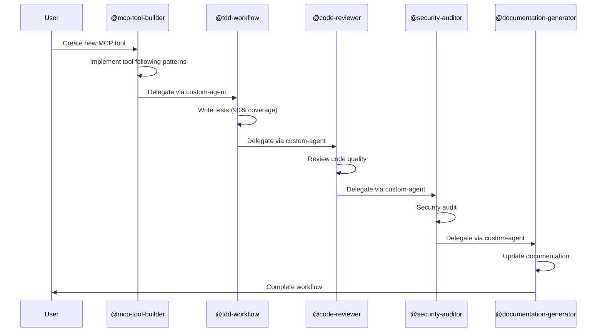

# Copilot Project Instructions

A TypeScript-based MCP (Model Context Protocol) server delivering advanced tools for hierarchical prompting, code hygiene analysis, design workflows, security hardening, and agile planning. This is an **experimental/research project** referencing evolving third-party models and docs. Please follow these guidelines when contributing:

## Using These Instructions

These instructions help GitHub Copilot and other AI coding assistants understand the project structure, conventions, and workflows. When working on tasks:

- **Well-suited for AI assistance**:
  - Bug fixes
  - Test coverage improvements
  - Documentation updates
  - Refactoring for clarity
  - Adding new tools following existing patterns
  - Updating dependencies
- **Requires human expertise**:
  - Major architectural changes
  - Complex business logic
  - Security-critical features
  - Ambiguous requirements
- **Always verify**: Lint, build, and test your changes early and often. Use `npm run quality` before committing.

## 1. Overview & Architecture

**Core Data Flow**: `src/index.ts` → tool handlers → business logic in `src/tools/` organized by domain.

### Key Service Layers

**Design Assistant Ecosystem** (`src/tools/design/`): The most complex subsystem, a **facade orchestrator** managing deterministic design workflows.

- **Coordinator**: `design-assistant.ts` routes actions to specialized services (session management, phase management, artifact generation, consistency enforcement)
- **Constraint System**: `constraint-manager.ts` loads YAML-based design constraints (phases, coverage rules, mandatory requirements)
- **Session State**: Manages multi-phase design sessions (start → advance phases → enforce coverage → generate artifacts)
- **Consistency Enforcers**: `cross-session-consistency-enforcer.ts` + `constraint-consistency-enforcer.ts` validate outputs against design rules
- **Services Layer** (`services/`): Handles session state, artifacts, phase transitions, consistency checks, and additional operations

**Prompt Builders** (`src/tools/prompt/`): Independent tools that generate structured prompts for AI agents

- **Hierarchical**: `hierarchical-prompt-builder.ts` — multi-level specificity prompts (independent → modeling → scaffolding)
- **Flow-based**: `prompt-flow-builder.ts`, `prompt-chaining-builder.ts` — sequential or parallel execution chains
- **Security**: `security-hardening-prompt-builder.ts` — OWASP/compliance-focused prompts with threat modeling
- **Domain-specific**: `domain-neutral-prompt-builder.ts` (objectives/workflow), `spark-prompt-builder.ts` (UI/UX cards)
- **Evaluation**: `prompting-hierarchy-evaluator.ts`, `hierarchy-level-selector.ts` — assess & recommend prompt levels
- **Analysis**: `code-analysis-prompt-builder.ts`, `architecture-design-prompt-builder.ts`, `debugging-assistant-prompt-builder.ts`
- All use shared utilities (`shared/prompt-utils.ts`, `shared/prompt-sections.ts`) for consistent structure
- Emit structured markdown/JSON outputs via `logger.ts`

**Analysis Tools** (`src/tools/analysis/`, `src/tools/semantic-code-analyzer.ts`): Code inspection and strategy frameworks

- **Code Quality**: `clean-code-scorer.ts` (0-100 score), `code-hygiene-analyzer.ts` (patterns/dependencies)
- **Coverage**: `iterative-coverage-enhancer.ts` — gap detection & adaptive thresholds
- **Strategy**: `strategy-frameworks-builder.ts` (SWOT/BSC/VRIO), `gap-frameworks-analyzers.ts` (capability/performance)
- **Planning**: `sprint-timeline-calculator.ts`, `model-compatibility-checker.ts`, `project-onboarding.ts`
- Bridge services for semantic analysis (`bridge/semantic-analyzer-bridge.ts`) and project onboarding

### Repository Structure

```
src/
  index.ts                          # MCP server entry, tool registration
  tools/
    design/                         # Design workflow orchestrator + services
      design-assistant.ts           # Facade coordinating all design operations
      constraint-manager.ts         # Constraint loading & validation (singleton)
      cross-session-consistency-enforcer.ts  # Multi-session validation (singleton)
      constraint-consistency-enforcer.ts     # Phase/constraint validation
      services/                     # Session, phase, artifact, consistency services
      types/                        # TypeScript domain types
      config/design-constraints.yaml # YAML-based phase/constraint config
    prompt/                         # Prompt builders (hierarchical, flow, security, etc.)
    analysis/                       # Strategy frameworks, gap analysis
    shared/                         # Shared utilities, error handling, logging
      errors.ts                     # Typed error classes (ValidationError, etc.)
      logger.ts                     # Structured logging
      prompt-utils.ts               # Prompt building utilities
    config/                         # Model and guidelines configuration
    bridge/                         # Bridge to external services (semantic analyzer, project onboarding)
  prompts/                          # Prompt definitions (aggregate via index.ts)
  resources/                        # Static resources (aggregate via index.ts)
  schemas/                          # Zod + MCP request schemas
tests/
  vitest/                           # Primary test suite (mirrors src/ structure)
  unit/                             # Legacy unit tests
demos/                              # Demo scripts (*.js) + generated reports (*.md)
scripts/                            # Build, test, and utility scripts
.github/                            # CI workflows, issue templates, and this instructions file
dist/                               # Compiled JavaScript output (generated by `npm run build`)
coverage/                           # Test coverage reports (generated by coverage commands)
```

## 2. Coding Conventions & Patterns

### ESM & TypeScript

- **Strict Mode Enforced** (`tsconfig.json`): `strict: true`, `isolatedModules: true`
- **ESM Imports**: All relative imports **must** end with `.js` (e.g., `import { a } from './b.js';`). Build outputs `.js` extensions.
- **No `any`**: Prefer precise types. Define interfaces in `types/` directories.

### Input Validation & Error Handling

- **Zod Schemas**: All tool inputs validated with zod (e.g., `z.object({ action: z.enum([...]) })`). Validation errors → `ValidationError` in `shared/errors.ts`.
- **Typed Errors**: Use domain-specific error classes (`ConfigurationError`, `ValidationError`, `OperationError`). All have `code`, `context`, `timestamp`.
- **Logging**: Use `shared/logger.ts` for structured logs. Never use `console.log`.

### Singleton State Management

**Critical**: These are app-wide singletons. Reuse, don't recreate.

- `constraintManager` (from `design/constraint-manager.ts`): Loads & caches YAML constraints. Used by design-assistant.
- `crossSessionConsistencyEnforcer` (from `design/cross-session-consistency-enforcer.ts`): Validates cross-session consistency.
- Model/guidelines config managers in `tools/config/`.
- **Bridge services** integrate external systems without creating dependencies (e.g., semantic analyzer, project onboarding).

### Immutability & Purity

- Prefer functional transforms. Avoid mutating input parameters.
- Design workflow functions return new state objects, not mutations.
- Services in `design/services/` should be pure where possible.

## 3. Build, Test, and Quality Workflow

### Critical Path: Pre-Commit Quality Gates

1. **Before committing**, run: `npm run quality` (type-check + Biome linting)
2. **Before pushing**, run: `npx lefthook run pre-push` (full test + lint suite)
3. Lefthook enforces these automatically; skipping breaks CI.

### Development Workflow

```bash
npm ci                    # Install exact dependencies
npm run build             # TypeScript → dist/ (required before running code)
npm run dev               # Watch mode (tsc --watch)
npm start                 # Build + start MCP server
```

### Testing Strategy

- **Primary Suite**: `npm run test:vitest` (Vitest, mirrors `src/` in `tests/vitest/`)
- **Coverage Reports**: `npm run test:coverage:vitest` (outputs to `coverage/`)
- **All Tests**: `npm run test:all` (unit + integration + demo + MCP smoke)
- **Individual Commands**:
  - `npm run test:unit` — Legacy unit tests
  - `npm run test:integration` — Integration tests (test-server.js)
  - `npm run test:demo` — Demo scripts (regression tests)
  - `npm run test:mcp` — MCP server smoke test

### Quality Checks (Biome + TypeScript)

```bash
npm run check              # Biome check (lint + format)
npm run check:fix          # Auto-fix Biome issues
npm run type-check         # TypeScript without emit
npm run lint               # Biome lint only
npm run lint:fix           # Auto-fix lint issues
```

### Demo Workflow

- **Demo scripts** in `demos/` are regression tests. Update them when changing tool output.
- `node demos/demo-tools.js` regenerates sample tool calls.
- Generated `.md` files document tool capabilities; commit these if updated.

### Git Hooks (Lefthook)

The project uses `lefthook` (configured in `lefthook.yml`) to enforce quality gates:

- **`pre-commit`**: Runs fast checks like formatting (Biome) and type-checking (`tsc --noEmit`)
- **`pre-push`**: Runs the full quality and test pipeline (`npm run quality` and `npm run test:all`)
- **Your changes must pass these hooks to be committed and pushed**
- Run manually: `npx lefthook run pre-commit` or `npx lefthook run pre-push`

## 4. Testing Patterns

### Architecture: Mirrored Structure

```
src/tools/design/design-assistant.ts          → tests/vitest/tools/design/design-assistant.spec.ts
src/tools/prompt/hierarchical-prompt-builder.ts → tests/vitest/tools/prompt/hierarchical-prompt-builder.spec.ts
```

### Testing Best Practices

1. **Test Public APIs Only**: Test exported functions/classes, not internal implementation. Example: `tests/vitest/unit/design-*.spec.ts`.
2. **Minimal Fixtures**: Inline small test data. Don't create large shared fixture files.
3. **Spies Over Mocks**: Use `vi.spyOn()` to observe function calls and verify behavior. See `tests/vitest/design-assistant-consistency-integration.test.ts` for patterns.
4. **Explicit Assertions**: Avoid snapshots. Use clear, specific assertions (e.g., `expect(result.coverage).toBe(0.85)`).
5. **Integration Tests**: Use integration tests to verify service composition (e.g., design-assistant with constraint-manager).

### Running & Coverage

- `npm run test:vitest` — Full Vitest suite
- `npm run test:coverage:vitest` — Generate coverage (default threshold: 90%)
- `npm run check:coverage-threshold --threshold=<n>` — Verify coverage meets threshold

## 5. Extending the Project

### Adding a New Tool

1. **Create file** in appropriate category: `src/tools/{category}/my-tool.ts`
2. **Export from barrel**: Add to `src/tools/{category}/index.ts`
3. **Register in server**: Add handler to `src/index.ts` (import + add to `tools` map)
4. **Add tests**: Create `tests/vitest/tools/{category}/my-tool.spec.ts` (mirror src/ structure)
5. **Update demos** (if applicable): Add to `demos/demo-tools.js`

### Adding Prompts or Resources

1. **Create file**: `src/prompts/my-prompt.ts` or `src/resources/my-resource.ts`
2. **Update aggregator**: Add to appropriate `index.ts` (exports via barrel)
3. Aggregators pull from these exports to build the MCP manifest

### Key Files to Know

- **`src/index.ts`** — Tool registration & MCP server setup (650+ lines, declarative)
- **`src/tools/design/constraint-manager.ts`** — Loads YAML constraints; core singleton
- **`src/tools/shared/errors.ts`** — Domain-specific error classes
- **`src/tools/design/services/`** — Pure, focused session/phase/artifact handlers

### Barrel File Pattern

Every module directory has `index.ts` that exports its public API:

```typescript
// src/tools/design/index.ts
export { designAssistant } from "./design-assistant.js";
export type { DesignAssistantRequest } from "./design-assistant.js";
```

## 6. Common Workflows & Patterns

### Design Assistant Workflow

1. **Session Start**: `design-assistant.ts` routes "start-session" → `sessionManagementService`
2. **Phase Advancement**: Calls `phaseManagementService` → validates against `constraintManager`
3. **Coverage Check**: `coverageEnforcer` validates phase outputs meet thresholds
4. **Consistency Enforcement**: `consistencyService` validates cross-phase dependencies
5. **Artifact Generation**: `artifactGenerationService` produces ADRs/specs/roadmaps

### Prompt Builder Pattern

- All prompt builders follow similar structure: input config → validation → section building → output
- Use `shared/prompt-utils.ts` and `shared/prompt-sections.ts` for consistency
- Return structured markdown or JSON; emit via `logger.ts` for tracing

### Bridge Service Pattern

**Bridge services** in `tools/bridge/` integrate external system capabilities without tight coupling:

- `semantic-analyzer-bridge.ts` — Integrates semantic code analysis (inspect symbols, find references, analyze patterns)
- `project-onboarding-bridge.ts` — Integrates project structure scanning and initialization
- **Pattern**: Services export a single factory function that returns methods, ensuring lazy initialization and single instances
- **Usage**: Called by higher-level tools (e.g., `project-onboarding.ts` calls bridge for codebase inspection)
- **Benefit**: Easy to mock or swap implementations without changing tool interfaces

### Error Handling Pattern

```typescript
import { ValidationError, ConfigurationError } from "../shared/errors.js";

try {
  // operation
} catch (error) {
  if (error instanceof ValidationError) {
    // handle validation
  } else if (error instanceof ConfigurationError) {
    // handle config
  }
}
```

## 7. Key Guidelines

1. **Follow TypeScript best practices** and maintain strict type safety
2. **Use ESM imports** with `.js` extensions for all relative imports
3. **Maintain existing code structure** and organization patterns
4. **Write tests for new functionality** - prefer Vitest, mirror `src/` structure in `tests/vitest/`
5. **Document public APIs** and complex logic with clear comments
6. **Run quality checks before committing** - `npm run quality` or `npx lefthook run pre-commit`
7. **Update demos when modifying tools** - regenerate with `node demos/demo-tools.js`
8. **Keep barrel files updated** - export new modules from appropriate `index.ts` files
9. **Use zod for input validation** - ensure robust schema definitions for all tool inputs
10. **Reuse singleton instances** - don't create new instances of shared services

## 8. GitHub Copilot Coding Agent

This section provides guidance specific to the autonomous **Copilot Coding Agent** running on GitHub.com in ephemeral GitHub Actions environments.

### Custom Agents

Specialized agents are available in `.github/agents/`. Invoke them using `@agent-name`:

#### Core Development Agents
- **`@mcp-tool-builder`** - Primary agent for creating and enhancing MCP tools following project patterns
- **`@tdd-workflow`** - Test-driven development agent (Red → Green → Refactor)
- **`@code-reviewer`** - Quality review using clean-code-scorer and code-hygiene-analyzer patterns

#### Quality & Security Agents
- **`@security-auditor`** - OWASP compliance checks and security hardening
- **`@documentation-generator`** - API documentation and README updates
- **`@architecture-advisor`** - Design pattern recommendations and ADR generation

#### Automation Agents
- **`@dependency-guardian`** - Dependency management and security vulnerability triage
- **`@ci-fixer`** - Debug and fix failing CI/CD workflows
- **`@changelog-curator`** - Maintain CHANGELOG.md following Keep a Changelog format

#### Advanced Agents
- **`@debugging-assistant`** - Root cause analysis and troubleshooting
- **`@performance-optimizer`** - Performance analysis and bundle optimization
- **`@prompt-architect`** - Prompt engineering and optimization

### Multi-Agent Delegation

**Important**: The `handoffs` property in agent frontmatter is **NOT supported** on the GitHub.com coding agent (only works in VS Code/IDE). Instead, use the **`custom-agent` tool** to delegate work between agents.

#### Delegation Pattern

When delegating to another agent, always provide:

1. **Context**: Summary of completed work and current state
2. **Files**: List of modified files with brief descriptions
3. **Focus**: Specific task for the receiving agent to address

#### Example Delegation

```markdown
After implementing a new MCP tool:

Use the custom-agent tool to invoke @tdd-workflow with context:
- Context: "Created new clean-code-scorer-v2 tool in src/tools/analysis/"
- Files: ["src/tools/analysis/clean-code-scorer-v2.ts", "src/tools/analysis/index.ts"]
- Focus: "Write comprehensive Vitest tests mirroring src/ structure, target 90% coverage"

After tests pass:

Use the custom-agent tool to invoke @code-reviewer with context:
- Context: "Implemented clean-code-scorer-v2 with full test coverage"
- Files: ["src/tools/analysis/clean-code-scorer-v2.ts", "tests/vitest/tools/analysis/clean-code-scorer-v2.spec.ts"]
- Focus: "Review code quality, check for TypeScript strict mode compliance, validate against project patterns"
```

### MCP Servers Available

This repository has two MCP servers configured in repository settings:

#### Fetch Server
- **Purpose**: Web content retrieval and up-to-date documentation lookup
- **Tool**: `mcp_fetch_fetch` - Retrieve content from URLs, useful for checking latest library versions or API docs
- **Command**: `uvx mcp-server-fetch`

#### Serena Server (Semantic Code Analysis)
- **Purpose**: Advanced code analysis, symbol management, and refactoring
- **Tools**:
  - `mcp_serena_find_symbol` - Find symbols by name path pattern
  - `mcp_serena_get_symbols_overview` - Get overview of symbols in a file
  - `mcp_serena_replace_symbol_body` - Replace symbol implementations safely
  - `mcp_serena_find_referencing_symbols` - Find all usages of a symbol
  - `mcp_serena_read_file` - Read file contents with semantic context
  - `mcp_serena_list_dir` - List directory contents
  - `mcp_serena_search_for_pattern` - Search codebase for patterns
- **Command**: `uvx --from "git+https://github.com/oraios/serena" serena`
- **Best for**: Large-scale refactoring, finding symbol references, understanding code structure

#### When to Use MCP Tools

- **Fetch**: When you need to check the latest documentation for libraries/APIs before making changes
- **Serena**: When performing refactoring across multiple files, finding all usages of a function/class, or analyzing code structure before making architectural changes

### Environment Configuration

The coding agent environment is pre-configured via `.github/copilot-setup-steps.yml`:

- **OS**: Ubuntu x64 (latest)
- **Node.js**: 22.x with npm cache
- **Python**: 3.12 (for MCP servers)
- **Build**: Project is pre-built (`npm ci && npm run build`)
- **MCP Servers**: Pre-cached (fetch, serena)

### Tool Aliases

The coding agent supports these tool aliases:

| Alias | Maps To | Description |
|-------|---------|-------------|
| `shell` | `bash`/`powershell` | Execute shell commands |
| `read` | `view` | Read file contents |
| `edit` | `str_replace` | Edit files with string replacement |
| `search` | `search` | Search files in the repository |
| `custom-agent` | Agent invocation | **Critical for multi-agent delegation** |

### Best Practices for Coding Agent

1. **Delegate Appropriately**: Use specialized agents for their domain expertise rather than trying to do everything yourself
2. **Provide Context**: When delegating, always include sufficient context about what was done and what needs to happen next
3. **Leverage MCP**: Use `serena` for complex refactoring and `fetch` for documentation lookup
4. **Follow Workflow**: Primary development → TDD → Code review → Security audit → Documentation
5. **Pre-built Environment**: The project is already built, so you can immediately run tests and quality checks

### Workflow Example



_If any of these instructions are unclear or seem incomplete, please ask for clarification!_
