# AGENTS.md - AI Agent Guidelines

This document follows the [AGENTS.md standard](https://agents-standard.dev/).

## Repository Overview

MCP (Model Context Protocol) server delivering advanced tools for hierarchical prompting, code hygiene analysis, design workflows, security hardening, and agile planning. Built with TypeScript in strict mode with comprehensive testing and quality gates.

## Agent Ecosystem

This repository uses **GitHub Copilot Coding Agent** with a connected multi-agent ecosystem. Specialized agents are located in `.github/agents/` and can be invoked using the `custom-agent` tool for delegation between agents.

## Available Agents

### Core Development Agents

| Agent | Purpose | Invoke With | Key Tools |
|-------|---------|-------------|-----------|
| **mcp-tool-builder** | Primary agent for creating and enhancing MCP tools | `@mcp-tool-builder` | shell, read, edit, search, custom-agent |
| **tdd-workflow** | Test-driven development - writes tests first, then implementation | `@tdd-workflow` | shell, read, edit, search, custom-agent |
| **code-reviewer** | Quality review using clean-code-scorer patterns | `@code-reviewer` | read, search, custom-agent |

### Quality & Security Agents

| Agent | Purpose | Invoke With | Key Tools |
|-------|---------|-------------|-----------|
| **security-auditor** | OWASP compliance and security hardening | `@security-auditor` | read, search, custom-agent |
| **documentation-generator** | API documentation and README updates | `@documentation-generator` | read, edit, search, custom-agent |
| **architecture-advisor** | Design pattern recommendations and ADR generation | `@architecture-advisor` | read, search, custom-agent |

### Automation Agents

| Agent | Purpose | Invoke With | Key Tools |
|-------|---------|-------------|-----------|
| **dependency-guardian** | Dependency management and security vulnerability triage | `@dependency-guardian` | read, search, custom-agent |
| **ci-fixer** | Debug and fix failing CI/CD workflows | `@ci-fixer` | shell, read, edit, custom-agent |
| **changelog-curator** | Maintain CHANGELOG.md following Keep a Changelog format | `@changelog-curator` | read, edit, custom-agent |

### Advanced Agents

| Agent | Purpose | Invoke With | Key Tools |
|-------|---------|-------------|-----------|
| **debugging-assistant** | Root cause analysis and troubleshooting | `@debugging-assistant` | shell, read, search, custom-agent |
| **performance-optimizer** | Performance analysis and bundle optimization | `@performance-optimizer` | shell, read, search, custom-agent |
| **prompt-architect** | Prompt engineering and optimization | `@prompt-architect` | read, search, custom-agent |

## MCP Integration

This repository has MCP servers configured in repository settings:

### Fetch Server
- **Purpose**: Web content retrieval and documentation lookup
- **Usage**: `mcp_fetch_fetch` tool for retrieving up-to-date documentation
- **Command**: `uvx mcp-server-fetch`

### Serena Server
- **Purpose**: Semantic code analysis and symbol management
- **Tools Available**:
  - `mcp_serena_find_symbol`: Find symbols by name path
  - `mcp_serena_get_symbols_overview`: Get overview of file symbols
  - `mcp_serena_replace_symbol_body`: Replace symbol implementations
  - `mcp_serena_find_referencing_symbols`: Find all symbol usages
  - `mcp_serena_read_file`: Read file contents with semantic context
  - `mcp_serena_list_dir`: List directory contents
- **Command**: `uvx --from "git+https://github.com/oraios/serena" serena`

## Multi-Agent Workflow Pattern

Agents delegate to each other using the `custom-agent` tool (not `handoffs`, which is only supported in VS Code):

```markdown
## Example Delegation

When your work is complete:
1. Use `custom-agent` to invoke `@code-reviewer` for quality review
2. After review passes, use `custom-agent` to invoke `@documentation-generator`

### Delegation Context Template
When delegating, provide:
- **Context**: Summary of what was accomplished
- **Files changed**: List of modified files with brief descriptions
- **Next action**: Specific task for the receiving agent to focus on
```

## Agent Workflow Diagram

```mermaid
flowchart TB
    subgraph Core["🎯 Core Agents"]
        MCP["mcp-tool-builder<br/>──────────<br/>Primary Development"]
        TDD["tdd-workflow<br/>──────────<br/>Test-Driven Dev"]
    end

    subgraph Quality["🔍 Quality Gates"]
        CR["code-reviewer<br/>──────────<br/>Clean Code Scoring"]
        SEC["security-auditor<br/>──────────<br/>OWASP/Hardening"]
        PERF["performance-optimizer<br/>──────────<br/>Bundle Analysis"]
    end

    subgraph Docs["📚 Documentation"]
        DOC["documentation-generator<br/>──────────<br/>API Docs/README"]
        CHANGE["changelog-curator<br/>──────────<br/>CHANGELOG.md"]
    end

    subgraph Analysis["🔬 Analysis"]
        ARCH["architecture-advisor<br/>──────────<br/>Design Patterns"]
        DEBUG["debugging-assistant<br/>──────────<br/>Root Cause Analysis"]
    end

    subgraph Auto["⚙️ Automation"]
        DEP["dependency-guardian<br/>──────────<br/>Renovate/Audits"]
        CI["ci-fixer<br/>──────────<br/>Workflow Repairs"]
    end

    MCP -->|"custom-agent"| TDD
    TDD -->|"custom-agent"| CR
    CR -->|"custom-agent"| SEC
    SEC -->|"custom-agent"| DOC
    MCP -->|"uses serena"| Analysis
    Quality -->|"reports to"| CHANGE
```



## Coding Standards

For detailed coding conventions, architecture patterns, and testing guidelines, see `.github/copilot-instructions.md`.

### Key Conventions
- **TypeScript Strict Mode**: All code follows strict type safety
- **ESM Imports**: Use `.js` extensions for relative imports
- **Zod Validation**: All tool inputs validated with Zod schemas
- **Vitest Testing**: Mirror `src/` structure in `tests/vitest/`
- **Quality Gates**: Run `npm run quality` before committing

## Development Environment

Agents run in ephemeral GitHub Actions environments with:
- **OS**: Ubuntu x64
- **Node.js**: 22.x
- **Python**: 3.12
- **Build**: Pre-built via `copilot-setup-steps.yml`

## Getting Started

1. Review `.github/copilot-instructions.md` for full coding guidelines
2. Check available agents in `.github/agents/`
3. Use `@agent-name` to invoke specialized agents
4. Leverage MCP servers (`fetch`, `serena`) for enhanced capabilities
5. Follow the multi-agent delegation pattern for complex workflows

## References

- [GitHub Copilot Coding Agent Documentation](https://docs.github.com/en/copilot/how-tos/use-copilot-agents/coding-agent)
- [Creating Custom Agents](https://docs.github.com/en/copilot/how-tos/use-copilot-agents/coding-agent/create-custom-agents)
- [Extending with MCP](https://docs.github.com/en/copilot/how-tos/use-copilot-agents/coding-agent/extend-coding-agent-with-mcp)
- [AGENTS.md Standard](https://agents-standard.dev/)
