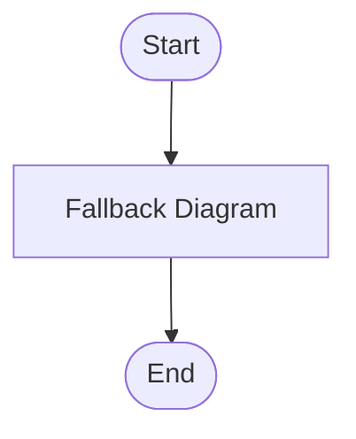

## Generated Mermaid Diagram

### Description

User submits data -> Validate -> Process -> Save -> Return summary

### Diagram Code

### Accessibility

- You can provide accTitle and accDescr to improve screen reader context.

### Validation

❌ Diagram invalid even after attempts: mermaid.parse is not a function

### Feedback Loop

- Try simplifying node labels (avoid punctuation that Mermaid may misparse)
- Ensure a single diagram header (e.g., 'flowchart TD')
- Replace complex punctuation with plain words
- If describing a pipeline, try a simpler 5-step flow and add branches gradually

### Generation Settings

Type: flowchart
Strict: true
Repair: true

### Usage Instructions

1. Copy the Mermaid code above
2. Paste it into any Mermaid-enabled Markdown renderer or the Live Editor
3. Adjust styling, layout, or relationships as needed

### Notes

Repair heuristics: classDef style tokens normalized, ensures colon syntax, fallback to minimal diagram if unrecoverable.
