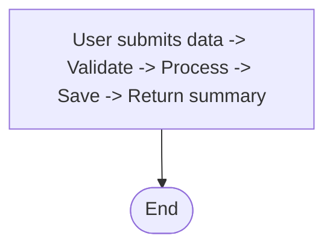

## Generated Mermaid Diagram

### Description
User submits data -> Validate -> Process -> Save -> Return summary

### Diagram Code

### Accessibility
- You can provide accTitle and accDescr to improve screen reader context.

### Validation
ℹ️ Validation skipped (mermaid not available). Diagram generated.

### Generation Settings
Type: flowchart
Strict: true
Repair: true

### Usage Instructions
1. Copy the Mermaid code above
2. Paste it into any Mermaid-enabled Markdown renderer or the Live Editor
3. Adjust styling, layout, or relationships as needed

### Notes
Repair heuristics: classDef style tokens normalized, ensures colon syntax, fallback to minimal diagram if unrecoverable.