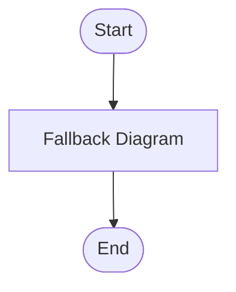

## Generated Mermaid Diagram

### Description
Start -> Ingest code -> Parse & categorize issues (Security, Reliability, Maintainability, Performance, Style) -> Prioritize risks -> Generate checklist & plan -> Output reports (markdown) -> End

### Diagram Code

### Accessibility
- Title: Code Hygiene Analyzer Flow
- Description: Flow showing analysis steps from code intake to categorized issues and remediation output

### Validation
✖ Diagram invalid even after attempts: mermaid.parse is not a function
### Feedback Loop
- Try simplifying node labels (avoid punctuation that Mermaid may misparse)
- Ensure a single diagram header (e.g., 'flowchart TD')
- Replace complex punctuation with plain words
- If describing a pipeline, try a simpler 5-step flow and add branches gradually

### Generation Settings
Type: flowchart
Strict: true
Repair: true

### Usage Instructions
1. Copy the Mermaid code above
2. Paste it into any Mermaid-enabled Markdown renderer or the Live Editor
3. Adjust styling, layout, or relationships as needed

### Notes
Repair heuristics: classDef style tokens normalized, ensures colon syntax, fallback to minimal diagram if unrecoverable.
