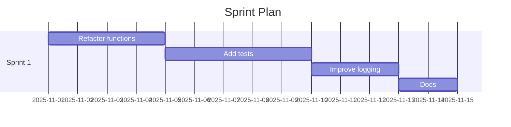

## 🗓️ Sprint Timeline Calculation

### Metadata
- **Updated:** 2025-11-01
- **Source tool:** mcp_ai-agent-guid_sprint-timeline-calculator

### Team Configuration
- **Team Size**: 3 members
- **Sprint Length**: 14 days
- **Team Velocity**: 19 story points per sprint
- **Total Tasks**: 4

### Capacity Analysis
- **Total Story Points**: 18
- **Required Sprints**: 1
- **Timeline**: 14 days (2 weeks)
- **Capacity Utilization**: 95%

### Sprint Summary
| Sprint | Planned Points | Tasks |
|-------:|----------------:|-------|
| 1 | 18 | Refactor functions, Add tests, Improve logging, Docs |

### Sprint Breakdown
**Sprint 1** (18 points):
  - Refactor functions (5 pts) - Priority: high
  - Add tests (8 pts) - Priority: high
  - Improve logging (3 pts) - Priority: medium
  - Docs (2 pts) - Priority: low

### Risk Assessment
1. **High**: Over 90% capacity utilization may lead to burnout and missed deadlines

### Recommendations
1. Consider reducing scope or adding team members to avoid overcommitment
2. Implement daily standups to track progress and identify blockers early
3. Plan for 20% buffer time to handle unexpected issues
4. Review and adjust velocity after each sprint based on actual completion

### Timeline Optimization Tips
- **Prioritize high-value tasks** early in the timeline
- **Address dependencies** before dependent tasks
- **Plan for 80% capacity** to account for meetings, code reviews, and unexpected issues
- **Include buffer time** for testing and bug fixes
- **Regular velocity tracking** to adjust future estimations
- **Consider skill distribution** when assigning tasks

### Velocity Tracking Formula
`Velocity = Completed Story Points / Sprint Duration`

Current calculations based on:
- Industry average: 8-10 story points per developer per sprint
- Adjusted for team size and sprint length
- Factoring in 20% overhead for meetings and coordination
- Using greedy optimization strategy with dependency-aware scheduling

### Gantt (Mermaid)

## Further Reading

*The following resources are provided for informational and educational purposes only. Their inclusion does not imply endorsement, affiliation, or guarantee of accuracy. Information may change over time; please verify current information with official sources.*

- **[AI-Assisted Sprint Planning Tools 2025](https://www.zenhub.com/blog-posts/the-7-best-ai-assisted-sprint-planning-tools-for-agile-teams-in-2025)**: ZenHub's guide to the best AI-powered sprint planning tools
- **[AI in Software Project Delivery](https://www.nitorinfotech.com/blog/ai-in-software-project-delivery-smarter-planning-and-execution/)**: How AI enables smarter planning and execution in projects
- **[Optimizing Sprint Planning with Linear Programming](https://medium.com/@karim.ouldaklouche/optimizing-sprint-planning-with-julia-a-linear-programming-approach-with-gurobi-03f28c0cf5bf)**: Using Julia and Gurobi for mathematical sprint optimization

