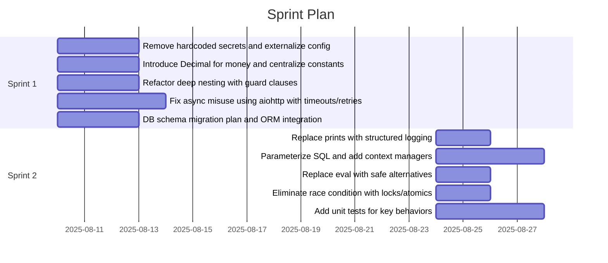

# Sprint Timeline for demo-code-analysis.py

## Sprint Timeline Calculation

### Team Configuration
- Team Size: 2 members
- Sprint Length: 14 days
- Team Velocity: 20 story points per sprint
- Total Tasks: 10

### Capacity Analysis
- Total Story Points: 33
- Required Sprints: 2
- Timeline: 28 days (4 weeks)
- Capacity Utilization: 83%

### Sprint Summary
| Sprint | Planned Points | Tasks |
|-------:|----------------:|-------|
| 1 | 17 | Remove hardcoded secrets and externalize config, Introduce Decimal for money and centralize constants, Refactor deep nesting with guard clauses, Fix async misuse using aiohttp with timeouts/retries, DB schema migration plan and ORM integration |
| 2 | 16 | Replace prints with structured logging, Parameterize SQL and add context managers, Replace eval with safe alternatives, Eliminate race condition with locks/atomics, Add unit tests for key behaviors |

### Sprint Breakdown
Sprint 1 (17 points):
- Remove hardcoded secrets and externalize config (3 pts)
- Introduce Decimal for money and centralize constants (3 pts)
- Refactor deep nesting with guard clauses (3 pts)
- Fix async misuse using aiohttp with timeouts/retries (5 pts)
- DB schema migration plan and ORM integration (3 pts)

Sprint 2 (16 points):
- Replace prints with structured logging (2 pts)
- Parameterize SQL and add context managers (5 pts)
- Replace eval with safe alternatives (2 pts)
- Eliminate race condition with locks/atomics (2 pts)
- Add unit tests for key behaviors (5 pts)

### Gantt (Mermaid)

