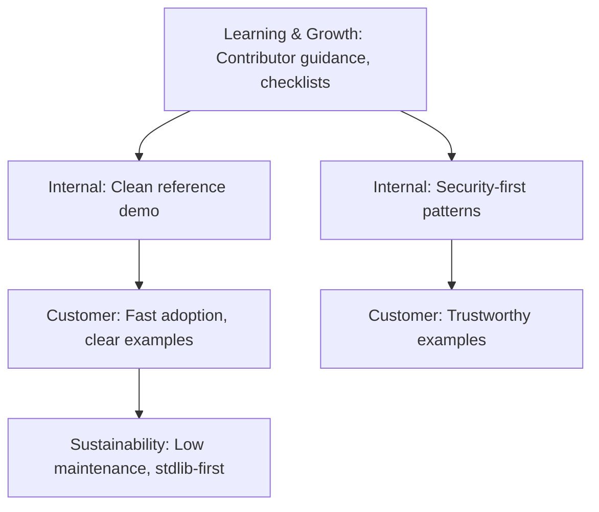
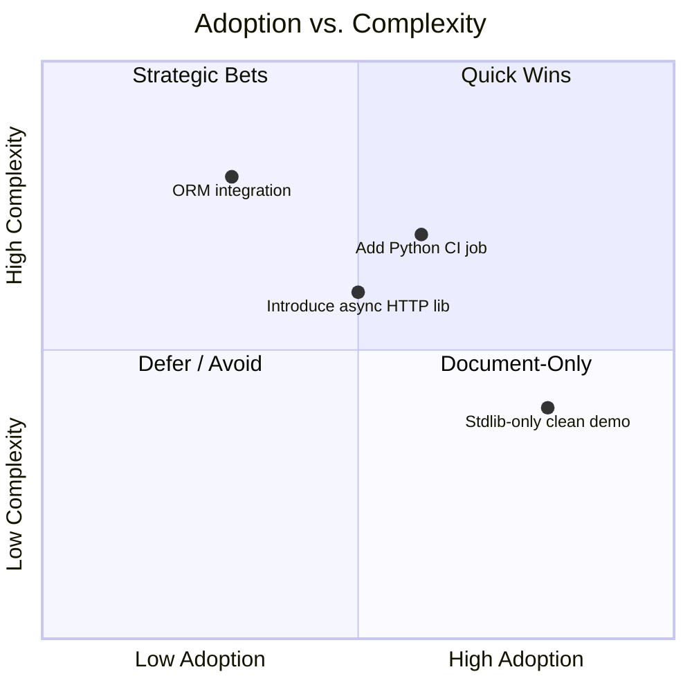

# Demo Code Strategy Analysis (Python) — demo-code-analysis.py

Updated: 2025-09-03
Source: demos/demo-code-analysis.py
Purpose: Strategic plan to keep the “bad patterns” demo intact for testing while adding a clean, secure reference implementation and migration guidance.

---

## Executive Summary

This document outlines a pragmatic strategy to evolve the Python demo module from an intentionally flawed stress-test into a dual-track asset: preserve the existing “bad” sample for tooling demos, and add a clean, secure, and testable reference variant. The plan focuses on minimal dependencies, security-first fixes, and contributor-friendly practices without disrupting current demos.

Key outcomes:

- Keep the original file unchanged for tests/docs.
- Create `demos/demo_code_clean.py` as the refactored reference.
- Document a migration checklist plus acceptance tests.
- Provide guidance for safe DB access, async HTTP, logging, and config.

---

## As-Is vs. To-Be

### As-Is (selected observations)

- Global mutable state and singletons; hardcoded API key; prints instead of logging.
- SQL injection via string interpolation; no context managers around I/O.
- Deep nesting; magic numbers; inconsistent naming and deprecated methods.
- Blocking requests in async function; race conditions via shared counter; `eval` usage.
- Mutable default args; monkey-patching; missing validation and error handling.

### To-Be (target capabilities)

- Secure config (env-first), structured logging, typed interfaces, validation.
- Parameterized SQL with context managers; or optional minimal ORM pattern.
- Async-safe HTTP (aiohttp/httpx) or keep sync in non-async contexts; timeouts/retries.
- Concurrency-safe counters/locks; no `eval`; robust error taxonomy and handling.
- No magic numbers; constants centralized; deprecated code isolated or removed.

### Transition Roadmap (milestones)

1. Add clean reference `demo_code_clean.py` and shared constants/utilities.
2. Introduce minimal tests for security/behavior; wire to CI (optional Python job).
3. Provide migration checklist and examples in README of demos.
4. Incrementally harden: config, logging, DB access, async HTTP, concurrency.

---

## Where to Play / How to Win

- Arena: OSS developer tooling and AI-agent guidelines; demo as educational artifact.
- Value: Clear contrast between anti-patterns and best practices with runnable code.
- Differentiators: Low-dependency, security-first, concise examples, acceptance tests.
- Systems: Lightweight Python testing, linters (optional), docs with Mermaid diagrams.

---

## Balanced Scorecard

- Customer
  - Objective: Make guidance easy to adopt.
  - KPI: Time-to-understand < 10 min; example runs without errors.
- Internal
  - Objective: Keep demo stability while adding a clean track.
  - KPI: Zero changes to original demo; all tests pass.
- Learning & Growth
  - Objective: Raise contributor fluency.
  - KPI: Add 5+ code comments and a migration checklist.
- Sustainability
  - Objective: Minimize maintenance overhead.
  - KPI: Dependencies = stdlib-only for clean demo.

---

## SWOT Analysis

- Strengths: Clear, focused demo; repository already emphasizes code hygiene; small scope.
- Weaknesses: Currently insecure by design; no Python CI; mixed contributor experience.
- Opportunities: Teach secure patterns; reusable acceptance tests; simple refactor win.
- Threats: Scope creep; dependency bloat; accidental breakage of existing demos.

---

## Objectives & Key Results (OKR-compatible)

- O1: Ship a clean, secure reference demo
  - KR1: Add `demo_code_clean.py` with stdlib-only, no eval, no hardcoded secrets.
  - KR2: Replace prints with logging; add env-based config loading; parameterized SQL.
  - KR3: Provide concurrency-safe counter and non-blocking patterns or document sync.
- O2: Document migration and acceptance
  - KR1: Migration checklist embedded in this doc and demos/README.
  - KR2: Add unit tests that assert security (no eval, parameterized SQL).
- O3: Keep original demo stable
  - KR1: No modifications to `demo-code-analysis.py`.
  - KR2: CI green with new tests and existing Node/Vitest unaffected.

---

## Strategy Map

---

## Gap Analysis

- People: Add inline comments and a short CONTRIBUTING snippet for Python demos.
- Process: Add simple Python test runner (optional) separate from TS CI.
- Tech: Introduce `logging`, `contextlib`, `sqlite3` parameterization, `os.environ`.
- Current vs Target: From unsafe patterns to safe-by-default templates with tests.
- Remediation Sequencing: constants/config -> logging -> DB safety -> async/concurrency.

---

## Scenario Planning (2x2)

---

## VRIO Assessment (selected capabilities)

- Security-first sample code: Valuable ✓, Rare △, Inimitable △, Organized ✓ → Parity/Advantage.
- Low-dependency patterns: Valuable ✓, Rare ✓, Inimitable △, Organized ✓ → Advantage.
- Acceptance tests for hygiene: Valuable ✓, Rare △, Inimitable △, Organized △ → Parity.

---

## Migration Checklist (developer-facing)

- [ ] Do not edit `demos/demo-code-analysis.py`.
- [ ] Add `demos/demo_code_clean.py` implementing:
  - [ ] Config: read from env with sensible defaults; no hardcoded secrets.
  - [ ] Logging: `logging` with INFO default; no `print` for operational logs.
  - [ ] DB: use context managers and parameterized SQL; optional table create IF NOT EXISTS.
  - [ ] No eval/exec; sanitize inputs; validate types.
  - [ ] Concurrency: avoid global mutable state; use locks or local state.
  - [ ] Async: don’t call blocking I/O in `async def`; use timeouts.
  - [ ] Replace magic numbers with named constants; centralize.
  - [ ] Provide safe equivalents for each risky function in the demo.
- [ ] Add minimal unit tests that assert:
  - [ ] Parameterized SQL used; unsafe query builder is absent in clean version.
  - [ ] No hardcoded secrets present; config reads from env.
  - [ ] Logging callable; no prints in clean paths.
  - [ ] Thread-safe counter increments produce expected results deterministically.

---

## Acceptance Tests (definition of done)

- Clean module imports without side effects and runs basic flows without exceptions.
- Static scan finds no occurrences of `eval(`, `exec(`, f-string SQL, or hardcoded keys.
- Logs are produced via `logging` module.
- DB interactions use parameterized queries and context managers.
- Concurrency demos do not mutate shared state unsafely.

---

## Appendix A: Clean Reference Sketch

This sketch guides the creation of `demo_code_clean.py` (stdlib-only). It is descriptive, not binding.

- Config
  - Source from env: `API_KEY`, `ENDPOINT`, `TIMEOUT` (int)
  - Data class or simple dict; validate and default.
- Logging
  - `logging.basicConfig(level=logging.INFO)` and module-level logger.
- DB Access
  - `with sqlite3.connect(path) as conn:` and `cur.execute("INSERT ... VALUES (?, ?)", (user, amount))`
  - `CREATE TABLE IF NOT EXISTS orders (user TEXT, amount REAL)`
- Safer Helpers
  - No `eval`; provide a small, explicit command whitelist if needed.
  - Replace deep nesting with early returns/guards.
  - Use `threading.Lock()` for shared counters or return computed values instead of mutating globals.
- Async/HTTP
  - If demonstrating async, use `asyncio.to_thread` for blocking I/O or keep function sync.
  - Always include timeout and simple retry/backoff with bounded jitter.

---

## Notes

- Keep the “bad” demo as-is for analyzer regression tests.
- Prefer clarity over cleverness; small APIs, explicit types via type hints.
- Document trade-offs and post a short README snippet in `demos/`.
