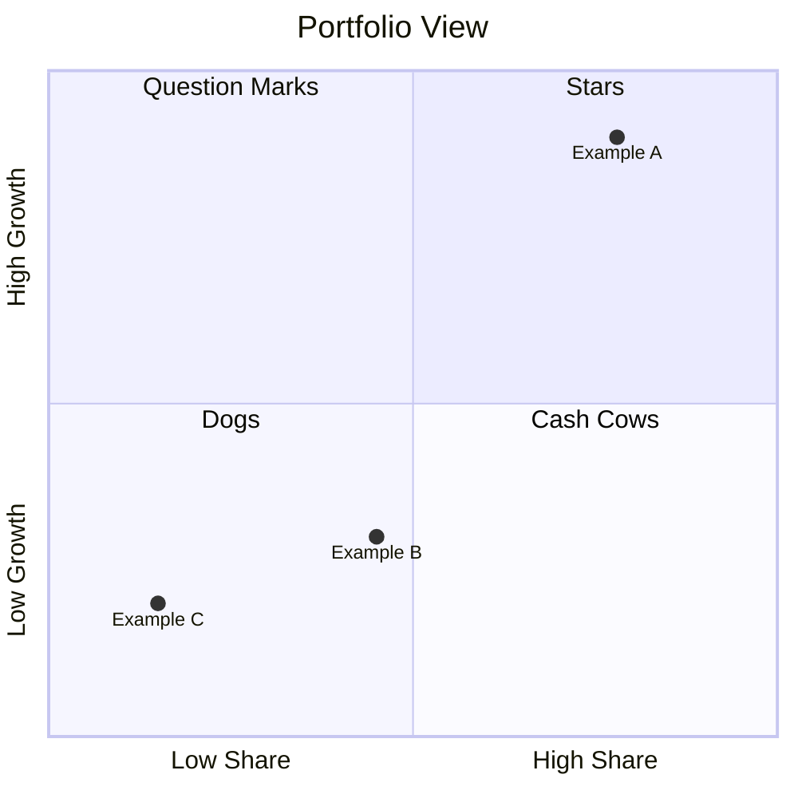
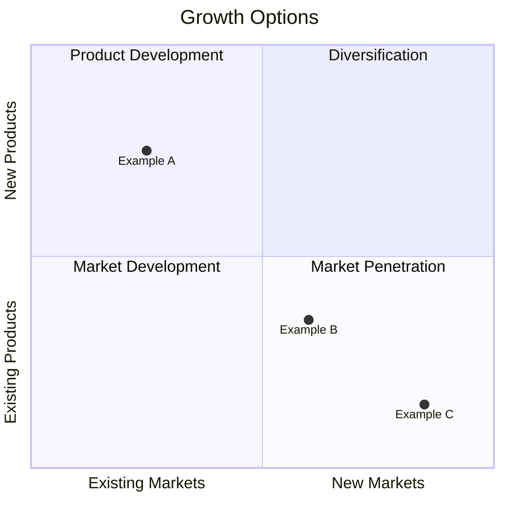

### Metadata
- Updated: 2025-10-01
- Source tool: mcp_ai-agent-guid_strategy-frameworks-builder
- Suggested filename: strategy-swot-wheretoplayhowtowin-balancedscorecard-mckinsey7s-bcgmatrix-ansoffm.md

# Strategy Toolkit Overview

Context: AI DevTools SaaS expanding in EU/US mid-market

Objectives:
- Grow ARR 30%
- Expand to two new segments
- Improve NRR 5pp

Stakeholders:
- Buyers
- Users
- Partners

## SWOT Analysis
- Strengths (internal)
- Weaknesses (internal)
- Opportunities (external)
- Threats (external)

## Where to Play / How to Win
- Define arenas (segments, geos, channels)
- Define unique value proposition and differentiators
- Specify capabilities and systems required
- List management systems/metrics to sustain advantage

## Balanced Scorecard
- Objectives across Financial, Customer, Internal, Learning & Growth
- Measures/KPIs for each objective
- Initiatives mapped to objectives
- RAG status and owners
- Deliverable: Balanced Scorecard matrix with metrics & owners
- Owner: Strategy/Finance lead
- Financial: revenue growth %, Customer: NPS, Internal: cycle time

## 7S Organizational Alignment (consulting-7s)
- Strategy, Structure, Systems
- Shared Values, Skills, Style, Staff
- Identify misalignments and actions

## Portfolio Prioritization (portfolio-gsm)
- Classify units: Stars, Cash Cows, Question Marks, Dogs
- Investment/divestment policy

## Growth Options (Ansoff)
- Market Penetration, Market Development
- Product Development, Diversification
- Risk/return summary per option
- Deliverable: Ansoff map with candidate initiatives
- Owner: Growth/Product lead
- Candidate metrics: revenue impact, time to market

## Strategy Map
- Link objectives cause→effect (Learning→Internal→Customer→Financial)
- Show dependencies and leading/lagging indicators

## PEST Analysis
- Political
- Economic
- Social
- Technological
- Deliverable: PEST register with time horizons
- Owner: Strategy/Policy analyst
- Indicators: regulatory changes count, macro economic signals

## VRIO Assessment
- List resources/capabilities
- Evaluate: Valuable, Rare, Inimitable, Organized
- Implication: Competitive disadvantage→Parity→Advantage→Sustained

## References
- Atlassian strategy frameworks: https://www.atlassian.com/work-management/strategic-planning/framework
- ClearPoint 20 frameworks: https://www.clearpointstrategy.com/blog/strategic-planning-models
- Quantive top frameworks: https://quantive.com/resources/articles/top-strategic-frameworks
- HBS strategy tools overview: https://online.hbs.edu/blog/post/strategy-frameworks-and-tools

