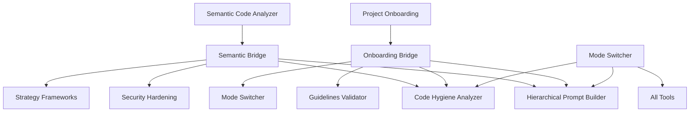

<!-- AUTO-GENERATED HEADER - DO NOT EDIT -->
<div align="center">

<!-- Animated gradient header -->


<br/>

<!-- Document Title -->
<h1>
  
</h1>

<p>
  <strong>🛠️ Developer Documentation</strong> • Architecture & Quality Standards
</p>

<!-- Quick Navigation Bar -->
<div>
  <a href="../README.md">🏠 Home</a> •
  <a href="./README.md">📚 Docs Index</a> •
  <a href="./CLEAN_CODE_INITIATIVE.md">✨ Clean Code</a> •
  <a href="./ERROR_HANDLING.md">⚠️ Errors</a> •
  <a href="../CONTRIBUTING.md">🤝 Contributing</a>
</div>

</div>

---
<!-- END AUTO-GENERATED HEADER -->


# Bridge Connectors - Tool Integration Layer

## Overview

The Bridge Connectors provide an integration layer that enables Serena-inspired tools (semantic code analyzer, project onboarding, mode switcher) to enhance and work seamlessly with all existing MCP AI Agent Guidelines tools.

## Architecture



## Components

### 1. Semantic Analyzer Bridge (`semantic-analyzer-bridge.ts`)

Provides integration points for semantic code analysis with other tools.

#### Functions

##### `enhancePromptWithSemantics(semanticAnalysis, promptContext)`
Enhances hierarchical prompts with semantic code insights.

**Parameters:**
- `semanticAnalysis`: Output from semantic-code-analyzer
- `promptContext`: Base prompt context to enhance

**Returns:** Enhanced prompt with code structure, patterns, and dependencies

**Example:**
```typescript
const semanticAnalysis = await semanticCodeAnalyzer({
  codeContent: code,
  analysisType: 'all'
});

const enhancedPrompt = enhancePromptWithSemantics(
  semanticAnalysis.content[0].text,
  "Refactor the authentication module"
);

// Use with hierarchical-prompt-builder
const plan = await hierarchicalPromptBuilder({
  context: enhancedPrompt,
  goal: "Create comprehensive refactoring plan"
});
```

##### `generateHygieneRecommendations(semanticAnalysis)`
Generates code hygiene recommendations based on semantic patterns.

**Returns:** Array of hygiene recommendations

##### `extractSemanticInsights(analysisText)`
Extracts structured insights from semantic analysis output.

**Returns:** Object with structure, patterns, dependencies, and symbols

##### `suggestRefactorings(semanticAnalysis)`
Creates prioritized refactoring suggestions.

**Returns:** Array of refactoring suggestions with priority levels

##### `generateSecurityAnalysisPrompt(semanticAnalysis)`
Generates security-focused analysis prompt from semantic insights.

**Returns:** Security analysis prompt string

##### `integrateWithStrategyFrameworks(semanticAnalysis, projectContext)`
Provides technical debt and architecture insights for strategy analysis.

**Returns:** Object with technicalDebt, architectureInsights, recommendations

### 2. Project Onboarding Bridge (`project-onboarding-bridge.ts`)

Provides integration points for project context with all tools.

#### Functions

##### `extractProjectContext(onboardingResult)`
Extracts structured project information from onboarding output.

**Returns:** Project context object with:
- name, type, languages, frameworks
- buildSystem, testFramework
- structure (directories, keyFiles, entryPoints)

**Example:**
```typescript
const onboarding = await projectOnboarding({
  projectPath: "/path/to/project",
  includeMemories: true
});

const context = extractProjectContext(onboarding.content[0].text);
// context.name, context.languages, context.structure, etc.
```

##### `enhanceToolWithProjectContext(toolInput, projectContext)`
Adds project context to any tool input.

**Example:**
```typescript
const enhancedInput = enhanceToolWithProjectContext(
  { codeContent: code, language: "TypeScript" },
  projectContext
);
```

##### `generateContextualPrompt(projectContext, taskDescription)`
Creates project-aware hierarchical prompt.

**Example:**
```typescript
const prompt = generateContextualPrompt(
  projectContext,
  "Add authentication to user service"
);

// Prompt includes project structure, languages, conventions
```

##### `generateProjectSpecificHygieneRules(projectContext)`
Generates hygiene rules tailored to project stack.

**Returns:** Array of language and framework-specific hygiene rules

##### `generateStrategyWithProjectContext(projectContext)`
Performs SWOT analysis based on project characteristics.

**Returns:** Object with swot analysis and recommendations

##### `generateModeGuidance(projectContext, mode)`
Provides mode-specific guidance using project context.

**Example:**
```typescript
const guidance = generateModeGuidance(projectContext, "debugging");
// Returns debugging tips specific to project's test framework and build system
```

## Integration Patterns

### Pattern 1: Enhanced Code Analysis

```typescript
// 1. Onboard project
const onboarding = await projectOnboarding({
  projectPath: "/path/to/project"
});
const projectContext = extractProjectContext(onboarding.content[0].text);

// 2. Analyze specific code
const analysis = await semanticCodeAnalyzer({
  codeContent: code,
  analysisType: "all"
});

// 3. Generate project-aware hygiene analysis
const hygieneRules = generateProjectSpecificHygieneRules(projectContext);
const semanticRecommendations = generateHygieneRecommendations(
  analysis.content[0].text
);

// 4. Combine for comprehensive analysis
const comprehensiveAnalysis = await codeHygieneAnalyzer({
  codeContent: code,
  language: projectContext.languages[0],
  additionalRules: [...hygieneRules, ...semanticRecommendations]
});
```

### Pattern 2: Context-Aware Refactoring

```typescript
// 1. Get project context
const projectContext = extractProjectContext(onboardingResult);

// 2. Switch to refactoring mode with project guidance
await modeSwitcher({
  targetMode: "refactoring",
  context: "ide-assistant"
});

const modeGuidance = generateModeGuidance(projectContext, "refactoring");

// 3. Create semantic analysis
const semanticAnalysis = await semanticCodeAnalyzer({
  codeContent: moduleCode,
  analysisType: "all"
});

// 4. Generate refactoring suggestions
const refactorings = suggestRefactorings(semanticAnalysis.content[0].text);

// 5. Create project-aware refactoring plan
const refactorPrompt = generateContextualPrompt(
  projectContext,
  `Refactor based on: ${refactorings.map(r => r.suggestion).join(", ")}`
);

const plan = await hierarchicalPromptBuilder({
  context: refactorPrompt + "\n\n" + modeGuidance,
  goal: "Create step-by-step refactoring plan"
});
```

### Pattern 3: Security Analysis Pipeline

```typescript
// 1. Get project and code insights
const projectContext = extractProjectContext(onboardingResult);
const semanticAnalysis = await semanticCodeAnalyzer({
  codeContent: code,
  analysisType: "all"
});

// 2. Generate security analysis prompt
const securityPrompt = generateSecurityAnalysisPrompt(
  semanticAnalysis.content[0].text
);

// 3. Create comprehensive security review
const securityAnalysis = await securityHardeningPromptBuilder({
  codeContext: securityPrompt,
  analysisScope: [
    "input-validation",
    "authentication",
    "authorization",
    "dependency-security"
  ],
  framework: projectContext.frameworks[0],
  language: projectContext.languages[0]
});
```

### Pattern 4: Strategy Planning with Technical Context

```typescript
// 1. Extract project context and semantic insights
const projectContext = extractProjectContext(onboardingResult);
const codeAnalysis = await semanticCodeAnalyzer({
  codeContent: mainModuleCode,
  analysisType: "all"
});

// 2. Generate strategy insights
const strategyInsights = integrateWithStrategyFrameworks(
  codeAnalysis.content[0].text,
  onboardingResult
);

const projectStrategy = generateStrategyWithProjectContext(projectContext);

// 3. Build comprehensive strategy
const strategy = await strategyFrameworksBuilder({
  frameworks: ["swot", "vrio", "pest"],
  context: `Project: ${projectContext.name} (${projectContext.type})`,
  objectives: strategyInsights.recommendations,
  constraints: strategyInsights.technicalDebt
});
```

## Benefits

### 1. **Universal Tool Enhancement**
- All existing tools can benefit from project context
- Semantic analysis provides deep code understanding
- Mode switching optimizes workflow

### 2. **Consistent Integration**
- Standard bridge patterns across tools
- Reusable integration functions
- Type-safe integrations

### 3. **Scaling Effects**
- Each new tool automatically benefits from bridges
- Compound improvements across tool chain
- Better accuracy through context awareness

### 4. **Developer Productivity**
- Less manual context switching
- Auto-generated project-specific guidance
- Semantic-aware code operations

## Future Enhancements

- [ ] Bidirectional integration (tools feeding back to bridges)
- [ ] Caching layer for repeated integrations
- [ ] ML-based pattern recognition in bridges
- [ ] Custom bridge configuration per project
- [ ] Cross-session context persistence

## References

- [Serena Strategies Documentation](./SERENA_STRATEGIES.md)
- [Integration Summary](./SERENA_INTEGRATION_SUMMARY.md)
- [Serena Repository](https://github.com/oraios/serena)


<!-- AUTO-GENERATED FOOTER - DO NOT EDIT -->

---

<div align="center">

<!-- Navigation Grid -->
<table>
  <tr>
    <td align="center" width="33%">
      <strong>🛠️ Code Quality</strong><br/>
      <a href="./CLEAN_CODE_INITIATIVE.md">Clean Code 100/100</a><br/>
      <a href="./code-quality-improvements.md">Quality Improvements</a><br/>
      <a href="./ERROR_HANDLING.md">Error Patterns</a>
    </td>
    <td align="center" width="33%">
      <strong>🏗️ Architecture</strong><br/>
      <a href="./BRIDGE_CONNECTORS.md">Bridge Connectors</a><br/>
      <a href="./TECHNICAL_IMPROVEMENTS.md">Refactoring</a><br/>
      <a href="./design-module-status.md">Module Status</a>
    </td>
    <td align="center" width="33%">
      <strong>📚 Resources</strong><br/>
      <a href="../CONTRIBUTING.md">Contributing Guide</a><br/>
      <a href="./REFERENCES.md">References</a><br/>
      <a href="../.github/copilot-instructions.md">Copilot Guide</a>
    </td>
  </tr>
</table>

<!-- Back to Top -->
<p>
  <a href="#top">⬆️ Back to Top</a>
</p>

<!-- Animated Waving Footer -->


<!-- Metadata Footer -->
<sub>
  <strong>MCP AI Agent Guidelines</strong> • Made with ❤️ by <a href="https://github.com/Anselmoo">@Anselmoo</a> and contributors<br/>
  Licensed under <a href="../LICENSE">MIT</a> • <a href="../DISCLAIMER.md">Disclaimer</a> • <a href="../CONTRIBUTING.md">Contributing</a>
</sub>

</div>

<!-- END AUTO-GENERATED FOOTER -->
