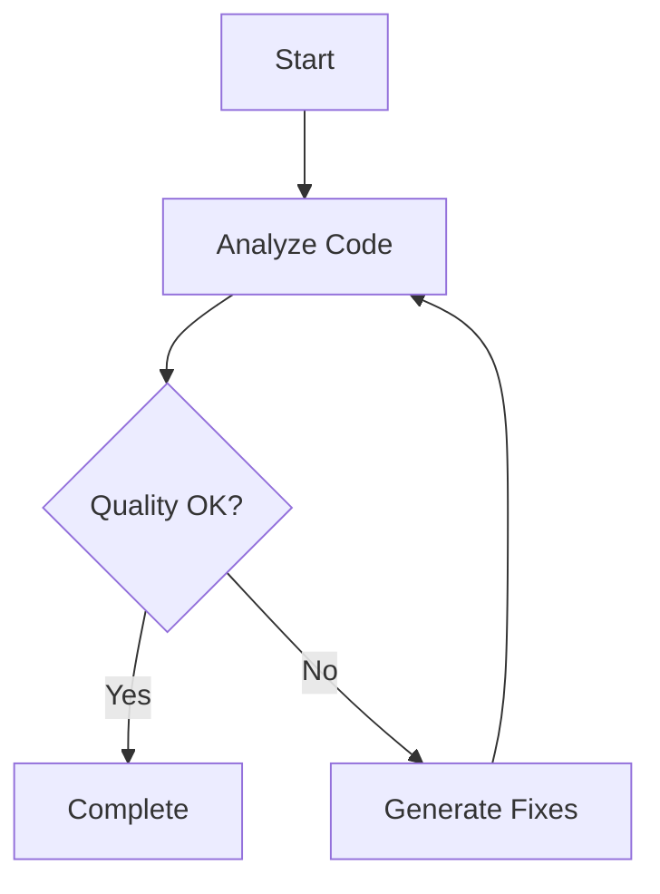

# Flow-Based Prompting Examples

> Advanced chaining strategies and multi-step prompt workflows

## Overview

Flow-based prompting enables complex, multi-step workflows by chaining prompts together, managing dependencies, and orchestrating parallel or sequential execution.

## Core Concepts

### Sequential Flows

Execute steps one after another, passing outputs between steps:

```typescript
{
  "chainName": "code-review-workflow",
  "executionStrategy": "sequential",
  "steps": [
    {
      "name": "analyze-code",
      "prompt": "Analyze code for quality issues",
      "outputKey": "analysisResults"
    },
    {
      "name": "generate-recommendations",
      "prompt": "Based on {{analysisResults}}, generate actionable recommendations",
      "dependencies": ["analyze-code"],
      "outputKey": "recommendations"
    },
    {
      "name": "create-tasks",
      "prompt": "Convert {{recommendations}} into sprint tasks",
      "dependencies": ["generate-recommendations"]
    }
  ]
}
```

### Parallel Flows

Execute independent steps simultaneously for efficiency:

```typescript
{
  "chainName": "comprehensive-audit",
  "executionStrategy": "parallel-where-possible",
  "steps": [
    {
      "name": "security-scan",
      "prompt": "Scan for security vulnerabilities"
    },
    {
      "name": "performance-analysis",
      "prompt": "Analyze performance bottlenecks"
    },
    {
      "name": "code-quality",
      "prompt": "Evaluate code quality metrics"
    },
    {
      "name": "consolidate-results",
      "prompt": "Merge findings from all scans",
      "dependencies": ["security-scan", "performance-analysis", "code-quality"]
    }
  ]
}
```

### Conditional Branching

Route execution based on conditions:

```typescript
{
  "flowName": "adaptive-testing",
  "nodes": [
    {
      "id": "run-tests",
      "type": "prompt",
      "name": "Execute Test Suite"
    },
    {
      "id": "check-coverage",
      "type": "condition",
      "name": "Coverage >= 80%?"
    },
    {
      "id": "generate-more-tests",
      "type": "prompt",
      "name": "Generate Additional Tests"
    },
    {
      "id": "complete",
      "type": "prompt",
      "name": "Mark as Complete"
    }
  ],
  "edges": [
    { "from": "run-tests", "to": "check-coverage" },
    { "from": "check-coverage", "to": "complete", "condition": "coverage >= 80" },
    { "from": "check-coverage", "to": "generate-more-tests", "condition": "coverage < 80" },
    { "from": "generate-more-tests", "to": "run-tests" }
  ]
}
```

## Practical Examples

### Example 1: Full-Stack Feature Development

```typescript
{
  "chainName": "feature-development-pipeline",
  "description": "End-to-end feature implementation workflow",
  "steps": [
    {
      "name": "requirements-analysis",
      "prompt": "Analyze requirements and extract user stories",
      "outputKey": "userStories"
    },
    {
      "name": "architecture-design",
      "prompt": "Design architecture for {{userStories}}",
      "dependencies": ["requirements-analysis"],
      "outputKey": "architecture"
    },
    {
      "name": "api-design",
      "prompt": "Design REST API based on {{architecture}}",
      "dependencies": ["architecture-design"],
      "outputKey": "apiSpec"
    },
    {
      "name": "security-review",
      "prompt": "Review {{apiSpec}} for security concerns",
      "dependencies": ["api-design"],
      "outputKey": "securityFindings"
    },
    {
      "name": "implementation-plan",
      "prompt": "Create implementation plan considering {{architecture}} and {{securityFindings}}",
      "dependencies": ["architecture-design", "security-review"],
      "outputKey": "plan"
    },
    {
      "name": "generate-tests",
      "prompt": "Generate test cases for {{apiSpec}}",
      "dependencies": ["api-design"],
      "outputKey": "testCases"
    },
    {
      "name": "create-documentation",
      "prompt": "Generate documentation from {{architecture}}, {{apiSpec}}, and {{testCases}}",
      "dependencies": ["architecture-design", "api-design", "generate-tests"]
    }
  ]
}
```

### Example 2: Code Migration Workflow

```typescript
{
  "flowName": "code-migration-flow",
  "description": "Migrate code to new framework version",
  "nodes": [
    {
      "id": "analyze-dependencies",
      "type": "prompt",
      "name": "Analyze Current Dependencies"
    },
    {
      "id": "identify-breaking-changes",
      "type": "prompt",
      "name": "Identify Breaking Changes"
    },
    {
      "id": "create-migration-plan",
      "type": "prompt",
      "name": "Create Migration Strategy"
    },
    {
      "id": "migrate-code",
      "type": "prompt",
      "name": "Perform Code Migration"
    },
    {
      "id": "run-tests",
      "type": "prompt",
      "name": "Execute Test Suite"
    },
    {
      "id": "test-passed",
      "type": "condition",
      "name": "All Tests Pass?"
    },
    {
      "id": "fix-issues",
      "type": "prompt",
      "name": "Fix Failing Tests"
    },
    {
      "id": "generate-changelog",
      "type": "prompt",
      "name": "Generate Migration Changelog"
    }
  ],
  "edges": [
    { "from": "analyze-dependencies", "to": "identify-breaking-changes" },
    { "from": "identify-breaking-changes", "to": "create-migration-plan" },
    { "from": "create-migration-plan", "to": "migrate-code" },
    { "from": "migrate-code", "to": "run-tests" },
    { "from": "run-tests", "to": "test-passed" },
    { "from": "test-passed", "to": "generate-changelog", "condition": "all_pass" },
    { "from": "test-passed", "to": "fix-issues", "condition": "some_fail" },
    { "from": "fix-issues", "to": "run-tests" }
  ]
}
```

### Example 3: Documentation Generation Pipeline

```typescript
{
  "chainName": "doc-generation-pipeline",
  "executionStrategy": "parallel-where-possible",
  "steps": [
    {
      "name": "extract-api-signatures",
      "prompt": "Extract all public API signatures from codebase",
      "outputKey": "apiSignatures"
    },
    {
      "name": "extract-types",
      "prompt": "Extract TypeScript type definitions",
      "outputKey": "types"
    },
    {
      "name": "extract-examples",
      "prompt": "Find usage examples from tests",
      "outputKey": "examples"
    },
    {
      "name": "generate-api-docs",
      "prompt": "Generate API documentation from {{apiSignatures}} and {{types}}",
      "dependencies": ["extract-api-signatures", "extract-types"],
      "outputKey": "apiDocs"
    },
    {
      "name": "generate-tutorial",
      "prompt": "Create tutorial using {{examples}}",
      "dependencies": ["extract-examples"],
      "outputKey": "tutorial"
    },
    {
      "name": "create-index",
      "prompt": "Build documentation index from {{apiDocs}} and {{tutorial}}",
      "dependencies": ["generate-api-docs", "generate-tutorial"]
    }
  ]
}
```

## Error Handling Patterns

### Retry Strategy

```typescript
{
  "name": "api-call-with-retry",
  "prompt": "Call external API",
  "errorHandling": "retry",
  "retryConfig": {
    "maxAttempts": 3,
    "backoff": "exponential"
  }
}
```

### Graceful Degradation

```typescript
{
  "name": "optional-enhancement",
  "prompt": "Add optional AI suggestions",
  "errorHandling": "skip",
  "fallback": "Continue without suggestions"
}
```

### Abort on Critical Failure

```typescript
{
  "name": "security-validation",
  "prompt": "Validate security requirements",
  "errorHandling": "abort",
  "reason": "Cannot proceed with security issues"
}
```

## Loop Constructs

### Processing Lists

```typescript
{
  "id": "process-files",
  "type": "loop",
  "name": "Process Each File",
  "config": {
    "items": "{{fileList}}",
    "action": {
      "type": "prompt",
      "name": "Analyze File",
      "prompt": "Analyze {{item}} for issues"
    }
  }
}
```

### Iterative Refinement

```typescript
{
  "flowName": "iterative-optimization",
  "nodes": [
    {
      "id": "optimize",
      "type": "prompt",
      "name": "Optimize Code"
    },
    {
      "id": "benchmark",
      "type": "prompt",
      "name": "Run Benchmarks"
    },
    {
      "id": "check-threshold",
      "type": "condition",
      "name": "Performance Acceptable?"
    },
    {
      "id": "done",
      "type": "prompt",
      "name": "Finalize"
    }
  ],
  "edges": [
    { "from": "optimize", "to": "benchmark" },
    { "from": "benchmark", "to": "check-threshold" },
    { "from": "check-threshold", "to": "done", "condition": "meets_threshold" },
    { "from": "check-threshold", "to": "optimize", "condition": "needs_improvement" }
  ]
}
```

## Best Practices

### 1. Keep Steps Focused

Each step should have a single, clear responsibility:

- ✅ "Extract user authentication logic"
- ❌ "Analyze code and generate tests and create documentation"

### 2. Manage Dependencies Explicitly

Always declare dependencies between steps to ensure correct execution order.

### 3. Use Descriptive Names

Make flow steps self-documenting:

- ✅ "validate-security-headers"
- ❌ "step1"

### 4. Handle Errors Appropriately

Choose error handling based on step criticality:

- **Critical steps**: `abort`
- **Retryable operations**: `retry`
- **Optional enhancements**: `skip`

### 5. Leverage Parallelization

Identify independent steps that can run simultaneously to reduce overall execution time.

### 6. Validate Outputs

Include validation steps after critical operations to ensure data integrity.

## Tool Integration

### Using with Prompt Chaining Builder

```typescript
import { promptChainingBuilder } from '@mcp-ai-agent-guidelines';

const result = await promptChainingBuilder({
  chainName: "my-workflow",
  steps: [/* ... */],
  executionStrategy: "sequential"
});
```

### Using with Prompt Flow Builder

```typescript
import { promptFlowBuilder } from '@mcp-ai-agent-guidelines';

const flow = await promptFlowBuilder({
  flowName: "my-flow",
  nodes: [/* ... */],
  edges: [/* ... */],
  outputFormat: "mermaid"
});
```

## Visualization

Both builders support Mermaid diagram generation for visualizing flows:



## Related Resources

- [Prompting Hierarchy Guide](./PROMPTING_HIERARCHY.md) - Understanding prompt levels
- [AI Interaction Tips](./AI_INTERACTION_TIPS.md) - Best practices for AI interaction
- [Tools Reference](./TOOLS_REFERENCE.md) - Complete tool documentation
- [Mermaid Diagram Examples](./MERMAID_DIAGRAM_EXAMPLES.md) - Flow visualization

## Conclusion

Flow-based prompting enables sophisticated, multi-step workflows with proper dependency management, error handling, and execution strategies. Use these patterns to build robust, maintainable AI workflows.
