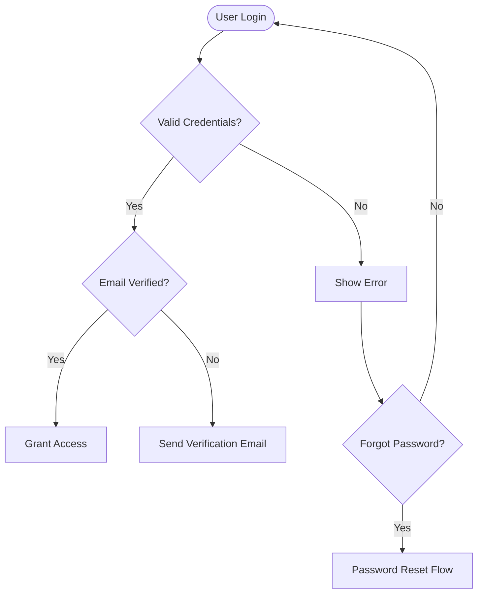
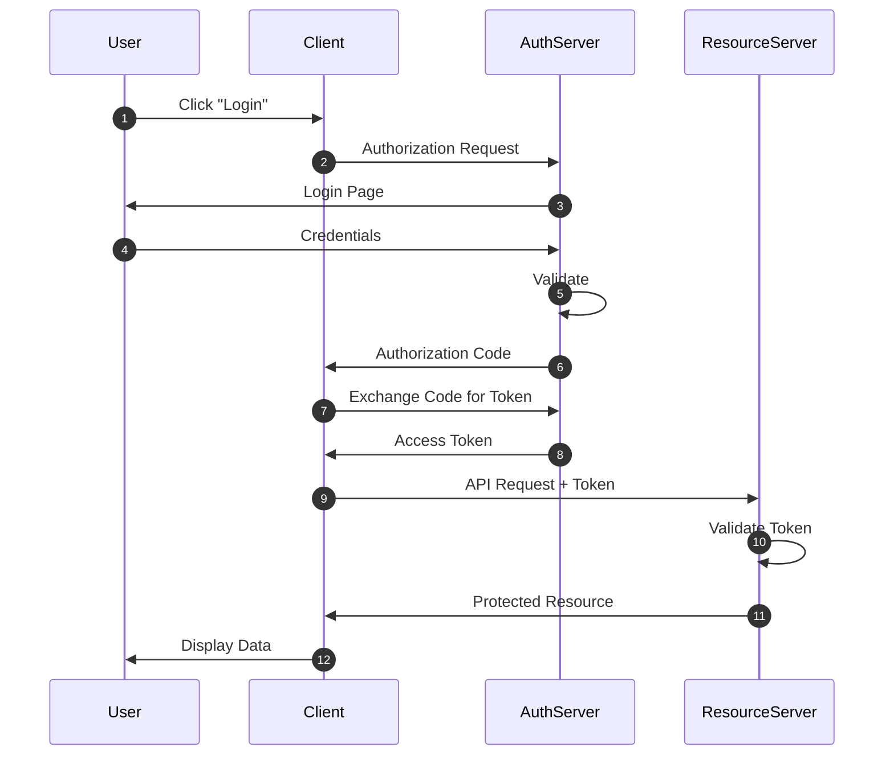
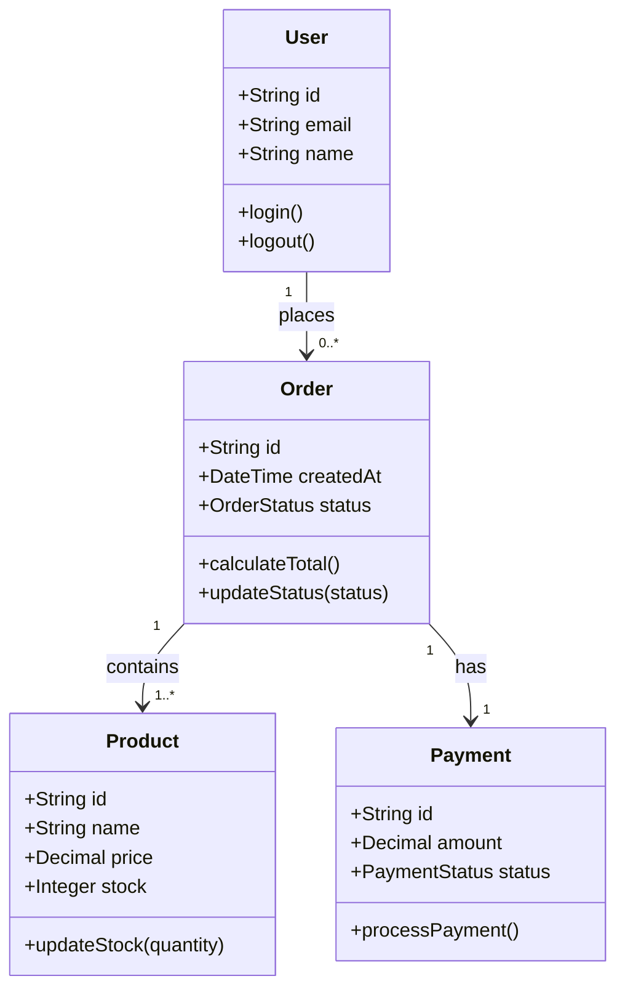
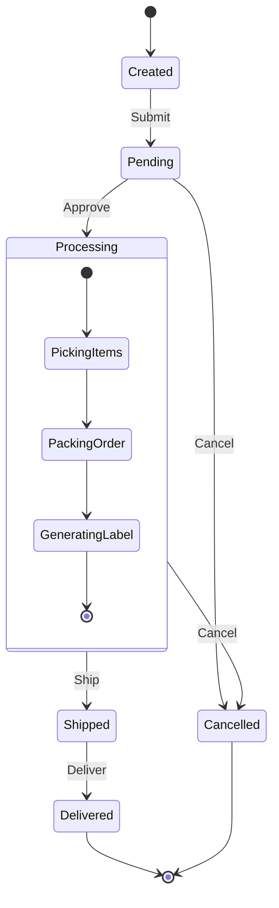
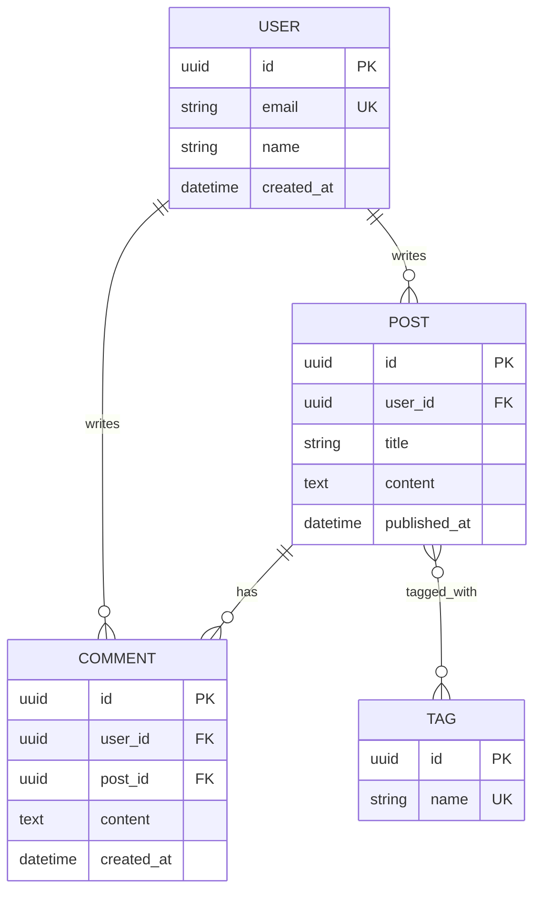
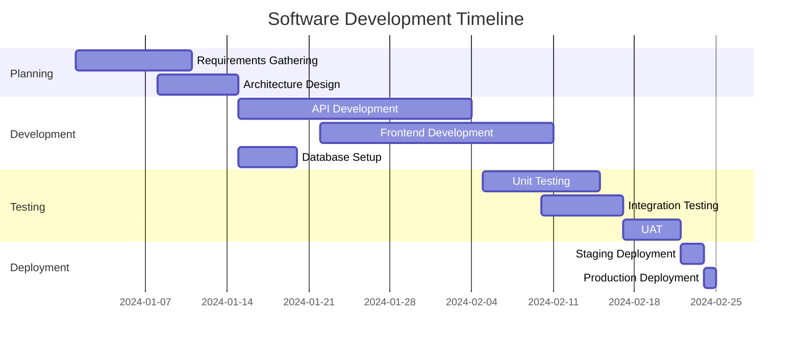
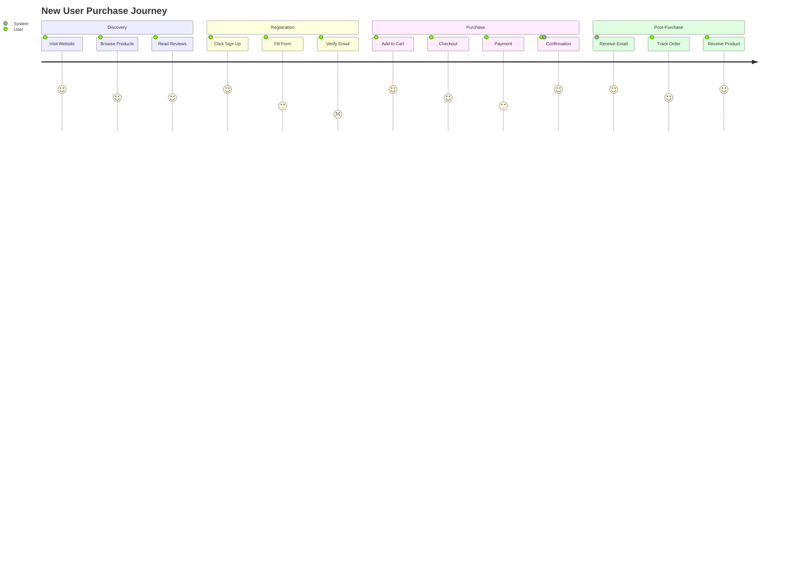
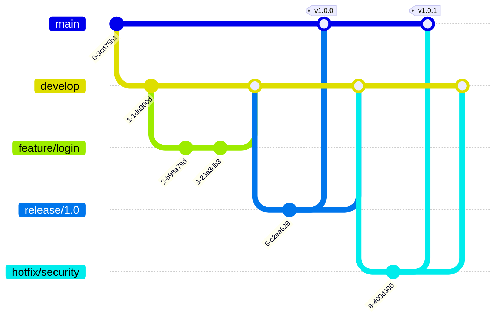

# Mermaid Diagram Examples

> Create flowcharts, sequence diagrams, ER diagrams, and more with AI-powered generation

## Overview

The `mermaid-diagram-generator` tool creates Mermaid diagrams from text descriptions, supporting 12+ diagram types with automatic validation, repair, and best practices enforcement.

## Supported Diagram Types

### 1. Flowcharts

**Use Case**: Process flows, decision trees, algorithms

**Example**:
```typescript
const diagram = await mermaidDiagramGenerator({
  description: "User authentication flow with email verification and password reset",
  diagramType: "flowchart",
  direction: "TD"
});
```

**Output**:


### 2. Sequence Diagrams

**Use Case**: API interactions, service communication, request/response flows

**Example**:
```typescript
const diagram = await mermaidDiagramGenerator({
  description: "OAuth 2.0 authorization code flow between client, auth server, and resource server",
  diagramType: "sequence",
  advancedFeatures: { autonumber: true }
});
```

**Output**:


### 3. Class Diagrams

**Use Case**: Object-oriented design, data models, inheritance hierarchies

**Example**:
```typescript
const diagram = await mermaidDiagramGenerator({
  description: "E-commerce system with User, Product, Order, and Payment classes",
  diagramType: "class"
});
```

**Output**:


### 4. State Diagrams

**Use Case**: Finite state machines, workflow states, object lifecycles

**Example**:
```typescript
const diagram = await mermaidDiagramGenerator({
  description: "Order processing states from creation to delivery",
  diagramType: "state"
});
```

**Output**:


### 5. Entity Relationship Diagrams

**Use Case**: Database schema, data relationships

**Example**:
```typescript
const diagram = await mermaidDiagramGenerator({
  description: "Blog database with users, posts, comments, and tags",
  diagramType: "er"
});
```

**Output**:


### 6. Gantt Charts

**Use Case**: Project timelines, sprint planning, task scheduling

**Example**:
```typescript
const diagram = await mermaidDiagramGenerator({
  description: "Software project timeline with design, development, testing, and deployment phases",
  diagramType: "gantt"
});
```

**Output**:


### 7. User Journey

**Use Case**: Customer experience mapping, user flows

**Example**:
```typescript
const diagram = await mermaidDiagramGenerator({
  description: "User journey for signing up and making first purchase",
  diagramType: "journey"
});
```

**Output**:


### 8. Git Graph

**Use Case**: Branch visualization, merge strategies

**Example**:
```typescript
const diagram = await mermaidDiagramGenerator({
  description: "Git flow with feature branches, releases, and hotfixes",
  diagramType: "git-graph"
});
```

**Output**:


## Advanced Features

### Custom Styling

```typescript
const diagram = await mermaidDiagramGenerator({
  description: "Styled flowchart with custom colors",
  diagramType: "flowchart",
  customStyles: `
    classDef errorClass fill:#f96,stroke:#333,stroke-width:2px
    classDef successClass fill:#9f6,stroke:#333,stroke-width:2px
    class Error errorClass
    class Success successClass
  `
});
```

### Accessibility

```typescript
const diagram = await mermaidDiagramGenerator({
  description: "User authentication flow",
  diagramType: "flowchart",
  accTitle: "User Authentication Process",
  accDescr: "Flowchart showing the steps a user takes to authenticate, including credential validation and email verification"
});
```

### Auto-Repair

```typescript
const diagram = await mermaidDiagramGenerator({
  description: "Complex diagram that might have syntax issues",
  diagramType: "flowchart",
  repair: true,  // Automatically fix common syntax errors
  strict: true   // Never emit invalid diagrams
});
```

## Practical Examples

### Example 1: API Design Documentation

```typescript
const apiFlow = await mermaidDiagramGenerator({
  description: `
    REST API flow for creating a new blog post:
    1. Client sends POST request to /api/posts
    2. API Gateway validates JWT token
    3. Auth Service verifies user permissions
    4. Post Service validates post content
    5. Database stores the post
    6. Cache is updated
    7. Event is published to message queue
    8. Response sent back to client
  `,
  diagramType: "sequence",
  direction: "LR"
});
```

### Example 2: Database Schema

```typescript
const schema = await mermaidDiagramGenerator({
  description: `
    Multi-tenant SaaS database:
    - Tenants table (id, name, plan)
    - Users table (id, tenant_id, email, role)
    - Projects table (id, tenant_id, name)
    - Tasks table (id, project_id, user_id, status)
    Each tenant has many users and projects
    Each project has many tasks
    Each task belongs to one user
  `,
  diagramType: "er"
});
```

### Example 3: State Machine

```typescript
const stateMachine = await mermaidDiagramGenerator({
  description: `
    Document approval workflow:
    - Draft: author can edit
    - Submitted: locked for review
    - In Review: reviewer can approve/reject
    - Approved: ready for publish
    - Published: live, read-only
    - Rejected: back to draft with feedback
    Include transitions for each state change
  `,
  diagramType: "state"
});
```

### Example 4: Sprint Planning

```typescript
const sprint = await mermaidDiagramGenerator({
  description: `
    2-week sprint timeline:
    Sprint Planning (Day 1, 2 hours)
    Development (Days 2-9, parallel streams):
      - Backend API development
      - Frontend implementation
      - Database migrations
    Testing (Days 10-12):
      - Unit tests
      - Integration tests
    Code Review (Days 11-13)
    Deployment (Day 14)
    Retrospective (Day 14)
  `,
  diagramType: "gantt"
});
```

## Best Practices

### 1. Clear Descriptions

```typescript
// ❌ Vague
"Show how the system works"

// ✅ Specific
"Show the user registration flow including email verification, with decision points for valid/invalid input and duplicate email handling"
```

### 2. Choose Right Diagram Type

| Need to Show... | Use Diagram Type |
|----------------|------------------|
| Process flow | Flowchart |
| API calls | Sequence |
| Data model | Class or ER |
| State transitions | State |
| Timeline | Gantt |
| User experience | Journey |
| Git workflow | Git-graph |

### 3. Keep It Simple

```typescript
// ❌ Too complex
"Show all 50 microservices and their interactions"

// ✅ Focused
"Show the authentication flow between API Gateway, Auth Service, and User Service"
```

### 4. Use Consistent Naming

```typescript
const diagram = await mermaidDiagramGenerator({
  description: `
    Use consistent naming:
    - Classes: PascalCase (UserService)
    - Functions: camelCase (validateUser)
    - Constants: UPPER_SNAKE_CASE (MAX_RETRIES)
    - Database: snake_case (user_profiles)
  `,
  diagramType: "class"
});
```

## Integration with Other Tools

### Design Assistant + Mermaid

```typescript
// 1. Design system architecture
const design = await designAssistant({
  action: "start-session",
  config: {
    goal: "Design microservices architecture"
  }
});

// 2. Generate diagram from design
const diagram = await mermaidDiagramGenerator({
  description: design.architecture,
  diagramType: "flowchart"
});
```

### Documentation Generator + Mermaid

```typescript
// 1. Analyze codebase
const analysis = await semanticCodeAnalyzer({
  codeContent: source,
  analysisType: "structure"
});

// 2. Generate class diagram
const classDiagram = await mermaidDiagramGenerator({
  description: `Class structure: ${analysis.classes.join(', ')}`,
  diagramType: "class"
});
```

## Troubleshooting

### Invalid Syntax

```typescript
// Enable auto-repair
const diagram = await mermaidDiagramGenerator({
  description: "...",
  diagramType: "flowchart",
  repair: true,
  strict: true  // Fallback to minimal valid diagram if repair fails
});
```

### Complex Diagrams

```typescript
// Break into sub-diagrams
const overview = await mermaidDiagramGenerator({
  description: "High-level system overview",
  diagramType: "flowchart"
});

const detailAuth = await mermaidDiagramGenerator({
  description: "Detailed authentication subsystem",
  diagramType: "sequence"
});

const detailData = await mermaidDiagramGenerator({
  description: "Detailed data model",
  diagramType: "er"
});
```

## Related Resources

- [Flow Prompting Examples](./FLOW_PROMPTING_EXAMPLES.md) - Workflow visualization
- [Design Assistant](./tools/design-assistant.md) - Architecture design
- [AI Interaction Tips](./AI_INTERACTION_TIPS.md) - Better diagram descriptions

## Conclusion

Mermaid diagrams provide powerful visualization capabilities for documentation, design, and communication. By using the diagram generator tool with clear descriptions and appropriate diagram types, you can create professional, maintainable visual documentation efficiently.
