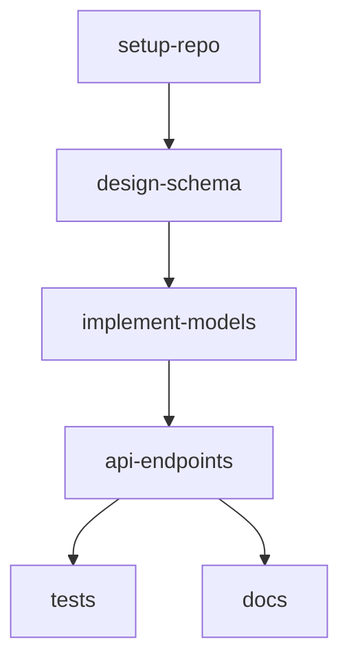

# Sprint Planning Reliability

> Dependency-aware timeline calculation and agile planning optimization

## Overview

The Sprint Timeline Calculator provides deterministic, dependency-aware sprint planning that accounts for team capacity, task dependencies, and realistic constraints. This tool helps teams create reliable, achievable sprint plans.

## Core Features

### 1. Dependency-Aware Scheduling

Traditional sprint planning often ignores task dependencies, leading to unrealistic timelines. This tool enforces dependency constraints:

```typescript
const result = await sprintTimelineCalculator({
  tasks: [
    {
      id: "api-design",
      estimate: 5,
      dependencies: []
    },
    {
      id: "api-implementation",
      estimate: 8,
      dependencies: ["api-design"] // Can't start until design is done
    },
    {
      id: "frontend-integration",
      estimate: 5,
      dependencies: ["api-implementation"]
    },
    {
      id: "testing",
      estimate: 3,
      dependencies: ["frontend-integration"]
    }
  ],
  teamSize: 3,
  sprintLength: 10,
  velocity: 20
});
```

**Result**:
- Tasks scheduled in valid dependency order
- Realistic timeline accounting for blockers
- Team capacity considered
- Sprint boundaries respected

### 2. Capacity Planning

Calculates realistic capacity based on:

- **Team Size**: Number of developers available
- **Sprint Length**: Duration in working days
- **Velocity**: Historical story points per sprint
- **Buffer**: Time for meetings, code review, unexpected issues

```typescript
// Example capacity calculation
Team: 3 developers
Sprint: 10 days
Velocity: 20 points/sprint
Effective capacity: 6.7 points/developer/sprint

// With 20% buffer for overhead
Adjusted capacity: 5.3 points/developer/sprint
Total team capacity: 16 points/sprint
```

### 3. Optimization Strategies

#### Greedy Bin-Packing (Default)

Deterministic algorithm that:
1. Sorts tasks by dependencies (topological order)
2. Assigns tasks to earliest available sprint
3. Respects team capacity limits
4. Ensures dependencies are met

**Pros**: Fast, deterministic, easy to understand
**Cons**: May not find globally optimal solution

#### Linear Programming (Experimental)

Uses MILP (Mixed Integer Linear Programming) for optimal scheduling:
- Minimizes total sprints required
- Maximizes team utilization
- Balances workload across team members

**Pros**: Finds optimal solution
**Cons**: Slower for large task sets

```typescript
const result = await sprintTimelineCalculator({
  tasks: [...],
  teamSize: 5,
  optimizationStrategy: "linear-programming" // vs "greedy"
});
```

## Usage Examples

### Example 1: Simple Sprint Planning

```typescript
const plan = await sprintTimelineCalculator({
  tasks: [
    { id: "setup-repo", estimate: 2, dependencies: [] },
    { id: "design-schema", estimate: 3, dependencies: ["setup-repo"] },
    { id: "implement-models", estimate: 5, dependencies: ["design-schema"] },
    { id: "api-endpoints", estimate: 8, dependencies: ["implement-models"] },
    { id: "tests", estimate: 3, dependencies: ["api-endpoints"] },
    { id: "docs", estimate: 2, dependencies: ["api-endpoints"] }
  ],
  teamSize: 2,
  sprintLength: 10,
  velocity: 15
});

// Output:
// Sprint 1: setup-repo, design-schema, implement-models (10 points)
// Sprint 2: api-endpoints (8 points)
// Sprint 3: tests, docs (5 points)
```

### Example 2: Complex Dependencies

```typescript
const plan = await sprintTimelineCalculator({
  tasks: [
    // Backend track
    { id: "api-auth", estimate: 5, dependencies: [] },
    { id: "api-users", estimate: 8, dependencies: ["api-auth"] },
    { id: "api-posts", estimate: 8, dependencies: ["api-auth"] },

    // Frontend track (parallel to backend initially)
    { id: "ui-setup", estimate: 3, dependencies: [] },
    { id: "ui-components", estimate: 5, dependencies: ["ui-setup"] },

    // Integration (depends on both tracks)
    { id: "integration", estimate: 5, dependencies: ["api-users", "api-posts", "ui-components"] },

    // Final testing
    { id: "e2e-tests", estimate: 3, dependencies: ["integration"] }
  ],
  teamSize: 4,
  sprintLength: 10,
  velocity: 25
});

// Automatically detects parallel work opportunities:
// Sprint 1: api-auth, ui-setup, ui-components (13 points)
// Sprint 2: api-users, api-posts (16 points)
// Sprint 3: integration, e2e-tests (8 points)
```

### Example 3: Large Team, High Velocity

```typescript
const plan = await sprintTimelineCalculator({
  tasks: [
    // 20 tasks with complex dependencies
    { id: "task-1", estimate: 5, dependencies: [] },
    { id: "task-2", estimate: 8, dependencies: ["task-1"] },
    // ... more tasks
  ],
  teamSize: 8,
  sprintLength: 14,
  velocity: 60
});
```

## Output Format

### Sprint Allocation

```json
{
  "sprints": [
    {
      "sprintNumber": 1,
      "tasks": ["setup-repo", "design-schema", "implement-models"],
      "totalPoints": 10,
      "capacity": 15,
      "utilization": 0.67
    },
    {
      "sprintNumber": 2,
      "tasks": ["api-endpoints"],
      "totalPoints": 8,
      "capacity": 15,
      "utilization": 0.53
    }
  ],
  "metrics": {
    "totalSprints": 3,
    "averageUtilization": 0.61,
    "estimatedCompletion": "2024-04-15"
  },
  "warnings": [
    "Sprint 2 has low utilization (53%)",
    "Consider parallelizing more work"
  ]
}
```

### Dependency Graph

Visualizes task dependencies:



### Critical Path

Identifies bottleneck sequence:

```
Critical Path: setup-repo → design-schema → implement-models → api-endpoints → tests
Duration: 21 points
Estimated: 3 sprints
```

## Best Practices

### 1. Accurate Estimation

Use consistent estimation units:

- **Story Points**: Relative sizing (Fibonacci: 1, 2, 3, 5, 8, 13)
- **Ideal Days**: Time without interruptions
- **Hours**: Detailed task breakdown

**Recommendation**: Story points with team calibration

### 2. Declare All Dependencies

Explicitly list all dependencies, even obvious ones:

```typescript
// ❌ Implicit dependency
{ id: "tests", estimate: 3, dependencies: [] }

// ✅ Explicit dependency
{ id: "tests", estimate: 3, dependencies: ["implementation"] }
```

### 3. Account for Uncertainty

Add buffer for unknowns:

```typescript
// For risky or novel work, inflate estimates
{
  id: "new-tech-spike",
  estimate: 8, // Base: 5, Buffer: 3
  dependencies: [],
  risk: "high" // Document why
}
```

### 4. Regular Calibration

Update velocity based on actual delivery:

```typescript
// Historical velocity
Sprint 1: 18 points delivered
Sprint 2: 22 points delivered
Sprint 3: 19 points delivered
Average: 19.7 points

// Use for planning
const plan = await sprintTimelineCalculator({
  velocity: 20, // Rounded from historical average
  // ...
});
```

### 5. Balance Utilization

Aim for 70-80% utilization to allow for:
- Code reviews
- Bug fixes
- Meetings
- Unplanned work

```typescript
// ❌ Over-planned (100% utilization)
Sprint capacity: 20 points
Planned work: 20 points
Risk: High, no buffer

// ✅ Realistic planning (75% utilization)
Sprint capacity: 20 points
Planned work: 15 points
Buffer: 5 points for overhead
```

## Handling Common Scenarios

### Scenario 1: Task Exceeds Sprint Capacity

```typescript
{
  id: "large-refactor",
  estimate: 25, // Bigger than single sprint
  dependencies: []
}

// Solution: Break into subtasks
{
  id: "refactor-phase1",
  estimate: 10,
  dependencies: []
},
{
  id: "refactor-phase2",
  estimate: 10,
  dependencies: ["refactor-phase1"]
},
{
  id: "refactor-phase3",
  estimate: 5,
  dependencies: ["refactor-phase2"]
}
```

### Scenario 2: Circular Dependencies

```typescript
// ❌ Invalid: circular dependency
{ id: "A", dependencies: ["B"] },
{ id: "B", dependencies: ["A"] }

// ✅ Fixed: break the cycle
{ id: "A-interface", dependencies: [] },
{ id: "B", dependencies: ["A-interface"] },
{ id: "A-impl", dependencies: ["B"] }
```

### Scenario 3: Changing Team Size

```typescript
// Mid-project team change
const initialPlan = await sprintTimelineCalculator({
  teamSize: 3,
  // Sprints 1-2
});

const adjustedPlan = await sprintTimelineCalculator({
  teamSize: 5, // Team grew
  // Sprints 3+
  // Remaining tasks only
});
```

### Scenario 4: Sprint Carryover

```typescript
// Task not completed in Sprint 1
const sprint2Plan = await sprintTimelineCalculator({
  tasks: [
    // Carry over from Sprint 1
    { id: "incomplete-task", estimate: 3, dependencies: [] },

    // New Sprint 2 tasks
    { id: "new-task", estimate: 5, dependencies: ["incomplete-task"] }
  ],
  // ...
});
```

## Integration with Other Tools

### Gap Analysis → Sprint Planning

```typescript
// 1. Identify gaps
const gaps = await gapFrameworksAnalyzers({
  frameworks: ["capability"],
  currentState: "No mobile app",
  desiredState: "Full mobile app"
});

// 2. Convert gaps to tasks
const tasks = gaps.actions.map(action => ({
  id: action.id,
  estimate: action.effort,
  dependencies: action.prerequisites
}));

// 3. Create sprint plan
const plan = await sprintTimelineCalculator({
  tasks,
  teamSize: 4,
  velocity: 25
});
```

### Strategy Frameworks → Sprint Planning

```typescript
// 1. Define strategic objectives
const strategy = await strategyFrameworksBuilder({
  frameworks: ["objectives"],
  context: "Q1 2024 product goals"
});

// 2. Break down into tasks
const tasks = strategy.objectives.map(obj => ({
  id: obj.id,
  estimate: obj.estimatedEffort,
  dependencies: []
}));

// 3. Plan sprints
const plan = await sprintTimelineCalculator({ tasks });
```

## Metrics and Reporting

### Velocity Tracking

Monitor sprint-over-sprint velocity:

```
Sprint 1: 18 points (planned: 20)
Sprint 2: 22 points (planned: 20)
Sprint 3: 19 points (planned: 20)
Average velocity: 19.7 points
Variance: ±2.1 points
```

### Dependency Impact

Measure how dependencies affect timeline:

```
Without dependencies: 2 sprints (all parallel)
With dependencies: 4 sprints (sequential constraints)
Dependency overhead: 100%
```

### Utilization Analysis

```
Average sprint utilization: 72%
Best sprint: Sprint 2 (85%)
Worst sprint: Sprint 4 (58%)
Recommendation: Improve task parallelization
```

## Related Resources

- [Gap Frameworks Analyzers](./tools/gap-frameworks-analyzers.md) - Identify gaps and create tasks
- [Strategy Frameworks Builder](./tools/strategy-frameworks-builder.md) - Strategic planning
- [AI Interaction Tips](./AI_INTERACTION_TIPS.md) - Effective tool usage

## Conclusion

The Sprint Timeline Calculator provides realistic, dependency-aware sprint planning that helps teams create achievable plans, identify bottlenecks, and optimize delivery schedules. By accounting for team capacity, task dependencies, and real-world constraints, it produces reliable timelines that teams can confidently commit to.
