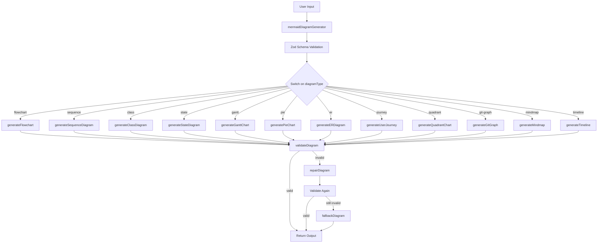
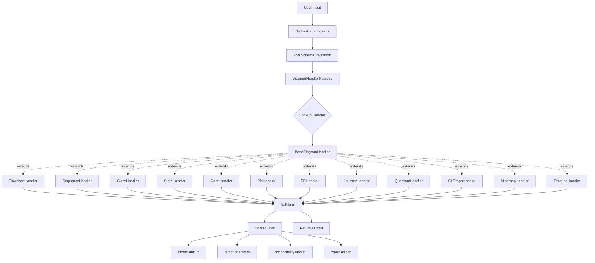

# ADR-0002: Refactor Mermaid Diagram Generator Using Strategy Pattern

## Status
Proposed

## Context

The `src/tools/mermaid-diagram-generator.ts` file has become a significant maintenance challenge due to its monolithic structure and high conditional complexity:

### Problems with Current Approach

1. **Excessive Conditional Complexity**: The file contains **87 if statements**, the highest in the codebase, making it difficult to understand, test, and maintain.

2. **Large File Size**: At **1,342 lines**, the file violates the Single Responsibility Principle by handling 12 different diagram generation strategies in a single location.

3. **Low Branch Coverage**: The high number of conditionals (87) creates a branch coverage challenge. Achieving the project's 90%+ coverage target is extremely difficult when testing a monolithic file with numerous intertwined code paths.

4. **Difficult Testing**: Integration tests must exercise the entire file, making it hard to:
   - Test edge cases for specific diagram types
   - Isolate failures to specific diagram generators
   - Write focused unit tests

5. **Maintenance Burden**: When modifying one diagram type (e.g., flowchart), developers must navigate through all 12 generator functions, increasing cognitive load and risk of unintended side effects.

6. **Onboarding Friction**: New contributors struggle to understand the file structure and locate relevant code for their diagram type of interest.

### Current Architecture



### Supported Diagram Types

The generator currently supports 12 diagram types:
1. **flowchart** - Flow diagrams with nodes and edges
2. **sequence** - Sequence diagrams for interactions
3. **class** - UML class diagrams
4. **state** - State machines
5. **gantt** - Project timelines
6. **pie** - Pie charts
7. **er** - Entity-relationship diagrams
8. **journey** - User journey maps
9. **quadrant** - Quadrant charts
10. **git-graph** - Git commit graphs
11. **mindmap** - Mind maps
12. **timeline** - Timeline diagrams

### Low Coupling Risk

Importantly, this refactoring has **low coupling risk**:
- The mermaid generator is self-contained with no design system dependencies
- It's used as a standalone MCP tool
- External dependencies are limited to the `mermaid` validation library (optional)
- No cross-tool dependencies that would be affected by internal restructuring

### Industry Patterns

The Strategy pattern is well-established for handling multiple algorithm variations:

- **Payment Processors**: Different payment methods (credit card, PayPal, crypto) use Strategy pattern
- **Compression Libraries**: Different algorithms (gzip, brotli, deflate) as strategies
- **Rendering Engines**: Different output formats (PDF, PNG, SVG) as strategies
- **Code Formatters**: Different language formatters (JS, Python, Go) as strategies

Our current monolithic approach would be equivalent to having a single giant `processPayment()` function with a switch statement for all payment types.

## Decision

**Adopt the Strategy pattern**: Decompose the monolithic generator into a modular architecture with individual handler classes for each diagram type.

### Proposed Architecture



### Directory Structure

```
src/tools/mermaid/
├── index.ts                         # Main orchestrator (~50 lines)
├── types.ts                         # Shared types (DiagramConfig, ValidationResult)
├── validator.ts                     # Mermaid syntax validation
├── registry.ts                      # Handler registry pattern
├── handlers/
│   ├── base.handler.ts              # Abstract base class (~30 lines)
│   ├── flowchart.handler.ts         # ~100 lines
│   ├── sequence.handler.ts          # ~100 lines
│   ├── class.handler.ts             # ~100 lines
│   ├── state.handler.ts             # ~100 lines
│   ├── gantt.handler.ts             # ~100 lines
│   ├── pie.handler.ts               # ~80 lines
│   ├── er.handler.ts                # ~100 lines
│   ├── journey.handler.ts           # ~90 lines
│   ├── quadrant.handler.ts          # ~90 lines
│   ├── git-graph.handler.ts         # ~90 lines
│   ├── mindmap.handler.ts           # ~90 lines
│   ├── timeline.handler.ts          # ~90 lines
│   └── index.ts                     # Handler exports
└── utils/
    ├── direction.utils.ts           # Direction handling (TD, TB, BT, LR, RL)
    ├── theme.utils.ts               # Theme processing
    ├── accessibility.utils.ts       # accTitle, accDescr
    └── repair.utils.ts              # Auto-repair logic
```

### Implementation Details

#### Base Handler Interface

```typescript
/**
 * Abstract base class for all diagram handlers.
 * Enforces consistent contract across all diagram types.
 */
export abstract class BaseDiagramHandler {
  /** Diagram type identifier (must match MermaidDiagramSchema enum) */
  abstract readonly diagramType: string;

  /**
   * Generate diagram code from description.
   * @param description - Natural language description of the diagram
   * @param theme - Optional theme name (default, dark, forest, neutral)
   * @param advancedFeatures - Type-specific advanced features
   * @returns Mermaid diagram code
   */
  abstract generate(
    description: string,
    theme?: string,
    advancedFeatures?: Record<string, unknown>
  ): string;

  /**
   * Apply theme to generated diagram.
   * Can be overridden by handlers with custom theme logic.
   */
  protected applyTheme(diagram: string, theme?: string): string {
    if (!theme) return diagram;
    return `%%{init: {'theme':'${theme}'}}%%\n${diagram}`;
  }

  /**
   * Validate input description.
   * Can be overridden by handlers with specific validation rules.
   */
  protected validateInput(description: string): void {
    if (!description || description.trim().length === 0) {
      throw new Error("Description cannot be empty");
    }
  }
}
```

#### Handler Registry

```typescript
/**
 * Registry pattern for handler lookup.
 * Provides O(1) handler retrieval by diagram type.
 */
export class DiagramHandlerRegistry {
  private handlers = new Map<string, BaseDiagramHandler>();

  /**
   * Register a handler for a specific diagram type.
   */
  register(handler: BaseDiagramHandler): void {
    if (this.handlers.has(handler.diagramType)) {
      throw new Error(`Handler already registered for type: ${handler.diagramType}`);
    }
    this.handlers.set(handler.diagramType, handler);
  }

  /**
   * Retrieve handler for diagram type.
   */
  get(type: string): BaseDiagramHandler {
    const handler = this.handlers.get(type);
    if (!handler) {
      throw new Error(`No handler registered for diagram type: ${type}`);
    }
    return handler;
  }

  /**
   * Check if handler exists for type.
   */
  has(type: string): boolean {
    return this.handlers.has(type);
  }
}
```

#### Orchestrator Flow

```typescript
// index.ts - Main orchestrator
export async function mermaidDiagramGenerator(args: unknown) {
  // 1. Normalize and validate input
  const input = MermaidDiagramSchema.parse(normalizeInput(args));

  // 2. Get handler from registry
  const handler = registry.get(input.diagramType);

  // 3. Generate diagram
  let diagram = handler.generate(
    input.description,
    input.theme,
    input.advancedFeatures
  );

  // 4. Apply accessibility metadata
  diagram = applyAccessibility(diagram, input.accTitle, input.accDescr);

  // 5. Validate and repair
  const validation = await validateDiagram(diagram);
  if (!validation.valid && input.repair) {
    diagram = repairDiagram(diagram);
  }

  // 6. Fallback if needed
  if (!validation.valid && input.strict) {
    diagram = fallbackDiagram();
  }

  // 7. Return formatted response
  return formatResponse(diagram, validation, input);
}
```

### Validation Flow

Validation, repair, and fallback remain cross-cutting concerns managed by the orchestrator:

1. **Input Validation** (Zod schema) - Orchestrator
2. **Handler Selection** - Registry lookup
3. **Diagram Generation** - Delegated to specific handler
4. **Syntax Validation** - Shared `validator.ts`
5. **Auto-Repair** - Shared `utils/repair.utils.ts`
6. **Fallback** - Orchestrator fallback logic

**Rationale**: These are cross-cutting concerns that apply uniformly to all diagram types. Handlers focus only on diagram-specific generation logic, keeping them simple and focused.

## Consequences

### Positive Consequences

✅ **Improved Testability**
- Each handler can be tested in isolation with focused test suites
- Unit tests can cover edge cases specific to each diagram type
- Mock/stub complexity reduced (test one handler at a time)
- Test files ~100 lines vs 1,342 line integration test

✅ **Achievable Branch Coverage**
- 87 if statements distributed across 12 handlers (~7 per handler)
- 90%+ branch coverage becomes feasible with targeted unit tests
- Coverage gaps easier to identify and address
- Each handler can reach 95%+ coverage independently

✅ **Better Maintainability**
- Find relevant code faster (navigate to specific handler file)
- Changes to one diagram type don't risk affecting others
- Clear separation of concerns
- Each file ~100 lines vs 1,342 line monolith

✅ **Parallel Development**
- Multiple developers can work on different handlers simultaneously
- Reduced merge conflicts (different files)
- Faster code reviews (smaller, focused PRs)

✅ **Type Safety**
- Base handler enforces contract across all implementations
- TypeScript compiler catches missing implementations
- Consistent method signatures

✅ **Extensibility**
- Adding new diagram type: create new handler file
- No modification to existing handlers (Open/Closed Principle)
- Easy to add handler-specific optimizations

✅ **Code Quality**
- Each handler can score 80+ on clean-code-scorer
- Focused single-responsibility components
- Reduced cognitive complexity per file

✅ **Onboarding**
- New contributors can understand one handler at a time
- Clear patterns to follow for new diagram types
- Self-documenting architecture

### Negative Consequences

⚠️ **More Files to Maintain**
- 1 file becomes ~20 files (12 handlers + base + utils + types + registry + index)
- Developers must navigate directory structure
- **Mitigation**: Clear naming conventions, comprehensive barrel exports, IDE navigation

⚠️ **Indirection**
- One level of indirection through registry lookup
- Slightly more complex call stack
- **Mitigation**: Registry lookup is O(1) with Map, negligible performance impact

⚠️ **Initial Migration Complexity**
- Requires careful coordination during migration
- Potential for temporary duplication
- **Mitigation**: Phased migration plan (see Implementation Plan section)

⚠️ **Learning Curve**
- New developers need to understand Strategy pattern
- More architectural concepts to grasp
- **Mitigation**: Clear documentation, architecture diagrams, ADR explains rationale

⚠️ **Potential Performance Impact**
- Additional function calls through abstraction
- Object instantiation overhead
- **Mitigation**: Benchmark before/after, cache handler instances, expect negligible impact

## Implementation Plan

### Phase 1: Foundation (Week 1, Low Risk)

**Goal**: Establish directory structure and shared components

1. **Create Directory Structure**
   ```bash
   mkdir -p src/tools/mermaid/{handlers,utils}
   touch src/tools/mermaid/{index.ts,types.ts,validator.ts,registry.ts}
   ```

2. **Define Types** (`types.ts`)
   - Extract and refine `MermaidDiagramInput` type
   - Define `DiagramConfig` interface
   - Define `ValidationResult` interface
   - Export all shared types

3. **Create Base Handler** (`handlers/base.handler.ts`)
   - Define abstract class with required methods
   - Implement default theme application
   - Implement default validation

4. **Extract Utilities**
   - `utils/direction.utils.ts` - Direction handling (TD, TB, BT, LR, RL)
   - `utils/theme.utils.ts` - Theme processing logic
   - `utils/accessibility.utils.ts` - accTitle, accDescr formatting
   - `utils/repair.utils.ts` - Auto-repair heuristics

5. **Move Validator** (`validator.ts`)
   - Extract `validateDiagram()` function
   - Extract `loadMermaidParse()` logic
   - Extract mermaid module loading logic

6. **Create Registry** (`registry.ts`)
   - Implement `DiagramHandlerRegistry` class
   - Add unit tests for registry

**Exit Criteria**:
- All utility functions extracted and tested
- Base handler class defined
- Registry implemented and tested
- No changes to main generator yet (parallel work)

### Phase 2: Handler Migration (Week 2-3, Medium Risk)

**Goal**: Migrate generators to individual handlers, one at a time

**Migration Order** (simplest to most complex):

1. **Pie Handler** (Simplest - ~80 lines, fewest conditionals)
   - Extract `generatePieChart()` to `handlers/pie.handler.ts`
   - Implement unit tests
   - Verify integration test compatibility

2. **Timeline Handler**
   - Extract `generateTimeline()`
   - Unit tests

3. **Mindmap Handler**
   - Extract `generateMindmap()`
   - Unit tests

4. **Quadrant Handler**
   - Extract `generateQuadrantChart()`
   - Unit tests

5. **Journey Handler**
   - Extract `generateUserJourney()`
   - Unit tests

6. **Git Graph Handler**
   - Extract `generateGitGraph()`
   - Unit tests

7. **ER Handler**
   - Extract `generateERDiagram()`
   - Unit tests

8. **Gantt Handler**
   - Extract `generateGanttChart()`
   - Unit tests

9. **State Handler**
   - Extract `generateStateDiagram()`
   - Unit tests

10. **Class Handler**
    - Extract `generateClassDiagram()`
    - Unit tests

11. **Sequence Handler**
    - Extract `generateSequenceDiagram()`
    - Unit tests

12. **Flowchart Handler** (Most complex - most used)
    - Extract `generateFlowchart()`
    - Comprehensive unit tests

**Per-Handler Checklist**:
- [ ] Create handler file extending `BaseDiagramHandler`
- [ ] Move generation logic from main file
- [ ] Move parsing utilities (e.g., `parseSequenceDescription`)
- [ ] Create unit test file mirroring `src/` structure
- [ ] Achieve 90%+ branch coverage for handler
- [ ] Register handler in registry
- [ ] Verify existing integration tests still pass

**Exit Criteria**:
- All 12 handlers implemented
- Each handler has 90%+ branch coverage
- Integration tests pass with new handlers
- Old generator functions marked as deprecated

### Phase 3: Integration (Week 3, Medium Risk)

**Goal**: Wire up orchestrator and complete migration

1. **Implement Orchestrator** (`index.ts`)
   - Create main `mermaidDiagramGenerator()` function
   - Implement handler lookup from registry
   - Integrate validation flow
   - Integrate repair and fallback logic
   - Format response output

2. **Register All Handlers**
   - Initialize registry singleton
   - Register all 12 handlers
   - Add registry initialization tests

3. **Update Exports**
   - Update `src/tools/index.ts` to export from new location
   - Create barrel exports in `src/tools/mermaid/index.ts`
   - Maintain backward compatibility

4. **Integration Testing**
   - Run full existing test suite
   - Verify all tests pass
   - Add orchestrator integration tests

**Exit Criteria**:
- New architecture fully functional
- All existing tests pass
- Coverage equals or exceeds baseline
- Backward compatibility maintained

### Phase 4: Cleanup (Week 4, Low Risk)

**Goal**: Remove old code, update documentation

1. **Deprecate Old File**
   - Mark `mermaid-diagram-generator.ts` as deprecated
   - Add deprecation notice pointing to new location
   - Keep file for one release cycle for safety

2. **Update Imports**
   - Audit and update all internal imports
   - Update demo scripts
   - Update documentation examples

3. **Documentation**
   - Update README with new architecture
   - Create architecture diagram in docs
   - Update CONTRIBUTING.md with handler pattern
   - Add JSDoc to all handlers

4. **Performance Validation**
   - Benchmark generation time (before/after)
   - Verify no regression
   - Document results

5. **Final Cleanup**
   - Remove deprecated file
   - Final coverage check (must meet 90%+)
   - Final quality gate

**Exit Criteria**:
- Old file removed
- Documentation updated
- Performance validated
- Coverage at 90%+
- Code review approved

## Migration Strategy

### Test Compatibility

**Existing Tests**: 5 test files with comprehensive coverage
- `tests/vitest/mermaid-diagram-generator.test.ts`
- `tests/vitest/mermaid-diagram-generator.more.test.ts`
- `tests/vitest/mermaid-diagram-enhancements.test.ts`
- `tests/vitest/mermaid-diagram-generator.parse-mock.test.ts`
- `tests/vitest/mermaid-generator.edge-cases.test.ts`

**Strategy**: Preserve existing tests as integration tests

1. **Keep Integration Tests Unchanged**
   - Existing tests validate end-to-end behavior
   - Tests import from main export (location agnostic)
   - Backward compatibility ensures tests pass

2. **Add Unit Tests**
   - Create handler-specific unit tests
   - Mirror structure: `tests/vitest/tools/mermaid/handlers/`
   - Focus on edge cases and branch coverage

3. **Test Structure**
   ```
   tests/vitest/
   ├── mermaid-diagram-generator.test.ts           # Integration (existing)
   ├── mermaid-diagram-generator.more.test.ts      # Integration (existing)
   ├── mermaid-diagram-enhancements.test.ts        # Integration (existing)
   ├── mermaid-diagram-generator.parse-mock.test.ts # Integration (existing)
   ├── mermaid-generator.edge-cases.test.ts        # Integration (existing)
   └── tools/mermaid/
       ├── registry.spec.ts                        # Unit (new)
       ├── validator.spec.ts                       # Unit (new)
       ├── handlers/
       │   ├── flowchart.handler.spec.ts           # Unit (new)
       │   ├── sequence.handler.spec.ts            # Unit (new)
       │   └── [... 10 more handler tests]
       └── utils/
           ├── direction.utils.spec.ts             # Unit (new)
           ├── theme.utils.spec.ts                 # Unit (new)
           ├── accessibility.utils.spec.ts         # Unit (new)
           └── repair.utils.spec.ts                # Unit (new)
   ```

4. **Coverage Strategy**
   - Integration tests: End-to-end validation
   - Unit tests: Branch coverage for individual handlers
   - Combined coverage must reach 90%+

5. **Gradual Refactoring**
   - Keep integration tests as safety net
   - Add unit tests as handlers are created
   - Monitor coverage metrics per PR
   - Don't remove old file until parity achieved

## Risk Assessment

### Risk 1: Breaking Changes During Migration

**Likelihood**: Medium
**Impact**: High (breaks existing functionality)

**Mitigation Strategies**:
- ✅ **Phased Approach**: Migrate one handler at a time
- ✅ **Feature Flag**: Add environment variable to switch between old/new implementation
- ✅ **Parallel Implementation**: Keep old file until all handlers migrated
- ✅ **Continuous Testing**: Run full test suite after each handler migration
- ✅ **Rollback Plan**: Git branching strategy allows quick revert

**Detection**:
- Integration tests fail
- Demo scripts produce different output
- MCP tool smoke tests fail

### Risk 2: Test Coverage Drops During Transition

**Likelihood**: Medium
**Impact**: Medium (quality gate failure)

**Mitigation Strategies**:
- ✅ **Coverage Baseline**: Document current coverage before migration
- ✅ **Per-Handler Coverage**: Require 90%+ coverage before merging each handler
- ✅ **Coverage Monitoring**: Check coverage in CI for every PR
- ✅ **Block Removal**: Don't remove old file until coverage equals or exceeds baseline
- ✅ **Targeted Testing**: Write unit tests specifically for uncovered branches

**Detection**:
- `npm run test:coverage:vitest` shows decrease
- CI coverage check fails
- Biome reports uncovered code

### Risk 3: Performance Degradation from Indirection

**Likelihood**: Low
**Impact**: Low (MCP tools not performance-critical)

**Mitigation Strategies**:
- ✅ **Benchmark Before/After**: Measure generation time for 1000 diagrams
- ✅ **Registry Optimization**: Use Map for O(1) handler lookup
- ✅ **Handler Caching**: Initialize handlers once, reuse instances
- ✅ **Profiling**: Use V8 profiler to identify bottlenecks
- ✅ **Acceptable Threshold**: <5% performance impact acceptable

**Detection**:
- Benchmark shows >5% slowdown
- User reports slow diagram generation
- Profiling shows registry lookup hotspot

### Risk 4: Developer Confusion During Transition

**Likelihood**: Medium
**Impact**: Medium (slower development, questions)

**Mitigation Strategies**:
- ✅ **Clear ADR**: This document explains rationale and approach
- ✅ **Migration Guide**: Step-by-step instructions for contributors
- ✅ **CONTRIBUTING.md Update**: Document new structure and patterns
- ✅ **Code Comments**: JSDoc explains handler pattern
- ✅ **Team Communication**: Announce migration timeline
- ✅ **Office Hours**: Dedicated time for questions

**Detection**:
- GitHub issues/questions about structure
- PRs with incorrect handler implementation
- Code review comments about confusion

### Risk 5: Merge Conflicts During Migration Period

**Likelihood**: Low
**Impact**: Medium (development friction)

**Mitigation Strategies**:
- ✅ **Fast Migration**: Target 2-week completion
- ✅ **Communication**: Announce migration start/end dates
- ✅ **Freeze Non-Critical Changes**: Pause non-urgent mermaid changes
- ✅ **Clear Ownership**: Assign migration to single developer/pair
- ✅ **Short-Lived Branch**: Keep migration branch active <2 weeks

**Detection**:
- Git merge conflicts in mermaid files
- Multiple PRs touching same generators
- Delayed PR reviews

### Risk 6: Incomplete Migration

**Likelihood**: Low
**Impact**: High (inconsistent codebase)

**Mitigation Strategies**:
- ✅ **Clear Exit Criteria**: Phase-by-phase validation checklist
- ✅ **Dedicated Time**: Allocate focused time for migration
- ✅ **Incremental Progress**: Merge handlers as completed (not all at once)
- ✅ **Milestone Tracking**: GitHub project board for visibility
- ✅ **Definition of Done**: All 12 handlers migrated + tests + docs

**Detection**:
- Migration stalled for >1 week
- Handlers partially implemented
- Mix of old/new patterns in codebase

## Alternatives Considered

### Alternative 1: Factory Pattern

**Description**: Use factory function to create diagram generators based on type, but keep generators as functions rather than classes.

```typescript
function createDiagramGenerator(type: string) {
  switch (type) {
    case 'flowchart': return generateFlowchart;
    case 'sequence': return generateSequenceDiagram;
    // ... 10 more cases
  }
}
```

**Pros:**
- Simpler than Strategy pattern (no classes/inheritance)
- Less boilerplate
- Functional programming style

**Cons:**
- Still requires switch statement in factory (conditional complexity)
- No type safety enforcement (easy to forget to implement required methods)
- Less extensible (can't override base behavior)
- Doesn't solve the branch coverage problem (switch still exists)
- No clear contract for what generators must implement

**Reason for Rejection**: Doesn't address the root cause of conditional complexity. The switch statement just moves from one location to another. Strategy pattern provides type safety and clear contracts.

---

### Alternative 2: Command Pattern

**Description**: Encapsulate each diagram generation as a command object with `execute()` method.

```typescript
interface DiagramCommand {
  execute(): string;
}

class FlowchartCommand implements DiagramCommand {
  execute() { /* ... */ }
}
```

**Pros:**
- Supports undo/redo if needed in future
- Can queue or defer operations
- Separates command creation from execution

**Cons:**
- Overkill for this use case (no need for undo/redo)
- More complex than Strategy pattern
- Additional abstraction layer without clear benefit
- Doesn't provide better testability than Strategy

**Reason for Rejection**: Unnecessary complexity. We don't need command queuing, undo/redo, or deferred execution. Strategy pattern is simpler and sufficient.

---

### Alternative 3: Keep Monolith, Improve Internal Structure

**Description**: Refactor within the single file by extracting helper functions and improving organization, but keep everything in one file.

```typescript
// Still in mermaid-diagram-generator.ts
function generateDiagram(input) {
  const generator = getGenerator(input.type);
  const parsed = parseDescription(input.description, input.type);
  return generator(parsed);
}
```

**Pros:**
- No new files (simpler mental model)
- No migration complexity
- Faster implementation
- No directory structure changes

**Cons:**
- **Doesn't solve testability problem** (still testing 1,342 line file)
- **Doesn't improve branch coverage** (87 if statements remain)
- Still violates Single Responsibility Principle
- File remains difficult to navigate
- Future maintenance challenges persist
- Doesn't address root cause

**Reason for Rejection**: This is a band-aid solution that doesn't address the fundamental architectural problem. While it might improve code organization slightly, it fails to solve testability, coverage, and maintainability issues.

---

### Alternative 4: Plugin Architecture with Dynamic Loading

**Description**: Implement external plugin system where diagram handlers are loaded dynamically from separate packages or files.

```typescript
// Dynamic loading
const handler = await import(`./plugins/${type}.plugin.js`);
const diagram = handler.generate(description);
```

**Pros:**
- Maximum extensibility (third-party plugins possible)
- Complete separation of concerns
- Lazy loading (only load needed handlers)

**Cons:**
- **Over-engineered** for internal tool
- Significantly more complex (plugin discovery, loading, versioning)
- Slower startup (dynamic imports)
- Harder to debug (runtime errors vs compile-time)
- No clear requirement for third-party extensibility
- Complicates build and deployment

**Reason for Rejection**: This is over-engineering for a problem that doesn't exist. We have no requirement for third-party extensions or dynamic plugin loading. Strategy pattern provides sufficient extensibility for adding new diagram types.

---

### Alternative 5: Functional Composition with Higher-Order Functions

**Description**: Use functional composition and higher-order functions instead of classes.

```typescript
const withTheme = (generator) => (desc, theme) => {
  const base = generator(desc);
  return theme ? applyTheme(base, theme) : base;
};

const withValidation = (generator) => async (desc) => {
  const diagram = generator(desc);
  return await validate(diagram);
};

const flowchartGenerator = withValidation(withTheme(generateFlowchart));
```

**Pros:**
- Functional programming style
- Composable behaviors
- No classes needed
- Elegant for simple cases

**Cons:**
- Less familiar to most developers (higher learning curve)
- TypeScript type inference can be complex with compositions
- Harder to debug (multiple layers of wrapping)
- No clear standard structure (each handler might compose differently)
- Doesn't provide the explicit contract that base class provides

**Reason for Rejection**: While elegant, this approach trades explicit structure for composition flexibility. For a team-maintained codebase, the explicit base class contract provides clearer expectations and better IDE support.

---

### Why Strategy Pattern is the Right Choice

The Strategy pattern is the optimal solution because it:

1. **Directly addresses the problem**: Eliminates 87 if statements by distributing them across 12 handlers
2. **Improves testability**: Each handler tested in isolation
3. **Achieves coverage goals**: 90%+ coverage feasible with unit tests
4. **Provides type safety**: Base class enforces contract
5. **Balances simplicity and structure**: More structured than Factory, simpler than Plugin architecture
6. **Industry-proven**: Widely used and understood pattern
7. **Extensible**: Easy to add new diagram types
8. **Maintainable**: Clear separation of concerns

## Success Criteria

To validate that this refactoring achieved its goals:

### Functional Requirements

- [ ] **All Existing Tests Pass**: Integration test suite passes without modification
- [ ] **Feature Parity**: All 12 diagram types generate identical output
- [ ] **Backward Compatibility**: Existing MCP tool consumers unaffected

### Quality Requirements

- [ ] **Branch Coverage**: ≥90% branch coverage achieved (up from current baseline)
- [ ] **Code Quality**: Each handler scores ≥80 on clean-code-scorer
- [ ] **File Size**: No individual file exceeds 200 lines
- [ ] **Conditional Complexity**: No file has >15 if statements

### Performance Requirements

- [ ] **No Performance Regression**: Generation time within 5% of baseline
- [ ] **Benchmark**: 1000 diagram generation test shows acceptable performance
- [ ] **Memory**: No memory leaks (run with `--expose-gc` and monitor)

### Documentation Requirements

- [ ] **All Handlers Documented**: JSDoc for public methods
- [ ] **Architecture Diagram**: Visual representation in docs
- [ ] **CONTRIBUTING.md Updated**: Handler pattern documented
- [ ] **Migration Guide**: Completed and archived

### Maintainability Requirements

- [ ] **Adding New Diagram Type**: Can be done in <1 hour
- [ ] **Handler Isolation**: Changes to one handler don't affect others
- [ ] **Clear Patterns**: New contributors can understand structure

## Validation Steps

### Before Migration (Baseline)

```bash
# Record baseline metrics
npm run test:coverage:vitest > baseline-coverage.txt
npm run check > baseline-lint.txt

# Benchmark performance
node scripts/benchmark-mermaid.js > baseline-perf.txt
```

### During Migration (Per Handler)

```bash
# After each handler implementation
npm run test:vitest -- handlers/flowchart.handler.spec.ts
npm run test:coverage:vitest -- handlers/flowchart.handler.spec.ts

# Verify integration tests still pass
npm run test:vitest -- mermaid-diagram-generator.test.ts
```

### After Migration (Final Validation)

```bash
# Full test suite
npm run test:all

# Coverage check
npm run test:coverage:vitest
npm run check:coverage-threshold --threshold=90

# Quality checks
npm run check
npm run type-check

# Performance benchmark
node scripts/benchmark-mermaid.js
# Compare with baseline-perf.txt - should be within 5%

# Manual smoke test
npm start
# Test each diagram type through MCP interface
```

### Production Validation

- [ ] Deploy to staging environment
- [ ] Run end-to-end MCP tool tests
- [ ] Monitor error rates
- [ ] Verify diagram output quality
- [ ] Check performance metrics

## Related Decisions

- **Issue #415**: Parent issue for mermaid-diagram-generator refactoring
- **Clean Code Scorer**: Quality metrics tool (`src/tools/analysis/clean-code-scorer.ts`)
- **Iterative Coverage Enhancer**: Coverage improvement tool (`src/tools/analysis/iterative-coverage-enhancer.ts`)

## Date
2025-12-21

## Authors
@architecture-advisor (GitHub Copilot Agent)

## References

- [MADR Format](https://adr.github.io/madr/)
- [Strategy Pattern](https://refactoring.guru/design-patterns/strategy)
- [Clean Code by Robert C. Martin](https://www.oreilly.com/library/view/clean-code-a/9780136083238/)
- [SOLID Principles](https://en.wikipedia.org/wiki/SOLID)
- [Issue #415](https://github.com/Anselmoo/mcp-ai-agent-guidelines/issues/415) - Mermaid generator refactoring
- [Project CONTRIBUTING.md](../../CONTRIBUTING.md) - Development guidelines
