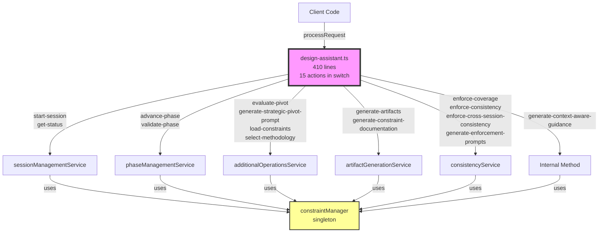
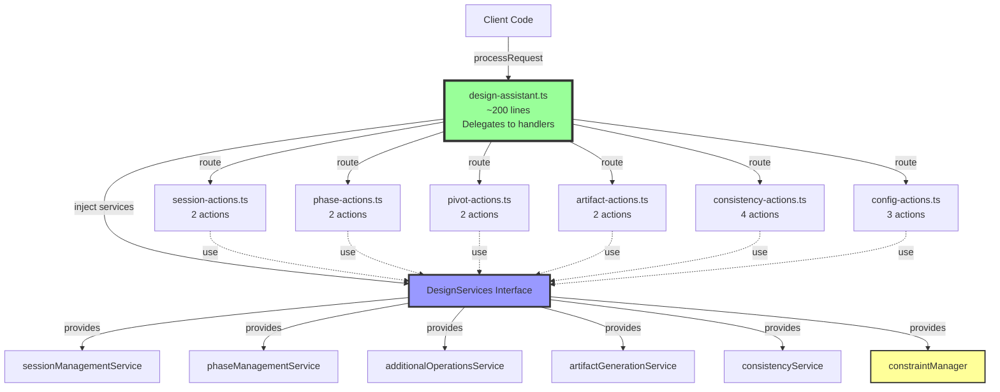
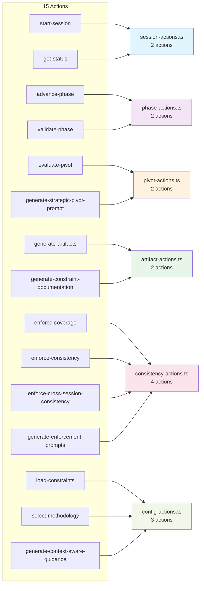

# ADR-0003: Extract Action Handlers from Design Assistant Facade

## Status
Proposed

## Context

The Design Assistant system is the largest and most complex subsystem in the MCP AI Agent Guidelines project, comprising **13,585 lines** of code across multiple files. The main orchestrator, `design-assistant.ts` (410 lines), implements a facade pattern with a single monolithic switch statement handling **15 different action types**.

### Current Architecture

The `DesignAssistantImpl` class currently uses a large switch statement in the `processRequest` method to route actions to specialized services:

```typescript
switch (action) {
  case "start-session": // → sessionManagementService
  case "advance-phase": // → phaseManagementService
  case "validate-phase": // → phaseManagementService
  case "evaluate-pivot": // → additionalOperationsService
  case "generate-strategic-pivot-prompt": // → additionalOperationsService
  case "generate-artifacts": // → artifactGenerationService
  case "enforce-coverage": // → consistencyService
  case "enforce-consistency": // → consistencyService
  case "get-status": // → sessionManagementService
  case "load-constraints": // → additionalOperationsService
  case "select-methodology": // → additionalOperationsService
  case "enforce-cross-session-consistency": // → consistencyService
  case "generate-enforcement-prompts": // → consistencyService
  case "generate-constraint-documentation": // → artifactGenerationService
  case "generate-context-aware-guidance": // → this.generateContextAwareGuidance
}
```

### Problems with Current Approach

1. **Violates Single Responsibility Principle**: The facade handles both routing logic and some implementation (e.g., `generateContextAwareGuidance` method)

2. **Testing Complexity**: Testing individual action handlers requires testing through the entire facade, making unit tests more complex

3. **Low Branch Coverage**: Current branch coverage is **86.06%** (target: 95%). The large switch statement creates many execution paths that are harder to cover

4. **Maintainability**: Adding new actions requires modifying the central switch statement, increasing risk of regressions

5. **Cyclic Dependency Fixed**: The circular dependency between `session.types.ts` ↔ `methodology.types.ts` was resolved by extracting `DesignPhase` to `common.types.ts`, but this revealed the larger architectural complexity

### Logical Action Groupings

Analysis of the 15 actions reveals 6 logical categories:

| Category | Actions | Count |
|----------|---------|-------|
| **Session Management** | start-session, get-status | 2 |
| **Phase Management** | advance-phase, validate-phase | 2 |
| **Pivot Operations** | evaluate-pivot, generate-strategic-pivot-prompt | 2 |
| **Artifact Generation** | generate-artifacts, generate-constraint-documentation | 2 |
| **Consistency Enforcement** | enforce-coverage, enforce-consistency, enforce-cross-session-consistency, generate-enforcement-prompts | 4 |
| **Configuration & Guidance** | load-constraints, select-methodology, generate-context-aware-guidance | 3 |

## Decision

**Extract action handlers into separate modules while maintaining the facade pattern.**

### Architecture Diagrams

#### Current Architecture (Before)

The current monolithic switch statement in `design-assistant.ts` routes all 15 actions:



#### Proposed Architecture (After)

Extract action handlers with dependency injection:



#### Action Groupings

How 15 actions map to 6 handler modules:



### Proposed Architecture

```
src/tools/design/
  design-assistant.ts          # Facade (maintains backward compatibility)
  actions/
    session-actions.ts         # Session management handlers
    phase-actions.ts           # Phase management handlers
    pivot-actions.ts           # Pivot operation handlers
    artifact-actions.ts        # Artifact generation handlers
    consistency-actions.ts     # Consistency enforcement handlers
    config-actions.ts          # Configuration & guidance handlers
```

### Implementation Strategy

Each action handler module will export a handler function with this signature:

```typescript
export async function handleActionName(
  request: DesignAssistantRequest,
  services: DesignServices
): Promise<DesignAssistantResponse>
```

Where `DesignServices` is an interface providing access to:
- `sessionManagementService`
- `phaseManagementService`
- `additionalOperationsService`
- `artifactGenerationService`
- `consistencyService`

The facade (`design-assistant.ts`) will:
1. Maintain all existing public APIs for backward compatibility
2. Delegate to appropriate action handlers based on action type
3. Initialize services once during `initialize()`
4. Inject services into handlers via dependency injection

### Dependency Injection for Singletons

The `constraintManager` and other singletons will be injected through the `DesignServices` interface rather than imported directly by handlers, ensuring:
- Testability (easy to mock services)
- No circular dependencies
- Clear service boundaries

## Consequences

### Positive Consequences

1. **Improved Testability**: Each action handler can be tested independently with mocked services

2. **Better Branch Coverage**: Smaller, focused modules are easier to test comprehensively, helping achieve the 95% coverage target

3. **Single Responsibility**: Each handler module has one clear responsibility

4. **Easier Maintenance**: Adding or modifying actions doesn't require touching the central switch statement

5. **Clear Separation of Concerns**: Action routing logic is separated from action implementation

6. **Preserved Backward Compatibility**: All existing APIs remain unchanged; external code doesn't need updates

### Negative Consequences

1. **More Files**: 6 additional files in the `actions/` directory

2. **Indirection**: One additional layer between facade and services (though this follows standard facade pattern)

3. **Initial Refactoring Effort**: Requires careful extraction to ensure no regressions

4. **Service Dependency Management**: Must carefully manage which services each handler needs access to

## Alternatives Considered

### Alternative 1: Keep Current Monolithic Switch Statement
**Pros:**
- No refactoring needed
- All logic in one place
- Simpler for initial understanding

**Cons:**
- Violates SRP
- Hard to test individual actions
- Low branch coverage persists
- Maintenance burden increases with new actions

**Rejected because**: Technical debt accumulates, making future changes riskier

### Alternative 2: Use Command Pattern with Action Registry
**Pros:**
- Very extensible
- Easy to add new actions dynamically
- Clear separation via command objects

**Cons:**
- Over-engineered for current needs
- Adds abstraction overhead
- Not consistent with functional style used in services

**Rejected because**: Too complex for the current requirement

### Alternative 3: Extract to Classes (OOP Style)
**Pros:**
- Encapsulation via classes
- Familiar OOP pattern

**Cons:**
- Inconsistent with functional style used throughout the project
- More boilerplate (class definitions, constructors)
- Doesn't match existing service layer pattern

**Rejected because**: Conflicts with project's functional programming style

### Alternative 4: Inline All Logic into Facade
**Pros:**
- Everything in one file
- No delegation overhead

**Cons:**
- Would create a massive file (potentially 1000+ lines)
- Violates separation of concerns
- Makes testing extremely difficult

**Rejected because**: Exacerbates existing problems

## Implementation Plan

### Phase 1: Preparation (Completed ✅)
- [x] Fix cyclic dependency: Extract `DesignPhase` to `common.types.ts`
- [x] Create ADR documenting the strategy
- [x] Verify all tests pass (4,310 tests passing)

### Phase 2: Extract Action Handlers (Future)
1. Create `actions/` directory structure
2. Extract session actions to `session-actions.ts`
3. Add unit tests for session actions
4. Extract phase actions to `phase-actions.ts`
5. Add unit tests for phase actions
6. Extract remaining action categories following the same pattern
7. Update `design-assistant.ts` to use extracted handlers
8. Verify all existing tests still pass
9. Add integration tests for handler composition

### Phase 3: Validation (Future)
1. Run full test suite (target: 95% branch coverage)
2. Performance testing (ensure no regression)
3. Documentation updates
4. Code review

## Risks and Mitigation

| Risk | Likelihood | Impact | Mitigation |
|------|------------|--------|------------|
| **Breaking existing functionality** | Medium | High | Preserve all public APIs; comprehensive test suite; incremental extraction |
| **Incorrect dependency injection** | Medium | Medium | TypeScript strict mode catches type errors; integration tests verify service composition |
| **Performance degradation** | Low | Low | Handlers are lightweight function calls; benchmark before/after |
| **Test coverage gaps** | Medium | Medium | Require 100% coverage for new handler modules; maintain overall 90%+ |
| **Circular dependencies reintroduced** | Low | Medium | Use dependency injection; avoid direct imports between handlers |

## Success Metrics

- ✅ **Branch Coverage**: Increase from 86.06% to 95%
- ✅ **Test Count**: Maintain or increase current 4,310 passing tests
- ✅ **LOC per File**: Reduce `design-assistant.ts` from 410 lines to ~200 lines
- ✅ **Action Handler Size**: Each handler module < 150 lines
- ✅ **No Breaking Changes**: All existing tests pass without modification
- ✅ **Build Time**: No significant increase (< 5%)

## Related Decisions

- **ADR-0001**: Build-time model type generation (similar refactoring approach)
- **ADR-0002**: Mermaid diagram generator strategy pattern refactoring (precedent for extracting handlers)
- **Cyclic Dependency Fix**: Extraction of `DesignPhase` to `common.types.ts` (completed as prerequisite)

## References

- Design System Files: `src/tools/design/` (13,585 lines)
- Current Coverage: 86.06% branch coverage
- Target Coverage: 95% branch coverage
- Facade Pattern: [Refactoring Guru - Facade](https://refactoring.guru/design-patterns/facade)
- SOLID Principles: Single Responsibility Principle (SRP)
- Project Coding Guidelines: `.github/COPILOT_INSTRUCTIONS.md`

---

*Generated on: 2026-01-01*
*Author: Architecture Advisor Agent (@architecture-advisor)*
*Status: Proposed - Awaiting team review and implementation*
