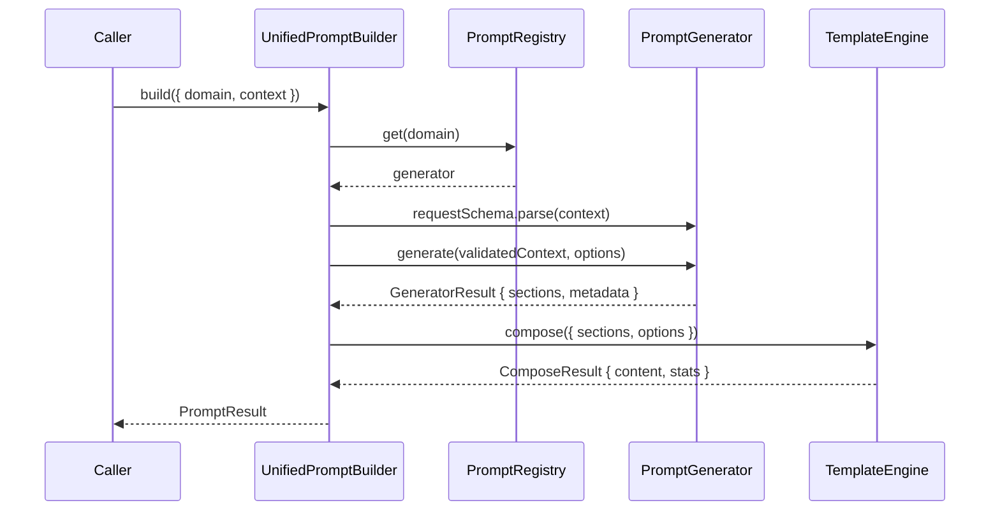

# ADR-0004: Unified Prompt Builder

**Status**: Accepted
**Date**: 2025-01-15
**Deciders**: @mcp-tool-builder, @architecture-advisor

---

## Context

The MCP AI Agent Guidelines project has 12+ independent prompt-builder tools, each duplicating output formatting, technique injection, and metadata generation logic. This creates:

- Duplication across `src/tools/prompt/` (8,600+ lines)
- Inconsistent output structure between tools
- High maintenance cost when adding new output formats (e.g., XML)
- No unified way to discover or compose prompt generators

## Decision

Introduce a `UnifiedPromptBuilder` in `src/domain/prompts/` as a central orchestration layer, built on three components:

```
┌─────────────────────────────────────┐
│        UnifiedPromptBuilder         │  ← public API
├─────────────────────────────────────┤
│  PromptRegistry (lazy singletons)   │  ← domain routing
├─────────────────────────────────────┤
│  TemplateEngine (render pipeline)   │  ← formatting
├────────────┬──────────┬─────────────┤
│ Markdown   │   XML    │  (custom)   │  ← SectionRenderers
└────────────┴──────────┴─────────────┘
```

### Data Flow



### Key Interfaces

- `PromptGenerator<T>` — implemented per domain; owns validation schema + generation logic
- `PromptRegistry` — singleton with lazy instantiation; `register(domain, factory)`
- `TemplateEngine` — composes `PromptSection[]` into final text via `SectionRenderer`
- `UnifiedPromptBuilder` — top-level entry; orchestrates registry + template engine

### Legacy Facades

Existing tools are preserved unchanged. New facade modules in `src/tools/prompt/facades/` wrap `UnifiedPromptBuilder` for backward compatibility with deprecation warnings. Removal planned for v0.16.0.

## Consequences

**Positive:**
- Single rendering pipeline; add XML once (not 12 times)
- New domains added by implementing `PromptGenerator<T>` + `registry.register()`
- Domain logic is pure TypeScript — testable at 100% without MCP framework
- Clear deprecation path for existing tools

**Negative:**
- Existing tools kept as-is until v0.16.0 (dual maintenance period)
- Performance overhead of registry lookup (negligible, lazy singleton)

## Alternatives Considered

1. **Handlebars templating** — rejected: adds runtime dependency, no type safety
2. **Class hierarchy** — rejected: promotes inheritance over composition
3. **Big refactor** — rejected: too risky without backward-compat guarantees

## References

- [Issue #1136 — Phase 2.5: Unified Prompt Ecosystem](https://github.com/owner/repo/issues/1136)
- [T-024 — PromptRegistry](../../plan-v0.14.x/speckit-v0.14.x-strategic-consolidation/tasks/phase-25-unified-prompts/T-024-prompt-registry.md)
- [T-026 — UnifiedPromptBuilder](../../plan-v0.14.x/speckit-v0.14.x-strategic-consolidation/tasks/phase-25-unified-prompts/T-026-unified-builder.md)
