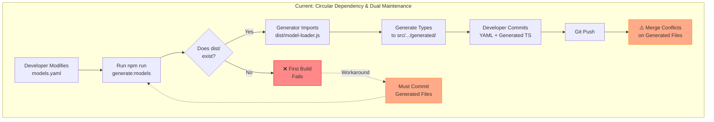
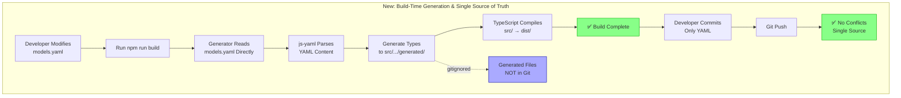

# Architecture Comparison: Model Type Generation

This document visualizes the architectural change described in ADR-0001.

## Current Architecture (Problematic)



**Problems:**
- 🔴 Circular dependency: Generator needs `dist/` → but `dist/` needs generated files
- 🔴 Dual maintenance: Must maintain YAML **and** generated files
- 🔴 Merge conflicts on generated files
- 🔴 Manual regeneration required before each commit
- 🔴 CI failures when developers forget to regenerate

---

## New Architecture (Clean)



**Benefits:**
- ✅ No circular dependency: Generator reads YAML directly
- ✅ Single source of truth: Only YAML committed
- ✅ No merge conflicts: Generated files gitignored
- ✅ Automatic regeneration: Build handles everything
- ✅ Follows industry best practices

---

## Comparison Table

| Aspect | Current (Bad) | New (Good) |
|--------|---------------|------------|
| **Source of Truth** | YAML + Generated TS (duplicate) | YAML only |
| **Git Tracking** | Generated files tracked | Generated files ignored |
| **Merge Conflicts** | Frequent on generated files | None (files not tracked) |
| **Developer Workflow** | Modify YAML → Regenerate → Commit both | Modify YAML → Build → Commit YAML |
| **Build Dependency** | Generator needs dist/ | Generator reads YAML directly |
| **CI Complexity** | Validation checks required | Simple build process |
| **Industry Alignment** | ❌ Anti-pattern | ✅ Standard practice |

---

## Build Flow Comparison

### Current Build Flow
```
1. (Optional) npm run generate:models
   └─> IF dist/model-loader.js EXISTS
       └─> Import from dist/
       └─> Generate to src/tools/config/generated/

2. tsc (TypeScript Compile)
   └─> Requires generated files to already exist in src/

3. npm run copy-yaml

⚠️ Problem: Step 1 needs output of Step 2, but Step 2 needs output of Step 1
```

### New Build Flow
```
1. npm run generate:models:internal
   └─> Read models.yaml directly with js-yaml
   └─> Generate to src/tools/config/generated/

2. tsc (TypeScript Compile)
   └─> Compiles everything including generated files

3. npm run copy-yaml

✅ Solution: Step 1 has no dependency on Step 2, breaking the cycle
```

---

## Industry Examples

Our new architecture follows the same pattern as established tools:

| Tool | Source (Committed) | Generated (Ignored) |
|------|-------------------|---------------------|
| **Protocol Buffers** | `.proto` files | Generated code |
| **GraphQL Codegen** | Schema files | Type definitions |
| **OpenAPI Generator** | `openapi.yaml` | Client code |
| **Prisma** | `schema.prisma` | Database client |
| **TypeORM** | Entity decorators | Migration files |
| **Our Tool** | `models.yaml` | Type definitions ✅ |

This is the **standard practice** across the industry.

---

## Migration Path

### Step 1: Update Generator (Break Circular Dependency)
```typescript
// Before: Circular dependency
const { loadModelsFromYaml } = await import("dist/tools/config/model-loader.js");

// After: Direct reading
import yaml from 'js-yaml';
const config = yaml.load(readFileSync("models.yaml", 'utf8'));
```

### Step 2: Update .gitignore
```gitignore
# Generated model types - regenerated at build time
src/tools/config/generated/*.ts
src/tools/config/generated/README.md
!src/tools/config/generated/.gitkeep
```

### Step 3: Remove from Git
```bash
git rm src/tools/config/generated/*.ts
git rm src/tools/config/generated/README.md
git commit -m "Remove generated files from version control"
```

### Step 4: Update Scripts
```json
{
  "generate:models:internal": "node scripts/generate-model-types.js",
  "build": "npm run generate:models:internal && tsc && npm run copy-yaml"
}
```

### Step 5: Clean Build Test
```bash
rm -rf dist/ src/tools/config/generated/*.ts
npm run build
# Should succeed ✅
```

---

## Developer Experience

### Before (Problematic)
```bash
# Developer workflow
vim src/tools/config/models.yaml  # Edit
npm run generate:models           # Manual step ⚠️
git add models.yaml generated/    # Commit both ⚠️
git commit -m "Update models"
# Later: Merge conflicts! ⚠️
```

### After (Clean)
```bash
# Developer workflow
vim src/tools/config/models.yaml  # Edit
npm run build                     # Automatic generation ✅
git add models.yaml               # Commit only source ✅
git commit -m "Update models"
# No merge conflicts! ✅
```

---

## Conclusion

The new architecture:
1. ✅ Eliminates dual maintenance
2. ✅ Prevents merge conflicts
3. ✅ Automates regeneration
4. ✅ Follows industry best practices
5. ✅ Simplifies CI/CD pipeline
6. ✅ Improves developer experience

This is the **correct architectural pattern** for code generation systems.
