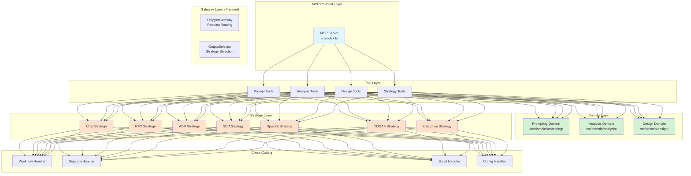

# Architecture Overview

> System design and layer architecture for MCP AI Agent Guidelines

## Table of Contents

- [High-Level Architecture](#high-level-architecture)
- [Layer Responsibilities](#layer-responsibilities)
- [Domain Layer Structure](#domain-layer-structure)
- [Output Strategy Pattern](#output-strategy-pattern)
- [Feature Flags](#feature-flags)
- [Design Decisions](#design-decisions)

## High-Level Architecture

MCP AI Agent Guidelines follows a **layered architecture** with clear separation of concerns:



## Layer Responsibilities

### MCP Protocol Layer

**Location:** `src/index.ts`

**Responsibilities:**
- Handle MCP protocol communication
- Register tools and expose schemas
- Route requests to tool handlers
- Serialize/deserialize MCP messages

**Key Code:**
```typescript
server.setRequestHandler(CallToolRequestSchema, async (request) => {
  const { name, arguments: args } = request.params;
  // Route to appropriate tool handler
});
```

---

### Tool Layer

**Location:** `src/tools/`

**Responsibilities:**
- **Thin wrappers** around domain logic
- Input validation with Zod schemas
- Call domain services
- Apply output strategies
- Handle MCP-specific concerns

**Structure:**
```
src/tools/
├── prompt/          # Prompt building tools
├── analysis/        # Code analysis tools
├── design/          # Design workflow tools
├── shared/          # Shared utilities
├── config/          # Configuration
└── bridge/          # External integrations
```

**Example Tool Handler:**
```typescript
export async function handleCleanCodeScorer(args: unknown): Promise<string> {
  // 1. Validate input
  const input = CleanCodeScorerSchema.parse(args);

  // 2. Call domain logic
  const score = calculateCleanCodeScore(input);

  // 3. Apply output strategy
  const strategy = selectStrategy(input.outputFormat);
  return strategy.render(score);
}
```

---

### Domain Layer

**Location:** `src/domain/`

**Responsibilities:**
- **Pure business logic** — no framework dependencies
- **Deterministic functions** — same input → same output
- **Framework-agnostic** — can be used outside MCP
- **100% testable** in isolation

**Structure:**
```
src/domain/
├── prompting/
│   ├── hierarchical-builder.ts
│   ├── hierarchy-selector.ts
│   ├── prompt-evaluator.ts
│   └── types.ts
├── analysis/
│   ├── code-scorer.ts
│   ├── hygiene-analyzer.ts
│   ├── dependency-auditor.ts
│   └── types.ts
├── design/
│   ├── session-manager.ts
│   ├── phase-workflow.ts
│   ├── artifact-generator.ts
│   └── types.ts
└── index.ts
```

**Key Principle:**
> Domain functions return **structured data**, never formatted strings.

**Example Domain Function:**
```typescript
// ✅ GOOD - Returns structured data
export function calculateScore(metrics: Metrics): ScoreResult {
  return {
    total: metrics.hygiene * 0.3 + metrics.coverage * 0.25,
    breakdown: {
      hygiene: metrics.hygiene,
      coverage: metrics.coverage,
    },
    recommendations: generateRecommendations(metrics),
  };
}

// ❌ BAD - Returns formatted string
export function calculateScore(metrics: Metrics): string {
  return `Score: ${metrics.hygiene * 0.3}`;
}
```

---

### Strategy Layer

**Location:** `src/strategies/`

**Responsibilities:**
- **Format domain results** into different output styles
- Implement **Strategy Pattern** for flexible rendering
- Support **cross-cutting capabilities** (workflows, diagrams, etc.)

**Available Strategies:**

| Strategy | Purpose | Output Format |
|----------|---------|---------------|
| **ChatStrategy** | LLM chat responses | Simple markdown |
| **RFCStrategy** | Team proposals | RFC document |
| **ADRStrategy** | Architecture decisions | ADR (Michael Nygard) |
| **SDDStrategy** | Agile workflows | spec.md, plan.md, tasks.md |
| **SpecKitStrategy** | GitHub projects | .specify/ directory |
| **TOGAFStrategy** | Enterprise architecture | TOGAF ADM |
| **EnterpriseStrategy** | Executive docs | TDD, HLD, LLD |

**Strategy Interface:**
```typescript
export interface OutputStrategy {
  readonly approach: OutputApproach;
  readonly crossCutting: CrossCuttingCapability[];

  render(result: DomainResult, options: RenderOptions): OutputArtifacts;
  supports(intent: UserIntent): boolean;
}
```

**Cross-Cutting Capabilities:**
```
src/strategies/cross-cutting/
├── manager.ts              # Orchestrates capabilities
├── workflow-handler.ts     # CI/CD pipelines
├── diagram-handler.ts      # Mermaid/PlantUML
├── types.ts
└── index.ts
```

---

### Gateway Layer (Planned)

**Location:** `src/gateway/` (future release)

**Responsibilities:**
- **Central orchestrator** for request routing
- **Automatic strategy selection** based on context
- **Cross-cutting concerns** application
- **Error handling and logging**

**Planned Structure:**
```
src/gateway/
├── polyglot-gateway.ts     # Main orchestrator
├── output-selector.ts      # Strategy selection logic
├── types.ts
└── index.ts
```

---

## Domain Layer Structure

### Prompting Domain

**Purpose:** Hierarchical prompt building, evaluation, and level selection.

**Key Modules:**
- `hierarchical-builder.ts` - Build structured prompts
- `hierarchy-selector.ts` - Recommend hierarchy levels
- `prompt-evaluator.ts` - Score prompt quality
- `chain-builder.ts` - Sequential prompt chains
- `flow-builder.ts` - Declarative prompt flows

### Analysis Domain

**Purpose:** Code quality analysis, hygiene checks, and dependency auditing.

**Key Modules:**
- `code-scorer.ts` - Clean Code 0-100 scoring
- `hygiene-analyzer.ts` - Pattern detection, code smells
- `dependency-auditor.ts` - Security and deprecation checks
- `semantic-analyzer.ts` - Symbol-based code understanding

### Design Domain

**Purpose:** Multi-phase design workflows with constraint enforcement.

**Key Modules:**
- `session-manager.ts` - Design session state
- `phase-workflow.ts` - Phase transitions
- `artifact-generator.ts` - ADRs, specs, roadmaps
- `constraint-validator.ts` - Enforce design constraints
- `consistency-enforcer.ts` - Cross-phase validation

---

## Output Strategy Pattern

### Why Strategy Pattern?

**Problem:** Different users need different output formats for the same analysis.

**Solution:** Separate **what** (domain logic) from **how** (presentation).

### Example: Clean Code Scorer

```typescript
// Domain layer - Pure logic
function calculateCleanCodeScore(input: Input): ScoreResult {
  return {
    total: 85,
    breakdown: {
      hygiene: 25,
      coverage: 90,
      typescript: 20,
      documentation: 12,
      security: 10,
    },
    recommendations: [
      'Increase test coverage to 95%',
      'Add JSDoc for public APIs',
    ],
  };
}

// Strategy layer - Multiple formats
const chatStrategy = new ChatStrategy();
chatStrategy.render(score);
// Output: "# Clean Code Score: 85/100\n\n..."

const rfcStrategy = new RFCStrategy();
rfcStrategy.render(score);
// Output: "# RFC: Code Quality Improvement\n\n## Proposal\n..."

const adrStrategy = new ADRStrategy();
adrStrategy.render(score);
// Output: "# ADR-001: Adopt Clean Code Standards\n\n..."
```

### Adding Cross-Cutting Capabilities

```typescript
const strategy = new SpecKitStrategy();
const result = strategy.render(score, {
  crossCutting: ['workflow', 'diagram'],
});

// result.primary: spec.md
// result.workflows: [{ name: 'quality.yml', content: '...' }]
// result.diagrams: [{ name: 'architecture.mmd', content: '...' }]
```

---

## Feature Flags

Feature flags control gradual rollout of new functionality:

```typescript
const FEATURE_FLAGS = {
  USE_OUTPUT_STRATEGY: process.env.USE_OUTPUT_STRATEGY === 'true',
  USE_GATEWAY_LAYER: process.env.USE_GATEWAY_LAYER === 'true',
};
```

**Current Status:**
- ✅ Output Strategy Layer: **Implemented**
- ✅ Domain Extraction: **Complete**
- ⏳ Gateway Layer: **Planned for v0.15.0**

---

## Design Decisions

### ADR References

- [ADR-001: Output Strategy Pattern](../plan-v0.13.x/adrs/ADR-001-output-strategy-pattern.md)
- [ADR-003: Strangler Fig Migration](../plan-v0.13.x/adrs/ADR-003-strangler-fig-migration.md)
- [ADR-004: ErrorCode Enum](../plan-v0.13.x/adrs/ADR-004-error-code-enum.md)
- [ADR-005: Cross-Cutting Capabilities](../plan-v0.13.x/adrs/ADR-005-cross-cutting-capabilities.md)

### Key Architectural Decisions

#### 1. Domain-First Design

**Decision:** Extract pure business logic to domain layer before implementing output strategies.

**Rationale:**
- Easier to test domain logic in isolation
- Domain can be reused across different UIs/protocols
- Changes to output formatting don't affect business logic

#### 2. Strategy Pattern Over Templates

**Decision:** Use Strategy Pattern instead of template engines.

**Rationale:**
- Type-safe strategy selection
- Easier to add new strategies
- Better IDE support and refactoring
- No external template engine dependencies

#### 3. Cross-Cutting as Composition

**Decision:** Cross-cutting capabilities are composable, not inheritance-based.

**Rationale:**
- Any strategy can use any cross-cutting capability
- Avoid deep inheritance hierarchies
- More flexible for future extensions

#### 4. Gradual Migration (Strangler Fig)

**Decision:** Migrate tools incrementally using feature flags.

**Rationale:**
- Zero downtime during migration
- Can roll back individual tools if needed
- Users can opt-in to new features gradually

---

## Directory Organization

```
src/
├── index.ts                    # MCP server entry point
├── domain/                     # Pure business logic
│   ├── prompting/
│   ├── analysis/
│   ├── design/
│   └── index.ts
├── strategies/                 # Output formatting
│   ├── chat-strategy.ts
│   ├── rfc-strategy.ts
│   ├── adr-strategy.ts
│   ├── sdd-strategy.ts
│   ├── speckit-strategy.ts
│   ├── togaf-strategy.ts
│   ├── enterprise-strategy.ts
│   ├── cross-cutting/
│   └── index.ts
├── tools/                      # Tool handlers (thin)
│   ├── prompt/
│   ├── analysis/
│   ├── design/
│   ├── shared/
│   └── index.ts
└── gateway/                    # (Planned) Central routing
    ├── polyglot-gateway.ts
    └── output-selector.ts
```

---

## Testing Architecture

### Layer-Specific Testing

| Layer | Coverage Target | Test Location | Focus |
|-------|-----------------|---------------|-------|
| Domain | 100% | `tests/vitest/domain/` | Pure function logic |
| Strategies | 95% | `tests/vitest/strategies/` | Format output correctness |
| Tools | 90% | `tests/vitest/tools/` | Integration with domain |
| Integration | Critical paths | `tests/vitest/integration/` | End-to-end workflows |

### Testing Principles

1. **Domain tests are pure** - No mocks, no I/O
2. **Strategy tests verify output** - Check rendered format
3. **Tool tests use spies** - Verify domain function calls
4. **Integration tests are minimal** - Only critical user flows

---

## See Also

- [Output Strategies Guide](./output-strategies.md)
- [SPEC-001: Output Strategy Layer](../plan-v0.13.x/specs/SPEC-001-output-strategy-layer.md)
- [SPEC-003: Error Handling Refactor](../plan-v0.13.x/specs/SPEC-003-error-handling-refactor.md)
- [Target Architecture (v0.13.x)](../plan-v0.13.x/ARCHITECTURE.md)
- [Phase 2 Tasks](../plan-v0.13.x/tasks/TASKS-phase-2-domain-extraction.md)
