# Skill–Instruction Graph

> Auto-generated by `scripts/visualize_skill_graph.py`.
> Edit `src/workflows/workflow-spec.ts`, `src/instructions/instruction-specs.ts`, or `src/skills/skill-specs.ts` and re-run to update.

## Coverage Summary

| Metric | Value |
|--------|-------|
| Instructions | 19 |
| Unique skills covered | 72 |
| Orphan skills (0 instructions) | 0 |

## Domain Glyph Legend

| Glyph | Prefix | Domain |
|-------|--------|--------|
| 🧬 | `adapt-` | Bio-inspired Adaptive Routing |
| 🏗️ | `arch-` | Architecture Design |
| 📈 | `bench-` | Advanced Evals |
| 🐛 | `debug-` | Debugging |
| 📚 | `doc-` | Documentation |
| 📊 | `eval-` | Evaluation & Benchmarking |
| 🔄 | `flow-` | Workflow |
| 🛡️ | `gov-` | Safety & Governance |
| 👑 | `lead-` | Leadership & Enterprise |
| 🎭 | `orch-` | Orchestration |
| 💬 | `prompt-` | Prompting |
| 🔍 | `qual-` | Code Analysis & Quality |
| 📋 | `req-` | Requirements Discovery |
| 💪 | `resil-` | Resilience & Self-repair |
| ♟️ | `strat-` | Strategy & Decision Making |
| 🔬 | `synth-` | Research & Synthesis |

## Flowchart

> All 18 domain groups and every skill node are shown.
> Edges connect each instruction to every skill it invokes.

```mermaid
flowchart LR

    %% ── Instructions (left column) ──────────────────────────────
    subgraph INSTRUCTIONS["📌 Instructions"]
        adapt["🧬 adapt"]
        analogy_think["📌 analogy-think"]
        bootstrap["🌱 bootstrap"]
        debug["🐛 debug"]
        design["🎨 design"]
        document["📚 document"]
        enterprise["🏢 enterprise"]
        evaluate["📊 evaluate"]
        govern["🛡️ govern"]
        implement["🔨 implement"]
        meta_routing["🧭 meta-routing"]
        orchestrate["🎭 orchestrate"]
        plan["🗺️ plan"]
        prompt_engineering["💬 prompt-engineering"]
        refactor["♻️ refactor"]
        research["🔬 research"]
        resilience["💪 resilience"]
        review["👁️ review"]
        testing["🧪 testing"]
    end

    %% ── Skill nodes grouped by domain prefix ───────────────────
    subgraph D_adapt["🧬 ADAPT"]
        adapt_aco_router["adapt-aco-router"]
        adapt_annealing["adapt-annealing"]
        adapt_hebbian_router["adapt-hebbian-router"]
        adapt_physarum_router["adapt-physarum-router"]
        adapt_quorum["adapt-quorum"]
    end

    subgraph D_arch["🏗️ ARCH"]
        arch_reliability["arch-reliability"]
        arch_scalability["arch-scalability"]
        arch_security["arch-security"]
        arch_system["arch-system"]
    end

    subgraph D_bench["📈 BENCH"]
        bench_analyzer["bench-analyzer"]
        bench_blind_comparison["bench-blind-comparison"]
        bench_eval_suite["bench-eval-suite"]
    end

    subgraph D_debug["🐛 DEBUG"]
        debug_assistant["debug-assistant"]
        debug_postmortem["debug-postmortem"]
        debug_reproduction["debug-reproduction"]
        debug_root_cause["debug-root-cause"]
    end

    subgraph D_doc["📚 DOC"]
        doc_api["doc-api"]
        doc_generator["doc-generator"]
        doc_readme["doc-readme"]
        doc_runbook["doc-runbook"]
    end

    subgraph D_eval["📊 EVAL"]
        eval_design["eval-design"]
        eval_output_grading["eval-output-grading"]
        eval_prompt["eval-prompt"]
        eval_prompt_bench["eval-prompt-bench"]
        eval_variance["eval-variance"]
    end

    subgraph D_flow["🔄 FLOW"]
        flow_context_handoff["flow-context-handoff"]
        flow_mode_switching["flow-mode-switching"]
        flow_orchestrator["flow-orchestrator"]
    end

    subgraph D_gov["🛡️ GOV"]
        gov_data_guardrails["gov-data-guardrails"]
        gov_model_compatibility["gov-model-compatibility"]
        gov_model_governance["gov-model-governance"]
        gov_policy_validation["gov-policy-validation"]
        gov_prompt_injection_hardening["gov-prompt-injection-hardening"]
        gov_regulated_workflow_design["gov-regulated-workflow-design"]
        gov_workflow_compliance["gov-workflow-compliance"]
    end

    subgraph D_lead["👑 LEAD"]
        lead_capability_mapping["lead-capability-mapping"]
        lead_digital_architect["lead-digital-architect"]
        lead_exec_briefing["lead-exec-briefing"]
        lead_l9_engineer["lead-l9-engineer"]
        lead_software_evangelist["lead-software-evangelist"]
        lead_staff_mentor["lead-staff-mentor"]
        lead_transformation_roadmap["lead-transformation-roadmap"]
    end

    subgraph D_orch["🎭 ORCH"]
        orch_agent_orchestrator["orch-agent-orchestrator"]
        orch_delegation["orch-delegation"]
        orch_multi_agent["orch-multi-agent"]
        orch_result_synthesis["orch-result-synthesis"]
    end

    subgraph D_prompt["💬 PROMPT"]
        prompt_chaining["prompt-chaining"]
        prompt_engineering["prompt-engineering"]
        prompt_hierarchy["prompt-hierarchy"]
        prompt_refinement["prompt-refinement"]
    end

    subgraph D_qual["🔍 QUAL"]
        qual_code_analysis["qual-code-analysis"]
        qual_performance["qual-performance"]
        qual_refactoring_priority["qual-refactoring-priority"]
        qual_review["qual-review"]
        qual_security["qual-security"]
    end

    subgraph D_req["📋 REQ"]
        req_acceptance_criteria["req-acceptance-criteria"]
        req_ambiguity_detection["req-ambiguity-detection"]
        req_analysis["req-analysis"]
        req_scope["req-scope"]
    end

    subgraph D_resil["💪 RESIL"]
        resil_clone_mutate["resil-clone-mutate"]
        resil_homeostatic["resil-homeostatic"]
        resil_membrane["resil-membrane"]
        resil_redundant_voter["resil-redundant-voter"]
        resil_replay["resil-replay"]
    end

    subgraph D_strat["♟️ STRAT"]
        strat_advisor["strat-advisor"]
        strat_prioritization["strat-prioritization"]
        strat_roadmap["strat-roadmap"]
        strat_tradeoff["strat-tradeoff"]
    end

    subgraph D_synth["🔬 SYNTH"]
        synth_comparative["synth-comparative"]
        synth_engine["synth-engine"]
        synth_recommendation["synth-recommendation"]
        synth_research["synth-research"]
    end

    %% ── Edges ───────────────────────────────────────────────────
    adapt --> adapt_aco_router
    adapt --> adapt_annealing
    adapt --> adapt_hebbian_router
    adapt --> adapt_physarum_router
    adapt --> adapt_quorum
    adapt --> eval_variance
    adapt --> flow_context_handoff
    adapt --> flow_mode_switching
    adapt --> flow_orchestrator
    adapt --> orch_agent_orchestrator
    adapt --> orch_delegation
    adapt --> orch_multi_agent
    adapt --> resil_homeostatic
    adapt --> strat_tradeoff


    bootstrap --> flow_context_handoff
    bootstrap --> flow_mode_switching
    bootstrap --> req_ambiguity_detection
    bootstrap --> req_analysis
    bootstrap --> req_scope
    bootstrap --> strat_prioritization
    bootstrap --> synth_research

    debug --> debug_assistant
    debug --> debug_postmortem
    debug --> debug_reproduction
    debug --> debug_root_cause
    debug --> eval_output_grading
    debug --> eval_variance
    debug --> flow_mode_switching
    debug --> qual_code_analysis
    debug --> qual_performance

    design --> arch_reliability
    design --> arch_scalability
    design --> arch_security
    design --> arch_system
    design --> doc_generator
    design --> eval_design
    design --> gov_regulated_workflow_design
    design --> lead_digital_architect
    design --> orch_multi_agent
    design --> req_acceptance_criteria
    design --> req_analysis
    design --> strat_advisor
    design --> strat_roadmap
    design --> strat_tradeoff
    design --> synth_comparative
    design --> synth_research

    document --> debug_postmortem
    document --> doc_api
    document --> doc_generator
    document --> doc_readme
    document --> doc_runbook
    document --> eval_output_grading
    document --> lead_staff_mentor
    document --> orch_result_synthesis
    document --> qual_review
    document --> req_acceptance_criteria
    document --> req_analysis
    document --> synth_recommendation

    enterprise --> arch_reliability
    enterprise --> arch_scalability
    enterprise --> arch_system
    enterprise --> bench_eval_suite
    enterprise --> doc_generator
    enterprise --> eval_design
    enterprise --> gov_model_governance
    enterprise --> gov_regulated_workflow_design
    enterprise --> lead_capability_mapping
    enterprise --> lead_digital_architect
    enterprise --> lead_exec_briefing
    enterprise --> lead_l9_engineer
    enterprise --> lead_software_evangelist
    enterprise --> lead_staff_mentor
    enterprise --> lead_transformation_roadmap
    enterprise --> orch_multi_agent
    enterprise --> strat_advisor
    enterprise --> strat_roadmap
    enterprise --> synth_research

    evaluate --> bench_analyzer
    evaluate --> bench_blind_comparison
    evaluate --> bench_eval_suite
    evaluate --> eval_design
    evaluate --> eval_output_grading
    evaluate --> eval_prompt
    evaluate --> eval_prompt_bench
    evaluate --> eval_variance
    evaluate --> qual_code_analysis
    evaluate --> qual_performance
    evaluate --> resil_redundant_voter
    evaluate --> resil_replay
    evaluate --> synth_comparative
    evaluate --> synth_engine
    evaluate --> synth_research

    govern --> arch_security
    govern --> debug_postmortem
    govern --> debug_root_cause
    govern --> doc_runbook
    govern --> gov_data_guardrails
    govern --> gov_model_compatibility
    govern --> gov_model_governance
    govern --> gov_policy_validation
    govern --> gov_prompt_injection_hardening
    govern --> gov_regulated_workflow_design
    govern --> gov_workflow_compliance
    govern --> qual_security
    govern --> req_acceptance_criteria
    govern --> resil_clone_mutate
    govern --> resil_homeostatic
    govern --> resil_membrane

    implement --> arch_reliability
    implement --> arch_scalability
    implement --> arch_security
    implement --> arch_system
    implement --> bench_eval_suite
    implement --> debug_assistant
    implement --> debug_reproduction
    implement --> doc_api
    implement --> doc_generator
    implement --> doc_readme
    implement --> eval_design
    implement --> flow_context_handoff
    implement --> flow_orchestrator
    implement --> gov_data_guardrails
    implement --> gov_model_compatibility
    implement --> gov_model_governance
    implement --> gov_policy_validation
    implement --> gov_prompt_injection_hardening
    implement --> orch_delegation
    implement --> orch_multi_agent
    implement --> prompt_engineering
    implement --> qual_code_analysis
    implement --> qual_review
    implement --> req_acceptance_criteria
    implement --> req_ambiguity_detection
    implement --> req_analysis
    implement --> req_scope
    implement --> strat_prioritization
    implement --> strat_tradeoff

    meta_routing --> adapt_aco_router
    meta_routing --> arch_system
    meta_routing --> debug_root_cause
    meta_routing --> eval_design
    meta_routing --> flow_mode_switching
    meta_routing --> flow_orchestrator
    meta_routing --> gov_policy_validation
    meta_routing --> lead_l9_engineer
    meta_routing --> orch_agent_orchestrator
    meta_routing --> orch_multi_agent
    meta_routing --> prompt_hierarchy
    meta_routing --> qual_refactoring_priority
    meta_routing --> req_ambiguity_detection
    meta_routing --> req_scope
    meta_routing --> resil_redundant_voter
    meta_routing --> strat_prioritization
    meta_routing --> strat_tradeoff

    orchestrate --> adapt_aco_router
    orchestrate --> adapt_hebbian_router
    orchestrate --> adapt_physarum_router
    orchestrate --> adapt_quorum
    orchestrate --> eval_design
    orchestrate --> flow_context_handoff
    orchestrate --> flow_mode_switching
    orchestrate --> flow_orchestrator
    orchestrate --> gov_data_guardrails
    orchestrate --> gov_workflow_compliance
    orchestrate --> orch_agent_orchestrator
    orchestrate --> orch_delegation
    orchestrate --> orch_multi_agent
    orchestrate --> orch_result_synthesis
    orchestrate --> req_scope
    orchestrate --> strat_prioritization

    plan --> doc_runbook
    plan --> eval_design
    plan --> lead_capability_mapping
    plan --> lead_exec_briefing
    plan --> lead_l9_engineer
    plan --> lead_transformation_roadmap
    plan --> orch_delegation
    plan --> req_acceptance_criteria
    plan --> req_analysis
    plan --> req_scope
    plan --> strat_advisor
    plan --> strat_prioritization
    plan --> strat_roadmap
    plan --> strat_tradeoff
    plan --> synth_recommendation
    plan --> synth_research

    prompt_engineering --> bench_blind_comparison
    prompt_engineering --> eval_output_grading
    prompt_engineering --> eval_prompt
    prompt_engineering --> eval_prompt_bench
    prompt_engineering --> gov_prompt_injection_hardening
    prompt_engineering --> prompt_chaining
    prompt_engineering --> prompt_engineering
    prompt_engineering --> prompt_hierarchy
    prompt_engineering --> prompt_refinement
    prompt_engineering --> synth_comparative

    refactor --> arch_reliability
    refactor --> arch_system
    refactor --> debug_assistant
    refactor --> debug_root_cause
    refactor --> doc_generator
    refactor --> eval_design
    refactor --> flow_context_handoff
    refactor --> qual_code_analysis
    refactor --> qual_performance
    refactor --> qual_refactoring_priority
    refactor --> qual_review
    refactor --> qual_security
    refactor --> strat_prioritization
    refactor --> strat_tradeoff

    research --> bench_analyzer
    research --> bench_blind_comparison
    research --> doc_generator
    research --> eval_variance
    research --> lead_capability_mapping
    research --> lead_exec_briefing
    research --> strat_advisor
    research --> strat_tradeoff
    research --> synth_comparative
    research --> synth_engine
    research --> synth_recommendation
    research --> synth_research

    resilience --> adapt_aco_router
    resilience --> adapt_hebbian_router
    resilience --> adapt_quorum
    resilience --> debug_root_cause
    resilience --> eval_output_grading
    resilience --> eval_variance
    resilience --> flow_context_handoff
    resilience --> gov_workflow_compliance
    resilience --> orch_agent_orchestrator
    resilience --> orch_multi_agent
    resilience --> resil_clone_mutate
    resilience --> resil_homeostatic
    resilience --> resil_membrane
    resilience --> resil_redundant_voter
    resilience --> resil_replay

    review --> doc_api
    review --> eval_output_grading
    review --> eval_prompt_bench
    review --> eval_variance
    review --> gov_model_governance
    review --> gov_policy_validation
    review --> gov_workflow_compliance
    review --> qual_code_analysis
    review --> qual_performance
    review --> qual_review
    review --> qual_security
    review --> req_acceptance_criteria
    review --> synth_recommendation

    testing --> arch_reliability
    testing --> bench_analyzer
    testing --> bench_eval_suite
    testing --> debug_assistant
    testing --> debug_reproduction
    testing --> debug_root_cause
    testing --> eval_design
    testing --> eval_output_grading
    testing --> eval_prompt
    testing --> eval_prompt_bench
    testing --> eval_variance
    testing --> gov_policy_validation
    testing --> gov_workflow_compliance
    testing --> qual_code_analysis
    testing --> qual_performance
    testing --> qual_review
    testing --> qual_security
    testing --> req_acceptance_criteria
    testing --> resil_redundant_voter

```

