# Agent Orchestrator Architecture

> Architecture design for multi-tool workflow orchestration and agent-to-agent communication

## 📋 Document Metadata

| Field         | Value                          |
| ------------- | ------------------------------ |
| Related Spec  | SPEC-004                       |
| Status        | Draft                          |
| Created       | January 2026                   |
| Phase         | Phase 3 (Broken Tools)         |
| Task          | P3-009                         |

---

## 1. Overview

The Agent Orchestrator enables multi-tool workflows where output from one tool becomes input to another. It provides a standardized way for MCP tools to delegate tasks to specialized agents and orchestrate complex multi-step workflows.

### 1.1 Purpose

The orchestrator addresses several key needs:

1. **Tool Composition** — Enable tools to work together seamlessly
2. **Context Propagation** — Pass results and context between agents
3. **Workflow Automation** — Pre-define common multi-agent workflows
4. **Observability** — Track and visualize agent execution chains

### 1.2 Current State vs. Target State

**Current Architecture:**
```
┌─────────────┐     ┌─────────────┐     ┌─────────────┐
│    User     │────▶│  MCP Server │────▶│   Tools     │
└─────────────┘     └─────────────┘     └─────────────┘
                          │
                          ▼
                   Single Request/Response
```

**Target Architecture:**
```
┌─────────────┐     ┌─────────────┐     ┌─────────────────────────┐
│    User     │────▶│  MCP Server │────▶│     Tool Orchestrator   │
└─────────────┘     └─────────────┘     └───────────┬─────────────┘
                                                    │
                    ┌───────────────────────────────┼───────────────────────────────┐
                    ▼                               ▼                               ▼
            ┌───────────────┐               ┌───────────────┐               ┌───────────────┐
            │  Agent: Code  │               │ Agent: Design │               │ Agent: Test   │
            │    Review     │──handoff──▶   │   Assistant   │──handoff──▶   │   Generator   │
            └───────────────┘               └───────────────┘               └───────────────┘
```

---

## 2. Core Concepts

### 2.1 Agent

An **Agent** is a tool wrapped with metadata for orchestration. Each agent represents a specific capability that can be invoked as part of a workflow.

**Properties:**
- **Identity** — Unique ID and human-readable name
- **Capabilities** — Tags describing what the agent can do
- **Schema** — Input/output schemas for validation
- **Resources** — Resource requirements (optional)

**Example:**
```typescript
const cleanCodeScorerAgent: AgentDefinition = {
  id: 'clean-code-scorer',
  name: 'Clean Code Scorer',
  description: 'Calculates comprehensive code quality score (0-100)',
  capabilities: ['code-analysis', 'quality-scoring', 'metrics'],
  inputSchema: CleanCodeScorerSchema,
  outputSchema: ScoreResultSchema,
};
```

### 2.2 Handoff

A **Handoff** is the transfer of context from one agent to another. It enables agents to delegate work to specialized agents.

**Properties:**
- **Source Agent** — Agent initiating the handoff
- **Target Agent** — Agent receiving the handoff
- **Context Payload** — Data and metadata passed between agents
- **Handoff Reason** — Why the handoff occurred

**Example:**
```typescript
const handoffRequest: HandoffRequest = {
  from: 'clean-code-scorer',
  to: 'security-hardening-prompt-builder',
  task: 'Check for security vulnerabilities',
  input: {
    codeContext: scoredCode,
    securityFocus: 'vulnerability-analysis',
  },
  context: {
    originalRequest: 'Review authentication module',
    agentChain: ['user', 'clean-code-scorer'],
    accumulatedResults: {
      'clean-code-scorer': { score: 85, issues: [...] },
    },
  },
};
```

### 2.3 Workflow

A **Workflow** is a predefined sequence of handoffs. Workflows enable common multi-agent patterns to be reused.

**Execution Modes:**
- **Sequential** — Execute agents one after another (initial implementation)
- **Conditional** — Branch based on previous results (future)
- **Parallel** — Run multiple agents simultaneously (future)

**Example:**
```typescript
const codeReviewWorkflow: WorkflowDefinition = {
  id: 'code-review-chain',
  name: 'Comprehensive Code Review',
  description: 'Multi-agent code review with quality scoring and security checks',
  steps: [
    {
      id: 'score',
      agent: 'clean-code-scorer',
      task: 'Calculate code quality score',
      input: { code: '$input.code', language: '$input.language' },
    },
    {
      id: 'security',
      agent: 'security-hardening-prompt-builder',
      task: 'Check for security vulnerabilities',
      input: { codeContext: '$input.code' },
      from: 'clean-code-scorer',
    },
  ],
};
```

---

## 3. Architecture

### 3.1 Component Diagram


### 3.2 Data Flow


### 3.3 Layer Integration


---

## 4. API Surface

### 4.1 AgentRegistry

The registry maintains the catalog of available agents.

#### registerAgent
```typescript
registerAgent(agent: AgentDefinition): void
```
Registers a new agent with the orchestrator.

**Parameters:**
- `agent: AgentDefinition` — Agent definition with ID, capabilities, and schemas

**Throws:**
- `McpToolError(VALIDATION_ERROR)` — If agent ID is duplicate
- `McpToolError(VALIDATION_ERROR)` — If agent definition is invalid

**Example:**
```typescript
registry.registerAgent({
  id: 'clean-code-scorer',
  name: 'Clean Code Scorer',
  description: 'Calculates code quality score',
  capabilities: ['code-analysis', 'quality-scoring'],
  inputSchema: CleanCodeScorerSchema,
  outputSchema: ScoreResultSchema,
});
```

#### getAgent
```typescript
getAgent(name: string): Agent | undefined
```
Retrieves an agent by ID.

**Parameters:**
- `name: string` — Agent ID

**Returns:**
- `Agent | undefined` — Agent definition or undefined if not found

#### queryByCapability
```typescript
queryByCapability(capabilities: string[]): Agent[]
```
Finds agents that have all specified capabilities.

**Parameters:**
- `capabilities: string[]` — Required capabilities (AND logic)

**Returns:**
- `Agent[]` — List of matching agents

**Example:**
```typescript
const agents = registry.queryByCapability(['code-analysis', 'security']);
// Returns: [security-hardening-prompt-builder, ...]
```

#### listAgents
```typescript
listAgents(): AgentInfo[]
```
Lists all registered agents with summary information.

**Returns:**
- `AgentInfo[]` — Array of agent metadata

### 4.2 AgentOrchestrator

The orchestrator coordinates agent execution and handoffs.

#### executeHandoff
```typescript
executeHandoff(request: HandoffRequest): Promise<HandoffResult>
```
Executes a single handoff from one agent to another.

**Parameters:**
- `request: HandoffRequest` — Handoff specification

**Returns:**
- `Promise<HandoffResult>` — Result with success status, output, and metadata

**Throws:**
- `McpToolError(VALIDATION_ERROR)` — If target agent doesn't exist
- `McpToolError(VALIDATION_ERROR)` — If input doesn't match agent schema
- `McpToolError(OPERATION_ERROR)` — If agent execution fails

**Example:**
```typescript
const result = await orchestrator.executeHandoff({
  from: 'user',
  to: 'clean-code-scorer',
  task: 'Score this code',
  input: { code: '...', language: 'typescript' },
});
```

#### executeWorkflow
```typescript
executeWorkflow(workflow: Workflow, input: unknown): Promise<WorkflowResult>
```
Executes a complete multi-agent workflow.

**Parameters:**
- `workflow: Workflow` — Workflow definition
- `input: unknown` — Initial input for first agent

**Returns:**
- `Promise<WorkflowResult>` — Aggregated results from all steps

**Throws:**
- `McpToolError(OPERATION_ERROR)` — If any step fails (based on error policy)

**Example:**
```typescript
const result = await orchestrator.executeWorkflow(
  CODE_REVIEW_WORKFLOW,
  { code: sourceCode, language: 'typescript' }
);
```

### 4.3 ExecutionGraph

The execution graph provides observability into agent execution.

#### recordHandoff
```typescript
recordHandoff(request: HandoffRequest, result: HandoffResult): void
```
Records a handoff in the execution graph.

**Parameters:**
- `request: HandoffRequest` — Original handoff request
- `result: HandoffResult` — Result from executing the handoff

#### toMermaid
```typescript
toMermaid(): string
```
Generates a Mermaid flowchart of the execution history.

**Returns:**
- `string` — Mermaid diagram source

**Example Output:**

```mermaid
flowchart LR
  user[👤 user]
  scorer[✅ clean-code-scorer]
  security[✅ security-hardening]

  user --> scorer
  scorer --> security
```


---

## 5. Integration Points

### 5.1 Tool Registration as Agents

Existing tools are registered as agents on server startup:

```typescript
// src/index.ts (server startup)
const registry = new AgentRegistry();
const orchestrator = new AgentOrchestrator(registry);

// Register existing tools as agents
registry.registerAgent({
  id: 'clean-code-scorer',
  name: 'Clean Code Scorer',
  description: 'Calculate code quality score',
  capabilities: ['code-analysis', 'quality-scoring'],
  inputSchema: CleanCodeScorerSchema,
  outputSchema: z.object({ score: z.number() }),
});

registry.registerAgent({
  id: 'security-hardening-prompt-builder',
  name: 'Security Hardening Prompt Builder',
  description: 'Generate security analysis prompts',
  capabilities: ['security', 'prompt-building'],
  inputSchema: SecurityHardeningSchema,
  outputSchema: z.string(),
});

// ... register more agents
```

### 5.2 MCP Tool Exposure

The orchestrator is exposed as an MCP tool:

```typescript
// src/tools/agent-orchestrator.ts
export async function handleAgentOrchestrator(args: unknown): Promise<string> {
  const input = AgentOrchestratorSchema.parse(args);

  switch (input.action) {
    case 'handoff':
      const result = await orchestrator.executeHandoff(input.request);
      return formatHandoffResult(result);

    case 'workflow':
      const workflowResult = await orchestrator.executeWorkflow(
        input.workflow,
        input.input
      );
      return formatWorkflowResult(workflowResult);

    case 'list-agents':
      const agents = orchestrator.listAgents();
      return formatAgentList(agents);

    default:
      throw new McpToolError(
        ErrorCode.VALIDATION_ERROR,
        `Unknown action: ${input.action}`
      );
  }
}
```

### 5.3 Execution Graph Logging

Execution graphs are logged for observability:

```typescript
import { logger } from '../tools/shared/logger.js';

// Log handoff start
logger.info('handoff:start', {
  from: request.from,
  to: request.to,
  task: request.task,
  traceId: generateTraceId(),
});

// Log handoff completion
logger.info('handoff:complete', {
  agentId: result.agentId,
  success: result.success,
  duration: result.metadata.duration,
  traceId: getTraceId(),
});

// Log execution graph
logger.info('execution:graph', {
  mermaid: graph.toMermaid(),
  nodeCount: graph.nodes.size,
  edgeCount: graph.edges.length,
});
```

### 5.4 Integration with OutputStrategy

Workflows can specify output formatting:

```typescript
const workflow: WorkflowDefinition = {
  id: 'design-to-spec',
  name: 'Design Session to Specification',
  output: {
    approach: 'adr',
    crossCutting: ['diagram', 'issues'],
  },
  steps: [
    // ... workflow steps
  ],
};

// Format final result using OutputStrategy
const strategy = getStrategy(workflow.output.approach);
const formatted = strategy.render(workflowResult, {
  crossCutting: workflow.output.crossCutting,
});
```

---

## 6. Error Handling

### 6.1 Error Policies

Workflows support configurable error handling:

```typescript
export type ChainErrorPolicy =
  | 'stop'           // Stop chain on first error (default)
  | 'continue'       // Continue with next step
  | 'retry'          // Retry failed step
  | 'fallback';      // Use fallback agent

export interface ErrorHandlingConfig {
  policy: ChainErrorPolicy;
  maxRetries?: number;
  fallbackAgent?: string;
  ignoreCodes?: ErrorCode[];
}
```

### 6.2 Error Propagation

```typescript
// Example: Retry policy with exponential backoff
const workflow: WorkflowDefinition = {
  id: 'resilient-workflow',
  name: 'Resilient Workflow',
  errorHandling: {
    policy: 'retry',
    maxRetries: 3,
  },
  steps: [
    {
      id: 'step1',
      agent: 'flaky-agent',
      task: 'Process data',
      input: { data: '$input.data' },
    },
  ],
};
```

---

## 7. Implementation Phases

### Phase 1: Core Infrastructure (P3-010, P3-011)
- [ ] Implement AgentRegistry
- [ ] Implement AgentOrchestrator
- [ ] Support single handoff execution
- [ ] Add basic error handling

### Phase 2: Workflows (P3-012, P3-013)
- [ ] Create agent definitions for existing tools
- [ ] Implement workflow execution
- [ ] Add pre-defined workflows (code review, design-to-spec)

### Phase 3: Observability (P3-015)
- [ ] Implement ExecutionGraph
- [ ] Add Mermaid visualization
- [ ] Integrate structured logging

### Phase 4: Advanced Features (Future)
- [ ] Conditional branching
- [ ] Parallel execution
- [ ] Human-in-the-loop approval
- [ ] Cross-server A2A communication

---

## 8. Pre-defined Workflows

### 8.1 Code Review Chain

Sequential workflow for comprehensive code review:

```
user → clean-code-scorer → security-hardening → documentation-generator
```

**Use Case:** Analyze code quality, check security, and generate documentation.

### 8.2 Design to Specification

Convert design session to formal specification:

```
user → design-assistant → architecture-design → domain-neutral-prompt → spec output
```

**Use Case:** Transform design brainstorming into structured specification documents.

### 8.3 Test Coverage Enhancement

Improve test coverage with gap analysis:

```
user → iterative-coverage-enhancer → tdd-workflow → code-reviewer
```

**Use Case:** Identify coverage gaps, generate tests, and review quality.

---

## 9. Success Criteria

| Criterion                   | Target   | Measurement                       |
| --------------------------- | -------- | --------------------------------- |
| AgentRegistry implementation | Complete | All methods working               |
| AgentOrchestrator implementation | Complete | Handoff and workflow execution |
| Pre-defined workflows       | 3+       | CODE_REVIEW, DESIGN_TO_SPEC, TEST_COVERAGE |
| Error handling policies     | 4        | stop, continue, retry, fallback   |
| Execution graph             | Complete | Mermaid visualization working     |
| Agent definitions           | 5+       | Key tools registered as agents    |
| Integration tests           | 90%+     | Coverage for core functionality   |

---

## 10. Future Considerations

### 10.1 Cross-Server A2A
Enable communication between different MCP servers:
- Protocol for server-to-server handoffs
- Service discovery mechanism
- Authentication and authorization

### 10.2 Persistent Memory
Agent memory across requests:
- Session storage for context
- Long-term memory for learning
- Privacy and data retention policies

### 10.3 AI-Based Routing
Dynamic agent selection:
- Capability matching via embeddings
- Task decomposition
- Automatic workflow generation

### 10.4 Human-in-the-Loop
Approval workflows:
- Pause execution for human review
- Interactive prompts for decisions
- Audit trail for approvals

---

## 11. References

- [SPEC-004: Agent Handoffs & A2A Chaining](../../plan-v0.13.x/specs/SPEC-004-agent-handoffs.md)
- [TASKS Phase 3: Broken Tools](../../plan-v0.13.x/tasks/TASKS-phase-3-broken-tools.md)
- [Architecture Overview](../architecture.md)
- [Google A2A Protocol](https://github.com/google/a2a)
- [LangGraph Documentation](https://python.langchain.com/docs/langgraph)
- [CrewAI Agents](https://www.crewai.com/)

---

*Document Created: January 2026*
*Status: Draft — Ready for Review*
