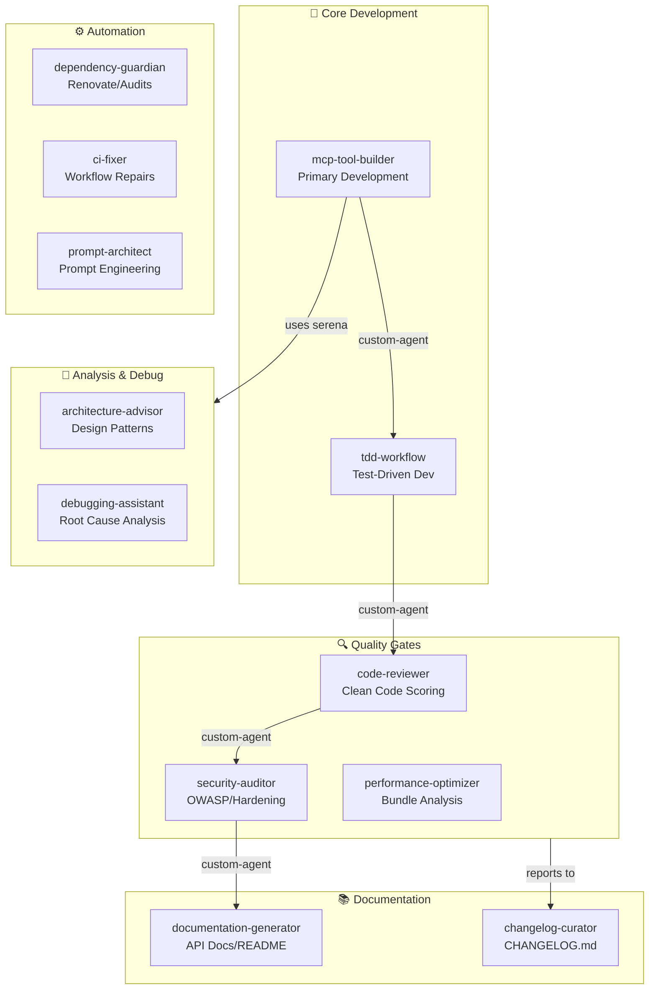
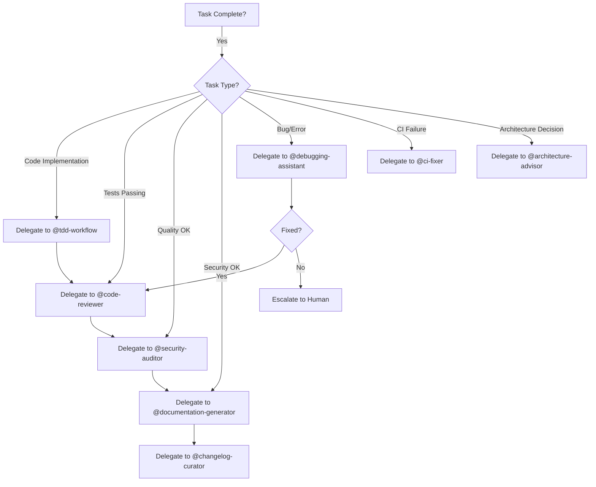
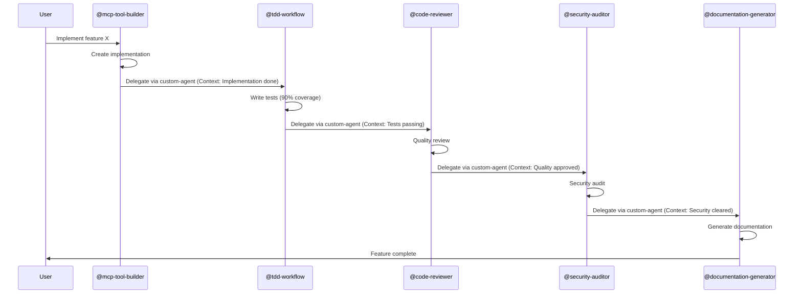
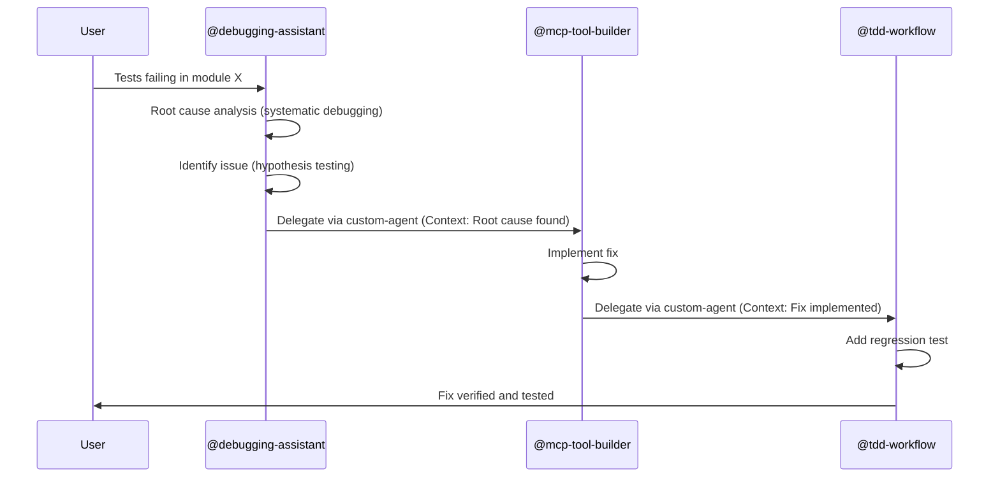
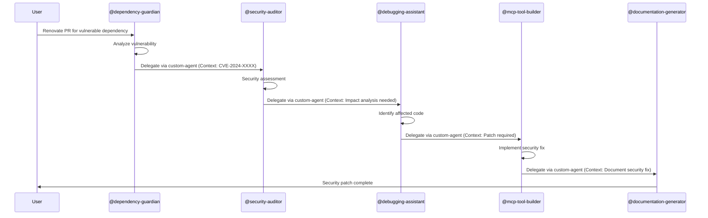

<!-- HEADER:START -->

<!-- HEADER:END -->

# Agent Ecosystem Documentation

This document provides comprehensive documentation for the **GitHub Copilot Coding Agent** ecosystem implemented in this repository.

## Table of Contents

- [Overview](#overview)
- [Architecture](#architecture)
- [Available Agents](#available-agents)
- [Multi-Agent Delegation](#multi-agent-delegation)
- [MCP Integration](#mcp-integration)
- [Environment Setup](#environment-setup)
- [Workflow Examples](#workflow-examples)
- [Best Practices](#best-practices)
- [Troubleshooting](#troubleshooting)

## Overview

This repository implements a **connected multi-agent ecosystem** for the GitHub Copilot Coding Agent, showcasing best practices for AI-assisted development workflows. The ecosystem consists of 12 specialized agents that collaborate via the `custom-agent` tool.

### Key Concepts

- **Specialized Agents**: Each agent is an expert in a specific domain (development, testing, security, documentation, etc.)
- **Delegation Pattern**: Agents use the `custom-agent` tool to invoke other agents (NOT `handoffs` - that's IDE-only)
- **MCP Integration**: 8 MCP servers provide enhanced capabilities (code analysis, web content, reasoning, browser automation)
- **Environment Setup**: Pre-configured via `.github/copilot-setup-steps.yml`

### Important Limitation

⚠️ **The `handoffs` property in agent frontmatter is NOT supported** by the Coding Agent on GitHub.com - it only works in VS Code/IDE. Instead, agents must use the **`custom-agent` tool** for delegation.

## Architecture

### Agent Interaction Flow



### Directory Structure

```
.github/
├── agents/                          # Agent definitions (12 agents)
│   ├── mcp-tool-builder.agent.md
│   ├── tdd-workflow.agent.md
│   ├── code-reviewer.agent.md
│   ├── security-auditor.agent.md
│   ├── documentation-generator.agent.md
│   ├── debugging-assistant.agent.md
│   ├── architecture-advisor.agent.md
│   ├── dependency-guardian.agent.md
│   ├── changelog-curator.agent.md
│   ├── ci-fixer.agent.md
│   ├── performance-optimizer.agent.md
│   └── prompt-architect.agent.md
├── copilot-instructions.md          # Main instructions (Section 8: Coding Agent)
└── copilot-setup-steps.yml          # Environment setup (NOT in workflows/)
```

## Available Agents

### Core Development Agents

#### mcp-tool-builder
- **Purpose**: Primary development agent for creating and enhancing MCP tools
- **Expertise**: TypeScript, ESM, Zod validation, MCP patterns
- **Delegates to**: `@tdd-workflow`, `@code-reviewer`, `@documentation-generator`
- **Tools**: shell, read, edit, search, ai-agent-guidelines/*, serena/*, fetch/*

#### tdd-workflow
- **Purpose**: Test-driven development with Red-Green-Refactor cycle
- **Expertise**: Vitest, 90% coverage targets, test patterns
- **Delegates to**: `@code-reviewer`, `@debugging-assistant`
- **Tools**: shell, read, edit, search, runTests

### Quality & Security Agents

#### code-reviewer
- **Purpose**: Quality review using clean-code-scorer patterns
- **Expertise**: Clean code metrics, TypeScript conventions, code hygiene
- **Delegates to**: `@security-auditor`, `@documentation-generator`
- **Tools**: read, search, ai-agent-guidelines/clean-code-scorer

#### security-auditor
- **Purpose**: OWASP compliance and security hardening checks
- **Expertise**: Security patterns, vulnerability detection, threat modeling
- **Delegates to**: `@debugging-assistant`, `@dependency-guardian`
- **Tools**: shell, read, ai-agent-guidelines/security-hardening-prompt-builder

#### performance-optimizer
- **Purpose**: Performance analysis and bundle optimization
- **Expertise**: Bundle analysis, performance profiling, optimization
- **Delegates to**: `@code-reviewer`, `@debugging-assistant`
- **Tools**: shell, read, playwright/*, chrome-devtools/*

### Documentation Agents

#### documentation-generator
- **Purpose**: API documentation and README updates
- **Expertise**: JSDoc, markdown, API documentation patterns
- **Delegates to**: `@code-reviewer`, `@changelog-curator`
- **Tools**: read, edit, ai-agent-guidelines/documentation-generator-prompt-builder

#### changelog-curator
- **Purpose**: Maintain CHANGELOG.md in Keep a Changelog format
- **Expertise**: Release notes, semantic versioning, change categorization
- **Tools**: read, edit, search

### Analysis & Debugging Agents

#### debugging-assistant
- **Purpose**: Root cause analysis and troubleshooting
- **Expertise**: Systematic debugging, error diagnosis, hypothesis testing
- **Delegates to**: `@mcp-tool-builder`, `@tdd-workflow`, `@ci-fixer`
- **Tools**: shell, read, search, ai-agent-guidelines/debugging-assistant-prompt-builder, serena/*

#### architecture-advisor
- **Purpose**: Design pattern recommendations and ADR generation
- **Expertise**: Architecture patterns, design decisions, trade-off analysis
- **Delegates to**: `@mcp-tool-builder`, `@documentation-generator`
- **Tools**: read, search, ai-agent-guidelines/design-assistant, ai-agent-guidelines/architecture-design-prompt-builder

### Automation Agents

#### dependency-guardian
- **Purpose**: Monitor dependencies and security vulnerabilities
- **Expertise**: Renovate PRs, npm audit, vulnerability triage
- **Delegates to**: `@security-auditor`, `@changelog-curator`
- **Tools**: shell, read, ai-agent-guidelines/dependency-auditor

#### ci-fixer
- **Purpose**: Debug and repair CI/CD workflows
- **Expertise**: GitHub Actions, workflow debugging, pipeline fixes
- **Delegates to**: `@debugging-assistant`, `@mcp-tool-builder`
- **Tools**: shell, read, edit, search

#### prompt-architect
- **Purpose**: Prompt engineering and optimization
- **Expertise**: Hierarchical prompts, prompt patterns, optimization
- **Delegates to**: `@code-reviewer`, `@documentation-generator`
- **Tools**: read, ai-agent-guidelines/hierarchical-prompt-builder, ai-agent-guidelines/prompting-hierarchy-evaluator

## Multi-Agent Delegation

### Using the `custom-agent` Tool

Agents delegate work using the `custom-agent` tool. When delegating, always provide:

1. **Context**: Summary of completed work
2. **Files**: List of modified files
3. **Focus**: Specific task for receiving agent

### Example Delegation Pattern

```markdown
## Delegation Instructions

When implementation is complete and tests pass:

1. **Use `custom-agent`** to invoke `@code-reviewer`:
   ```
   Context: Implemented new MCP tool "semantic-search-builder" in src/tools/prompt/
   Files:
   - src/tools/prompt/semantic-search-builder.ts
   - tests/vitest/tools/prompt/semantic-search-builder.spec.ts
   Focus: Review for clean code patterns, TypeScript conventions, and quality metrics
   ```

2. **After review passes**, use `custom-agent` to invoke `@documentation-generator`:
   ```
   Context: New semantic-search-builder tool implemented and reviewed
   Files:
   - src/tools/prompt/semantic-search-builder.ts
   Focus: Generate JSDoc comments and update API documentation
   ```
```

### Delegation Decision Tree



## MCP Integration

This repository has **8 MCP servers** configured for enhanced capabilities:

### Core Development

#### fetch
- **Purpose**: Web content retrieval
- **Tools**: `mcp_fetch_fetch`
- **Use cases**: Check library versions, fetch documentation, verify URLs

#### serena
- **Purpose**: Semantic code analysis
- **Tools**:
  - `mcp_serena_find_symbol` - Find symbols by name path
  - `mcp_serena_get_symbols_overview` - Overview of file symbols
  - `mcp_serena_replace_symbol_body` - Replace symbol implementations
  - `mcp_serena_find_referencing_symbols` - Find all usages
  - `mcp_serena_rename_symbol` - Rename symbols across codebase
  - `mcp_serena_search_for_pattern` - Pattern-based code search

#### ai-agent-guidelines
- **Purpose**: This project's 30+ tools
- **Tools**:
  - `hierarchical_prompt_builder`
  - `clean_code_scorer`
  - `design_assistant`
  - `security_hardening_prompt_builder`
  - Plus 26+ additional tools

### AI & Reasoning

#### sequentialthinking
- **Purpose**: Advanced chain-of-thought reasoning
- **Use cases**: Complex problem solving, hypothesis generation/verification

#### deepwiki
- **Purpose**: Knowledge base search and retrieval (HTTP)

#### context7
- **Purpose**: Library documentation resolver (HTTP)
- **Tools**: `resolve_library_id`, `get_library_docs`

### Browser Automation

#### playwright
- **Purpose**: Automated browser testing and web scraping
- **Use cases**: UI testing, form filling, network monitoring

#### chrome-devtools
- **Purpose**: Chrome DevTools protocol integration
- **Use cases**: Performance profiling, network analysis, debugging

### MCP Usage in Agents

```markdown
## Example: Using Serena for Code Analysis

When analyzing code structure:

1. **Get overview**: Use `mcp_serena_get_symbols_overview` to understand file structure
2. **Find symbols**: Use `mcp_serena_find_symbol` to locate specific functions/classes
3. **Find usages**: Use `mcp_serena_find_referencing_symbols` to see where code is used
4. **Refactor**: Use `mcp_serena_replace_symbol_body` or `mcp_serena_rename_symbol`
```

## Environment Setup

The Coding Agent environment is pre-configured via `.github/copilot-setup-steps.yml`:

### Setup Steps

1. **Checkout repository** - Full git history
2. **Setup Node.js 22** - With npm cache
3. **Install dependencies** - `npm ci`
4. **Build project** - `npm run build`
5. **Setup Python 3.12** - For uvx/MCP servers
6. **Install uvx** - `pip install uv`
7. **Pre-cache MCP servers** - Fetch and serena

### Environment Details

- **OS**: Ubuntu x64
- **Node.js**: 22.x
- **Python**: 3.12
- **Runtime**: Ephemeral GitHub Actions container
- **Duration**: Fresh environment per agent invocation

## Workflow Examples

### Example 1: Implementing a New Feature



### Example 2: Debugging a Failing Test



### Example 3: Security Vulnerability Response



## Best Practices

### For Agent Creators

1. **Clear Delegation Instructions**: Specify when and how to use `custom-agent`
2. **Provide Context**: Always include what was done, files changed, and next focus
3. **Use MCP Tools**: Leverage serena for code analysis, fetch for documentation
4. **Follow Patterns**: Study existing agents for delegation patterns
5. **Document Expertise**: Clearly define what the agent is expert in

### For Agent Users

1. **Choose Right Agent**: Use agent table to find appropriate specialist
2. **Provide Clear Instructions**: Be specific about what you need
3. **Trust Delegation**: Let agents delegate to each other naturally
4. **Review Outputs**: Verify work meets requirements
5. **Iterate if Needed**: Refine instructions based on results

### Code Quality Standards

All agents follow these standards (from `.github/copilot-instructions.md`):

- **TypeScript strict mode** - No `any` types
- **ESM imports** - All relative imports end with `.js`
- **Zod validation** - All tool inputs validated
- **Test coverage** - 90% target for new code
- **Quality checks** - Run `npm run quality` before committing

## Troubleshooting

### Common Issues

#### Agent Not Delegating Properly

**Problem**: Agent doesn't invoke other agents

**Solution**: Check that agent instructions include delegation section with `custom-agent` tool usage examples

#### Handoffs Not Working

**Problem**: Used `handoffs` in agent frontmatter

**Solution**: Remove `handoffs` property - it's NOT supported on GitHub.com. Use `custom-agent` tool in instructions instead

#### MCP Tools Not Available

**Problem**: Agent can't access MCP tools

**Solution**: Verify tools are listed in agent frontmatter:
```yaml
tools:
  - serena/*
  - ai-agent-guidelines/*
  - fetch/*
```

#### Environment Issues

**Problem**: Dependencies or build failing

**Solution**: Check `.github/copilot-setup-steps.yml` includes all required setup steps

### Getting Help

1. **Review existing agents**: Check `.github/agents/` for patterns
2. **Check instructions**: Read `.github/copilot-instructions.md` Section 8
3. **Test locally**: Build and test before deploying agents
4. **Ask debugging-assistant**: Use `@debugging-assistant` for troubleshooting

## References

- [GitHub Copilot Coding Agent - Create Custom Agents](https://docs.github.com/en/copilot/how-tos/use-copilot-agents/coding-agent/create-custom-agents)
- [GitHub Copilot Coding Agent - Extend with MCP](https://docs.github.com/en/copilot/how-tos/use-copilot-agents/coding-agent/extend-coding-agent-with-mcp)
- [GitHub Copilot Coding Agent - Customize Environment](https://docs.github.com/en/copilot/how-tos/use-copilot-agents/coding-agent/customize-the-agent-environment)
- [AGENTS.md Standard](https://agents.md/)
- [AGENTS.md GitHub Repository](https://github.com/openai/agents.md)
- [MCP Protocol Specification](https://modelcontextprotocol.io/specification)

## Contributing

To contribute to the agent ecosystem:

1. Follow patterns in existing agents
2. Test delegation workflows thoroughly
3. Document MCP tool usage
4. Update this documentation
5. Submit PR for review

See [CONTRIBUTING.md](../../CONTRIBUTING.md) for general guidelines.

<!-- FOOTER:START -->

<!-- FOOTER:END -->
