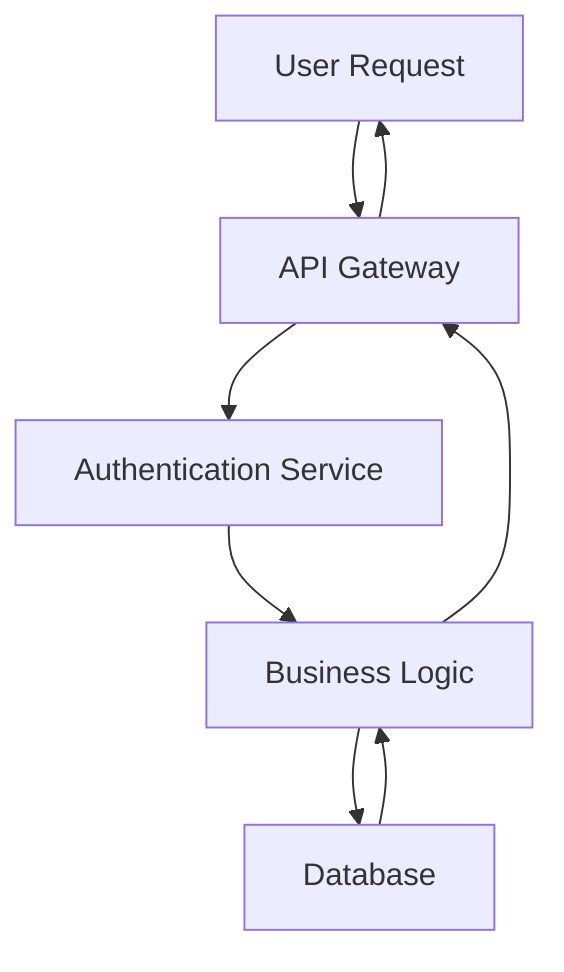

# Output Strategies

> Comprehensive guide to the 7 output approaches and 6 cross-cutting capabilities

## Overview

MCP AI Agent Guidelines supports **7 output strategies** for rendering domain analysis results in different documentation formats. Each strategy follows the **Strategy Pattern** to decouple domain logic from presentation, enabling the same analysis to be formatted as chat responses, RFCs, ADRs, specs, or enterprise documentation.

Additionally, **6 cross-cutting capabilities** can be added to ANY output approach, generating automation artifacts like CI/CD workflows, shell scripts, diagrams, and configuration files.

## Architecture

The Output Strategy Layer separates domain logic from output formatting:

```
┌─────────────────────────────────────────┐
│         MCP Protocol Layer              │
│    (Request/Response Handling)          │
└─────────────────────────────────────────┘
                 │
                 ▼
┌─────────────────────────────────────────┐
│          Gateway Layer                  │
│   - Route requests to domain services   │
│   - Select output strategy              │
│   - Apply cross-cutting concerns        │
└─────────────────────────────────────────┘
                 │
        ┌────────┴────────┐
        ▼                 ▼
┌──────────────┐  ┌──────────────────┐
│ Domain Layer │  │ Strategy Layer   │
│ - Pure logic │  │ - Format results │
│ - No I/O     │  │ - Templates      │
└──────────────┘  └──────────────────┘
```

**Key Benefits:**
- **Separation of Concerns**: Domain logic is pure and testable
- **Flexibility**: Same analysis, multiple output formats
- **Composability**: Mix and match strategies with cross-cutting capabilities
- **Maintainability**: Changes to formatting don't affect domain logic

## Available Strategies

### 1. Chat (Default)

**Purpose:** Simple markdown optimized for LLM chat interfaces.

**Best For:**
- Quick questions and answers
- Interactive sessions
- Exploratory analysis

**Format:**
```markdown
# Analysis Title

## Summary
Brief overview of findings...

## Details
Detailed analysis content...

## Recommendations
- Recommendation 1
- Recommendation 2
```

**Usage:**
```typescript
// Default strategy
const result = await server.callTool('design-assistant', {
  action: 'generate-artifacts',
  sessionId: 'my-session',
  outputFormat: 'chat', // or omit for default
});
```

---

### 2. RFC (Request for Comments)

**Purpose:** Formal proposal format for team alignment and decision-making.

**Best For:**
- Feature proposals
- Architecture changes
- Team consensus building

**Format:**
```markdown
# RFC: Feature Title

## Summary
One-paragraph overview

## Scope
What is and isn't included

## Participants
- **Author(s)**: Names
- **Reviewers**: Names
- **Approvers**: Names

## Status
Draft | Under Review | Approved | Rejected

## Proposal
Detailed proposal description

## Pros and Cons

### Pros
- Benefit 1
- Benefit 2

### Cons
- Tradeoff 1
- Tradeoff 2

## Alternatives Considered
Alternative approaches and why they were rejected

## Open Questions
- Question 1?
- Question 2?

## Conclusion
Final recommendation
```

**Usage:**
```typescript
const result = await server.callTool('design-assistant', {
  action: 'generate-artifacts',
  sessionId: 'my-session',
  outputFormat: 'rfc',
});
```

---

### 3. ADR (Architecture Decision Record)

**Purpose:** Document architectural decisions following Michael Nygard's format.

**Best For:**
- Recording design decisions
- Explaining rationale
- Historical context

**Format:**
```markdown
# ADR-XXX: Decision Title

## Status

Proposed | Accepted | Deprecated | Superseded

Date: January 2026

## Context

What is the issue we're addressing? What forces are at play?

## Decision

What is the change we're proposing/making?

## Consequences

### Positive
- Benefit 1
- Benefit 2

### Negative
- Tradeoff 1
- Tradeoff 2

### Neutral
- Side effect 1
- Side effect 2
```

**Usage:**
```typescript
const result = await server.callTool('design-assistant', {
  action: 'generate-artifacts',
  sessionId: 'my-session',
  outputFormat: 'adr',
});
```

---

### 4. SDD (Spec-Driven Development)

**Purpose:** Generate spec.md, plan.md, and tasks.md for agile workflows.

**Best For:**
- Feature development
- Sprint planning
- Iterative delivery

**Format:** Produces **3 files**:

**spec.md:**
```markdown
# Specification: Feature Name

## Overview
High-level description

## Requirements
1. Functional requirement 1
2. Functional requirement 2

## Acceptance Criteria
- [ ] Criterion 1
- [ ] Criterion 2

## Constraints
- Constraint 1
- Constraint 2
```

**plan.md:**
```markdown
# Implementation Plan: Feature Name

## Phases

### Phase 1: Foundation
Description of phase

**Deliverables:**
- Deliverable 1
- Deliverable 2

### Phase 2: Implementation
...
```

**tasks.md:**
```markdown
# Tasks: Feature Name

- [ ] Task 1 (2 hours)
- [ ] Task 2 (4 hours)
- [ ] Task 3 (8 hours)
```

**Usage:**
```typescript
const result = await server.callTool('design-assistant', {
  action: 'generate-artifacts',
  sessionId: 'my-session',
  outputFormat: 'sdd',
});
```

---

### 5. SpecKit (GitHub Spec Kit)

**Purpose:** Premium output with complete `.specify/` directory structure.

**Best For:**
- Complex projects
- GitHub-native workflows
- Comprehensive documentation

**Format:** Produces `.specify/` directory:
```
.specify/
├── spec.md              # Specification
├── plan.md              # Implementation plan
├── tasks.md             # Task breakdown
├── architecture.md      # Architecture diagrams
├── decisions/           # ADRs
│   └── ADR-001.md
└── workflows/           # CI/CD definitions
    └── ci.yml
```

**Usage:**
```typescript
const result = await server.callTool('design-assistant', {
  action: 'generate-artifacts',
  sessionId: 'my-session',
  outputFormat: 'speckit',
  crossCutting: ['workflow', 'diagram'],
});
```

---

### 6. TOGAF (Enterprise Architecture)

**Purpose:** TOGAF ADM (Architecture Development Method) deliverables.

**Best For:**
- Enterprise architecture
- Large-scale transformations
- Governance and compliance

**Format:**
```markdown
# TOGAF ADM Phase [X]: Title

## Phase Overview
Description of ADM phase

## Objectives
1. Objective 1
2. Objective 2

## Inputs
- Input document 1
- Input document 2

## Activities
1. Activity description
2. Activity description

## Outputs
- Architecture Vision Document
- Stakeholder Map
- Principles Catalog

## Stakeholders
- Role 1: Responsibility
- Role 2: Responsibility
```

**Usage:**
```typescript
const result = await server.callTool('design-assistant', {
  action: 'generate-artifacts',
  sessionId: 'my-session',
  outputFormat: 'togaf',
});
```

---

### 7. Enterprise (Traditional Documentation)

**Purpose:** Board-level executive documentation (TDD, HLD, LLD).

**Best For:**
- Executive presentations
- Traditional enterprises
- Regulatory compliance

**Format:** Produces **3 documents**:

**TDD (Technical Design Document):**
```markdown
# Technical Design Document

## Executive Summary
Business-level overview

## System Overview
High-level architecture

## Design Details
Technical specifications
```

**HLD (High-Level Design):**
```markdown
# High-Level Design

## Architecture Diagram
[Mermaid diagram]

## Component Overview
Component descriptions

## Integration Points
External dependencies
```

**LLD (Low-Level Design):**
```markdown
# Low-Level Design

## Module Specifications
Detailed module design

## Data Models
Database schemas

## API Specifications
Endpoint definitions
```

**Usage:**
```typescript
const result = await server.callTool('design-assistant', {
  action: 'generate-artifacts',
  sessionId: 'my-session',
  outputFormat: 'enterprise',
});
```

---

## Cross-Cutting Capabilities

Cross-cutting capabilities are **additive** — they can be applied to ANY output approach to generate automation and visualization artifacts.

### 1. Workflow

**Purpose:** Generate CI/CD pipeline definitions.

**Supports:**
- GitHub Actions
- GitLab CI
- Jenkins
- CircleCI

**Example Output:**
```yaml
# .github/workflows/automation.yml
name: Automation Workflow

on:
  push:
    branches: [main]
  pull_request:

jobs:
  build:
    runs-on: ubuntu-latest
    steps:
      - uses: actions/checkout@v4
      - name: Setup Node.js
        uses: actions/setup-node@v4
        with:
          node-version: '22'
      - run: npm ci
      - run: npm run build
      - run: npm test
```

---

### 2. Shell Script

**Purpose:** Generate automation scripts.

**Supports:**
- Bash
- PowerShell
- Python scripts

**Example Output:**
```bash
#!/bin/bash
# deploy.sh - Automated deployment script

set -euo pipefail

echo "Starting deployment..."
npm run build
npm run test
npm run deploy
echo "Deployment complete!"
```

---

### 3. Diagram

**Purpose:** Generate visual documentation.

**Supports:**
- Mermaid diagrams
- PlantUML
- Architecture diagrams
- Sequence diagrams
- ER diagrams

**Example Output:**


---

### 4. Config

**Purpose:** Generate configuration files.

**Supports:**
- JSON
- YAML
- TOML
- Environment files

**Example Output:**
```json
{
  "name": "my-service",
  "version": "1.0.0",
  "environment": "production",
  "database": {
    "host": "${DB_HOST}",
    "port": 5432
  }
}
```

---

### 5. Issues

**Purpose:** Generate GitHub/GitLab issue templates.

**Example Output:**
```markdown
---
name: Bug Report
about: Report a bug to help us improve
labels: bug
---

## Bug Description
A clear description of what the bug is.

## Steps to Reproduce
1. Step 1
2. Step 2

## Expected Behavior
What should happen

## Actual Behavior
What actually happens

## Environment
- OS:
- Version:
```

---

### 6. PR Template

**Purpose:** Generate pull request templates.

**Example Output:**
```markdown
## Description
Brief description of changes

## Type of Change
- [ ] Bug fix
- [ ] New feature
- [ ] Breaking change

## Checklist
- [ ] Tests pass
- [ ] Documentation updated
- [ ] Code reviewed
```

---

## Usage Examples

### Basic Usage (Single Strategy)

```typescript
// Generate chat output (default)
const chat = await server.callTool('design-assistant', {
  action: 'generate-artifacts',
  sessionId: 'session-1',
  outputFormat: 'chat',
});

// Generate ADR
const adr = await server.callTool('design-assistant', {
  action: 'generate-artifacts',
  sessionId: 'session-1',
  outputFormat: 'adr',
});
```

### Advanced Usage (Strategy + Cross-Cutting)

```typescript
// Generate SpecKit with workflows and diagrams
const speckit = await server.callTool('design-assistant', {
  action: 'generate-artifacts',
  sessionId: 'session-1',
  outputFormat: 'speckit',
  crossCutting: ['workflow', 'diagram', 'config'],
});

// Generate RFC with GitHub Actions workflow
const rfc = await server.callTool('design-assistant', {
  action: 'generate-artifacts',
  sessionId: 'session-1',
  outputFormat: 'rfc',
  crossCutting: ['workflow', 'pr-template'],
});
```

### Multiple Cross-Cutting Capabilities

```typescript
// Generate enterprise docs with full automation
const enterprise = await server.callTool('design-assistant', {
  action: 'generate-artifacts',
  sessionId: 'session-1',
  outputFormat: 'enterprise',
  crossCutting: [
    'workflow',      // CI/CD pipeline
    'shell-script',  // Deployment scripts
    'diagram',       // Architecture diagrams
    'config',        // Configuration files
    'issues',        // Issue templates
    'pr-template',   // PR template
  ],
});
```

## Selection Guide

Use this guide to choose the right output strategy:

| Scenario | Recommended Strategy | Cross-Cutting |
|----------|---------------------|---------------|
| Quick Q&A | `chat` | None |
| Team proposal | `rfc` | `pr-template` |
| Architectural decision | `adr` | `diagram` |
| Feature development | `sdd` | `workflow`, `issues` |
| Complex project | `speckit` | `workflow`, `diagram`, `config` |
| Enterprise architecture | `togaf` | `diagram` |
| Executive presentation | `enterprise` | `diagram`, `config` |

## Implementation Details

### Domain Layer

Pure business logic in `src/domain/`:
- `domain/analysis/` - Code analysis logic
- `domain/design/` - Design workflow logic
- `domain/prompting/` - Prompt building logic

**Key Principle:** Domain functions return structured data, never formatted strings.

### Strategy Layer

Output formatting in `src/strategies/`:
- `strategies/chat-strategy.ts`
- `strategies/rfc-strategy.ts`
- `strategies/adr-strategy.ts`
- `strategies/sdd-strategy.ts`
- `strategies/speckit-strategy.ts`
- `strategies/togaf-strategy.ts`
- `strategies/enterprise-strategy.ts`

**Cross-Cutting:** `strategies/cross-cutting/`
- `manager.ts` - Orchestrates capabilities
- `workflow-handler.ts` - CI/CD generation
- `diagram-handler.ts` - Visual documentation

### Gateway Layer

Request routing and strategy selection (planned for future release):
- `gateway/polyglot-gateway.ts` - Central orchestrator
- `gateway/output-selector.ts` - Strategy selection logic

## Testing

All strategies have comprehensive test coverage:

```bash
# Test all strategies
npm run test:vitest -- strategies

# Test specific strategy
npm run test:vitest -- strategies/rfc-strategy.spec.ts

# Test cross-cutting capabilities
npm run test:vitest -- strategies/cross-cutting
```

## Migration from Legacy Tools

If you're using tools that output only markdown, you can gradually migrate:

1. **Continue using existing tools** - They still work with `chat` format
2. **Try different formats** - Use `outputFormat` parameter
3. **Add cross-cutting** - Enhance with workflows/diagrams
4. **Adopt SpecKit** - For comprehensive project documentation

## References

- [SPEC-001: Output Strategy Layer](../plan-v0.13.x/specs/SPEC-001-output-strategy-layer.md)
- [ADR-001: Output Strategy Pattern](../plan-v0.13.x/adrs/ADR-001-output-strategy-pattern.md)
- [ADR-005: Cross-Cutting Capabilities](../plan-v0.13.x/adrs/ADR-005-cross-cutting-capabilities.md)
- [Strategy Pattern (Martin Fowler)](https://refactoring.guru/design-patterns/strategy)

## See Also

- [Design Assistant Tool](./tools/design-assistant.md)
- [Architecture Guide](./tips/bridge-connectors.md)
- [Tools Reference](./tips/tools-reference.md)
