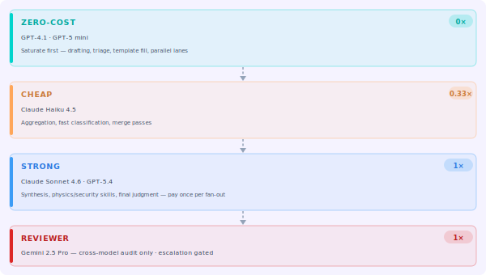
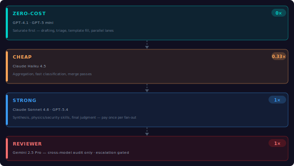
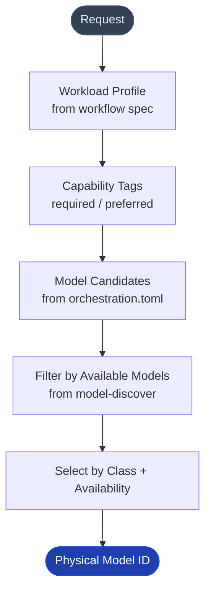

import { Aside } from "@astrojs/starlight/components";

<div class="concept-img-light">
  
</div>
<div class="concept-img-dark">
  
</div>

## Core Rule

**Model IDs are dynamic.** Never hardcode display names or model IDs in source code. Use **role classes** (`free`, `cheap`, `strong`, `reviewer`) in code; the router resolves the actual model at runtime from `orchestration.toml`.

```typescript
// ✅ Correct — use role class
const model = modelRouter.resolveForClass("strong");

// ❌ Wrong — hardcoded model name
const model = "claude-sonnet-4-6"; // will break when model roster changes
```

## Role Classes

| Class | Use case | Cost multiplier |
|-------|----------|----------------|
| `free` | Broad drafting, fan-out, template fill, triage | 0× |
| `cheap` | Aggregation, fast classification, merge, routing | ~0.33× |
| `strong` | Synthesis, physics, security, final judgment | 1× |
| `reviewer` | Cross-model audit, independent critique | 1× |

## orchestration.toml is the Authority

The `orchestration.toml` file at `.mcp-ai-agent-guidelines/config/orchestration.toml` is the single source of truth for:

- Which physical model maps to which role class
- Which capability tags are required/preferred per workload profile
- Fan-out counts per profile
- Human-in-the-loop toggles

The built-in defaults (`src/config/orchestration-defaults.ts`) are an **explicit fallback only** — they are not the normal runtime authority. Strict mode fails fast if the primary file cannot be loaded.

## ModelRouter Resolution Flow



## Cost Hierarchy

From the project's model roster (`.copilot-models`):

| Tier | Role class | Example models | Usage |
|------|-----------|----------------|-------|
| Zero-Cost | `free` | GPT-4.1, GPT-5 mini | Saturate first — fan-out, drafting, triage |
| Efficient | `cheap` | Claude Haiku 4.5, GPT-5.4 mini | Aggregation, merge, fast classification |
| Advanced | `strong` | Claude Sonnet 4.6, Claude Opus 4.6, GPT-5.4 | Synthesis, physics, security, final judgment |
| Cross-Model | `reviewer` | Gemini 2.5 Pro, Gemini 3.1 Pro | Cross-model audit only |

**Core rule:** saturate the free tier first. Pay exactly once for synthesis/review. Never run strong end-to-end on a task where free lanes can draft.

## Strong Model Parity

Two strong models are kept as **peers, not primary/backup**:

| Dimension | Strong model A | Strong model B |
|-----------|---------------|---------------|
| Long-context coherence | Excellent | Excellent |
| Independent adversarial critique | May confirm own prior plan | **Preferred** — lower self-agreement bias |
| Physics / math symbolic reasoning | **Preferred** for `qm-*` | Also strong |
| Security threat modeling | Strong | **Preferred** as first-pass `gov-*` reviewer |
| Tie-breaking escalation | Final call | First escalation |

The value is in the **disagreement surface** between the two — whenever model A generates a plan, model B is the critique lane, not optional.

## ModelRouter API

```typescript
// src/models/model-router.ts

// Resolve model for a role class
const model = await modelRouter.profileForClass("strong");

// Discover available models
const models = await modelRouter.discoverAvailableModels();

// Check if a capability tag is available
const canDoPhysics = modelRouter.supportsCapability("math_physics");
```

## Extending the Roster

To add a new model:

1. Add it to the model registry in `orchestration.toml` under the appropriate class
2. Call `model-discover` to verify it is advertised by the host
3. The `ModelRouter` picks it up automatically on next initialization — no code changes needed

<Aside type="tip">
Use `mcp_ai-agent-guid_model-discover` (or `orchestration-model-discover` tool) at session start to get the current live model roster. Never cache it across sessions — the host may have different models available.
</Aside>

## See Also

- [Orchestration Patterns](/mcp-ai-agent-guidelines/concepts/orchestration/) — the five patterns and when to use each
- [MCP Configuration](/mcp-ai-agent-guidelines/getting-started/mcp-config/) — orchestration.toml reference
