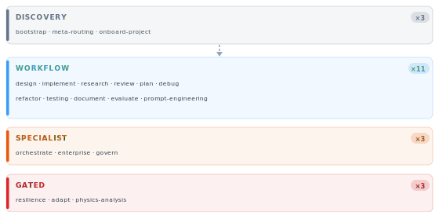
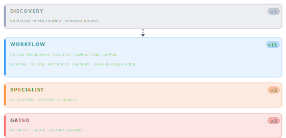
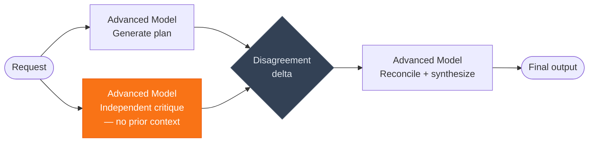
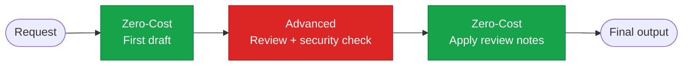
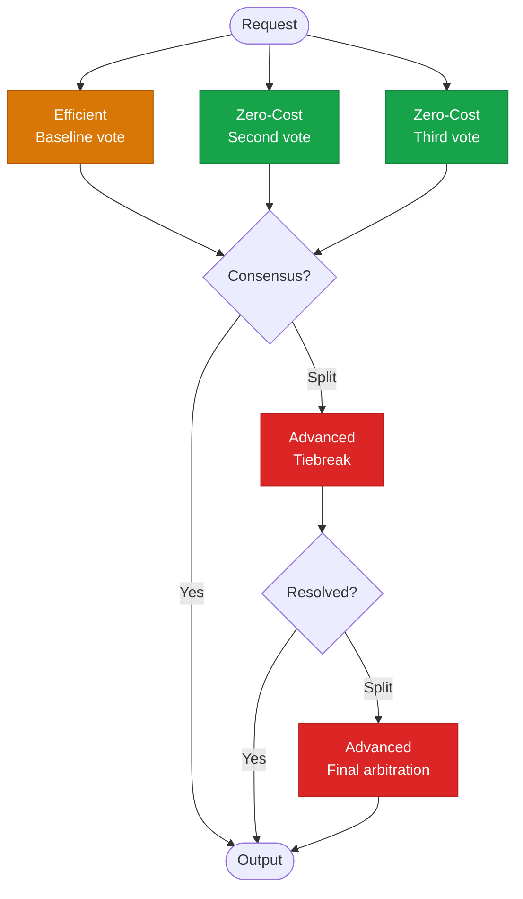
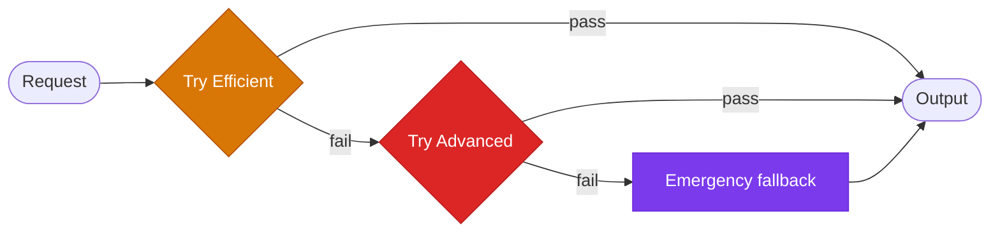
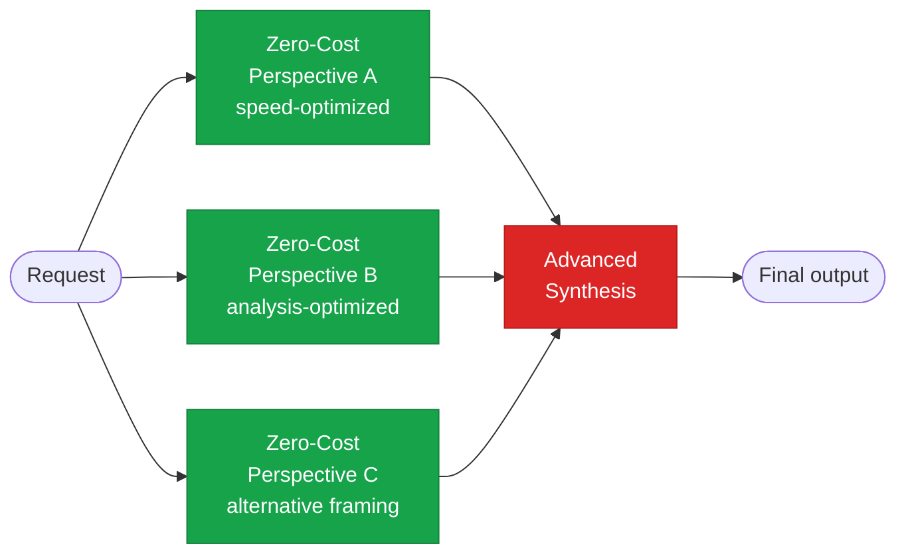

import { Aside, CardGrid, Card } from "@astrojs/starlight/components";

## Tool Tier Classification

The 20 instruction tools are classified into four routing tiers. `bootstrap`, `meta-routing`, and `onboard-project` act as **discovery** entrypoints that route consumers to the right tier for their request.

<div class="concept-img-light">
  
</div>
<div class="concept-img-dark">
  
</div>

## Capability/Profile-Based Resolution

The runtime does not bind workflows to hard-coded provider model names. Model selection is resolved through **capability tags** and **workload profiles** declared in `orchestration.toml`, then mapped to physical model IDs by `src/models/model-router.ts`.

`xstate` manages workflow state — it is not the model resolver.

## Capability Tags

Implemented capability tags:

| Tag | Meaning |
|-----|---------|
| `fast_draft` | Speed-optimized generation |
| `deep_reasoning` | Multi-step causal chain reasoning |
| `large_context` | Long-context coherence |
| `adversarial` | Independent critique, low self-agreement bias |
| `classification` | Fast label/route assignment |
| `cost_sensitive` | Minimize token cost |
| `structured_output` | Schema-bound JSON/code output |
| `code_analysis` | Code understanding and review |
| `security_audit` | Security threat modeling |
| `synthesis` | Multi-source reconciliation |
| `math_physics` | Symbolic math and physics reasoning |
| `low_latency` | Sub-500ms response priority |

## Workload Profiles

22 named workload profiles in `orchestration.toml`:

| Profile | Required Tags | Fan-Out | Notes |
|---------|--------------|---------|-------|
| `meta_routing` | `classification` | 1 | `low_latency` preferred |
| `implement` | `code_analysis`, `structured_output` | 2 | `cost_sensitive` preferred |
| `research` | `synthesis` | 3 | `cost_sensitive` preferred |
| `evaluation` | `structured_output` | 3 | `cost_sensitive` preferred |
| `governance` | `security_audit`, `adversarial` | 1 | **Human-in-the-loop** required |
| `physics_analysis` | `math_physics`, `deep_reasoning` | 1 | No fallback configured |
| `documentation` | `structured_output` | 3 | `cost_sensitive` preferred |
| `benchmarking` | `structured_output` | 3 | — |
| `prompt_engineering` | `structured_output` | 2 | — |

## The Five Orchestration Patterns

### Pattern 1: Parallel Critique → Synthesis

**Use for:** architecture decisions, wave gating, high-risk design.



The disagreement delta between steps 1 and 2 is itself signal — review it before step 3.


### Pattern 2: Draft → Review Chain

**Use for:** code generation, mechanical implementation. Cuts advanced-model token cost ~60%.



**Refactoring variant:** Single-file → Zero-Cost only. Cross-module → add Advanced boundary review. Parallel batch → 3× Zero-Cost lanes in parallel → single Advanced diff-review.


### Pattern 3: Majority Vote for Classification

**Use for:** `eval-*`, `bench-*` skills.



### Pattern 4: Cascade with Fallback

**Use for:** resilience-oriented dispatch. Implements `resil_homeostatic_module`'s PID setpoint concept.



| Condition | First try | Fallback | Emergency |
|-----------|-----------|----------|-----------|
| Simple skill dispatch | Cheap | Free | Free |
| Complex skill dispatch | Free | Strong | — |
| Physics skills (`qm-*`, `gr-*`) | Strong | Strong (back-translation) | — |
| Governance (`gov-*`) | Strong (first-pass) | Strong (final judgment) | — |

### Pattern 5: Free Triple Parallel + Single Strong Synthesis

**Use for:** research, synthesis, roadmap generation (zero marginal cost for 3× Zero-Cost lanes).



Cost model: 3 zero-cost calls + 1 Advanced synthesis pass on 300–500 tokens ≈ **80% cheaper** than running Advanced end-to-end.


## Dynamic Parallelism

Parallelism is driven by profile `fan_out` and pattern — not legacy tier names. The server uses `p-queue` with `concurrency: 3` for fan-out workflows. Strong model stays in synthesis/review lane only.

**Never free-parallel (strong required):**
`qm-*`, `gr-*`, `gov-*`, `adapt-*`, `resil-*`, `orch-agent-orchestrator`

## ModelRouter

`src/models/model-router.ts` resolves model role classes to physical model IDs at runtime. Physical model names are **never hardcoded in source**. Use role classes in code:

| Role class | Purpose |
|------------|---------|
| `free` | Broad drafting, fan-out lanes, template fill |
| `cheap` | Fast aggregation, classification, merge |
| `strong` | Synthesis, physics, security, final judgment |
| `reviewer` | Cross-model audit, independent critique |

Always call `mcp_ai-agent-guid_model-discover` to get current model IDs — the roster changes.

## Debugging Orchestration

Use the MCP Inspector CLI to verify the real routing path:

```bash
npm run build
npx -y @modelcontextprotocol/inspector --cli node dist/index.js \
  --method tools/call \
  --tool-name system-design \
  --tool-arg 'request="Design a session token store"'
```

See [MCP Debugging Reference](/mcp-ai-agent-guidelines/reference/mcp-debugging/) for full debugging workflow.
