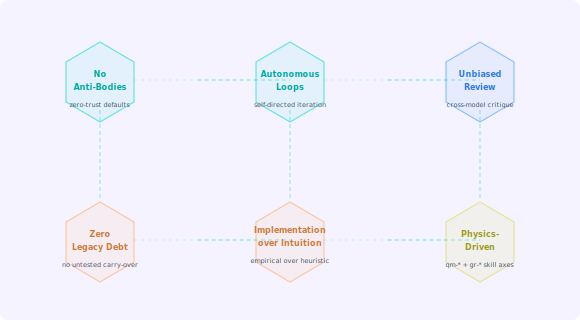
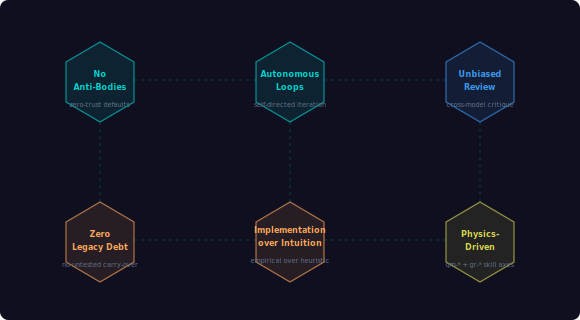

import { Aside } from "@astrojs/starlight/components";

<div class="concept-img-light">
  
</div>
<div class="concept-img-dark">
  
</div>

## The "Software Evangelist" Mandate

In modern AI agent architecture, humans are the bottleneck and the carriers of *emotional legacy debt*. The primary tenet of the Guidelines orchestration is **Radical Forward Movement**.

### No Anti-Bodies

Every dependency is a first-class citizen. If an integration requires duct tape, it is rejected. This means:

- Dependencies (Zod, AI SDK, `@toon-format/toon`, xstate) are integrated cleanly or not at all
- No shim layers, no version-pinning workarounds that survive longer than one sprint
- The `quality` pipeline (`npm run quality`) is mandatory — no merge bypasses

### Autonomous Loops

The agent ecosystem operates on state machines where failing tests automatically throw back to debug loops. Humans do not babysit test runners.

```
test-verify (failing) → auto-chain to issue-debug → fix → test-verify (re-run)
```

This pattern is enforced via workflow FSMs in `src/workflows/workflow-spec.ts` and the `task-bootstrap` auto-chain mechanism.

### Unbiased Architectural Review

Physics and metaphor analyses (QM/GR skills) strip subjective arguments out of coupling disputes. When two engineers disagree about whether a module is "too coupled", the `qm-entanglement-mapper` gives an objective entanglement coefficient. No more "I feel like this is too coupled."

## Zero Legacy Debt

Code is continuously evaluated. Any module detected with high `spacetime_debt` or `event-horizon` metrics by the QM/GR pipelines is refactored without asking for permission.

This is not aspirational — it is enforced through:

1. **`gr-spacetime-debt-metric`** skill: computes accumulated technical debt as relativistic spacetime curvature
2. **`gr-event-horizon-detector`** skill: flags modules past the "point of no return" for refactoring
3. **`code-refactor`** tool auto-chains to `physics-analysis` when metrics exceed thresholds

<Aside type="note">
Zero Legacy Debt does not mean big-bang rewrites. It means *continuous, incremental elimination* — each sprint reduces the debt metric by at least one threshold level.
</Aside>

## Implementation over Intuition

Code remains the source of truth. This means:

- **Documentation follows code**, not the other way around. `docs-generate` produces docs from source; source is never written to match wishful docs
- **Workflow state handling** lives in `src/infrastructure/state-machine-orchestration.ts` with machine-readable specs in `src/workflows/workflow-spec.ts`
- **Every claim in architecture docs** is verifiable by a test or a generated artifact

The current docs contract verifies that:
- Each implemented workflow has Markdown/JSON documentation
- Workflow specs can render Mermaid state diagrams
- The skill coverage graph has zero orphan skills

## The Skill Count Discipline

102 skills are not an accident. The count is precisely tracked because:

- **Skill inflation is complexity debt**: every skill added must justify its existence in the coverage matrix
- **Domain prefix uniqueness** prevents collision and enables tier dispatch
- **`scripts/verify_matrix.py`** is the automated guardian — it fails CI if any skill is orphaned from a workflow

## Why MCP?

The Model Context Protocol was chosen because:

1. **Transport-agnostic**: stdin/stdout today, WebSocket tomorrow — the server code does not change
2. **Tool discovery**: `tools/list` gives hosts a clear catalog without documentation parsing
3. **Host ecosystem**: Claude Desktop, VS Code Copilot, Cline, and others support it natively
4. **Composability**: multiple MCP servers can coexist — this server can chain to GitHub MCP, Serena, or any other

## Advisory-Only by Design

This server produces *advisory outputs* — recommendations, analysis, generated artifacts — but makes **zero runtime LLM calls itself**. The orchestration layer decides *which model to assign* to each skill, but the actual LLM inference happens in the host's own model execution environment.

This is a deliberate security and cost boundary: the server cannot exfiltrate data through LLM calls, and model costs are controlled by the host.

## See Also

- [The Skill System](/mcp-ai-agent-guidelines/concepts/skill-system/) — instruction-first architecture details
- [Orchestration Patterns](/mcp-ai-agent-guidelines/concepts/orchestration/) — multi-model pattern reference
- [Physics Skills QM](/mcp-ai-agent-guidelines/skills/physics-qm/) — quantum mechanics code metaphors
- [Physics Skills GR](/mcp-ai-agent-guidelines/skills/physics-gr/) — general relativity code metaphors
