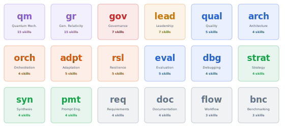
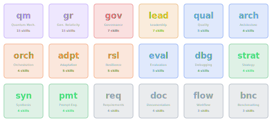
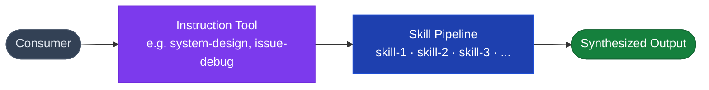

import { Aside, Badge } from "@astrojs/starlight/components";

## Domain Coverage

All 102 skills are organized into 18 domain groups. The domain prefix determines which dispatch tier handles each skill — `qm-*` and `gr-*` route through the physics-gated tier; `gov-*` is always governance-reviewed.

<div class="concept-img-light">
  
</div>
<div class="concept-img-dark">
  
</div>

## Instruction-First Architecture

The public MCP surface exposes **20 instruction tools** — high-level mission verbs like `system-design`, `feature-implement`, `issue-debug`. These are the *only* entry points consumers interact with.

Beneath each instruction tool is a **skill pipeline**: the instruction resolves which skills to invoke based on the request, orchestrates them in the right order (serial, parallel, or cascade), and synthesizes the results into a single coherent output.



Skills are **never called directly** by consumers. They are internal workflow assets.

## What is a Skill?

A skill is a focused, single-purpose AI workflow step with:

- A canonical **ID** (`qm-superposition-generator`, `gov-prompt-injection-hardening`, etc.)
- A **preferred model class** (`free`, `cheap`, `strong`, `reviewer`)
- A **domain prefix** that determines dispatch tier
- A **description** of exactly when to invoke it
- A **source implementation** under `src/skills/<domain>/<skill-id>.ts`

## 18 Skill Domains

| Domain | Prefix | Count | Gated? | Purpose |
|--------|--------|-------|--------|---------|
| Requirements | `req-` | 4 | No | Scope clarification, acceptance criteria, ambiguity detection |
| Architecture | `arch-` | 4 | No | Reliability, scalability, security, system design |
| Quality | `qual-` | 5 | No | Code analysis, performance, security, review, refactoring priority |
| Debugging | `debug-` | 4 | No | Assistant, postmortem, reproduction, root cause |
| Documentation | `doc-` | 4 | No | API docs, README, generator, runbook |
| Evaluation | `eval-` | 5 | No | Design, output grading, prompt, prompt-bench, variance |
| Benchmarking | `bench-` | 3 | No | Analyzer, blind comparison, eval suite |
| Workflows | `flow-` | 3 | No | Context handoff, mode switching, orchestrator |
| Governance | `gov-` | 7 | No | Data guardrails, model compatibility, policy validation, prompt injection hardening, regulated workflow design, workflow compliance |
| Orchestration | `orch-` | 4 | No | Agent orchestrator, delegation, multi-agent, result synthesis |
| Prompting | `prompt-` | 4 | No | Chaining, engineering, hierarchy, refinement |
| Research | `synth-` | 4 | No | Comparative, engine, recommendation, research |
| Strategy | `strat-` | 4 | No | Advisor, prioritization, roadmap, tradeoff |
| Resilience | `resil-` | 5 | No | Clone/mutate, homeostatic, membrane, redundant voter, replay |
| Adaptive | `adapt-` | 5 | **Yes** (`ENABLE_ADAPTIVE_ROUTING`) | ACO router, annealing, Hebbian router, Physarum router, quorum |
| Leadership | `lead-` | 7 | No | Capability mapping, digital architect, exec briefing, L9 engineer, software evangelist, staff mentor, transformation roadmap |
| Quantum Mechanics | `qm-` | 15 | **Yes** (`ENABLE_PHYSICS_SKILLS`) | 15 QM metaphor skills — coupling, coverage, style via quantum analogies |
| General Relativity | `gr-` | 15 | **Yes** (`ENABLE_PHYSICS_SKILLS`) | 15 GR metaphor skills — technical debt, gravitational mass, refactoring paths |

## Skill Gating

Three domains are gated behind environment variables:

```bash
# Physics skills (qm-* and gr-*, 30 skills total)
ENABLE_PHYSICS_SKILLS=true

# Bio-inspired adaptive routing (adapt-*, 5 skills)
ENABLE_ADAPTIVE_ROUTING=true
```

Ungated skills run by default. Gated skills silently fall back to conventional analysis unless the gate is open — they never fail, they degrade gracefully.

<Aside type="tip">
The `criticalSkillGuard` system allows individual high-risk skills (e.g. `gov-regulated-workflow-design`) to require explicit confirmation. This is a per-skill opt-in, not an environment gate.
</Aside>

## Dispatch Tiers

Skill prefix determines which dispatch tier in `skill-handler.ts`:

| Prefix group | Tier |
|-------------|------|
| `qm-`, `gr-` | Physics tier |
| `gov-` | Governance tier |
| `adapt-` | Adaptive tier |
| Everything else | Core tier |

Each tier can add validation, logging, or pre/post hooks specific to that domain.

## Skill IDs and Aliases

Skills have a **canonical ID** (e.g., `qm-superposition-generator`) and may have **legacy aliases** for backward compatibility. The spec file `src/skills/skill-specs.ts` bridges legacy IDs to canonical ones. Always use canonical IDs in code; legacy aliases continue to dispatch but are not advertised.

## Verifying Coverage

The `scripts/verify_matrix.py` script enforces **zero orphan skills** — every skill must appear in at least one workflow in `src/workflows/workflow-spec.ts`. Run it as part of the quality gate:

```bash
python3 scripts/verify_matrix.py
```

## See Also

- [Skill Domain Reference](/mcp-ai-agent-guidelines/skills/) — all 102 skills organized by domain
- [Philosophy](/mcp-ai-agent-guidelines/concepts/philosophy/) — why instruction-first architecture
- [Orchestration Patterns](/mcp-ai-agent-guidelines/concepts/orchestration/) — how skills are orchestrated
