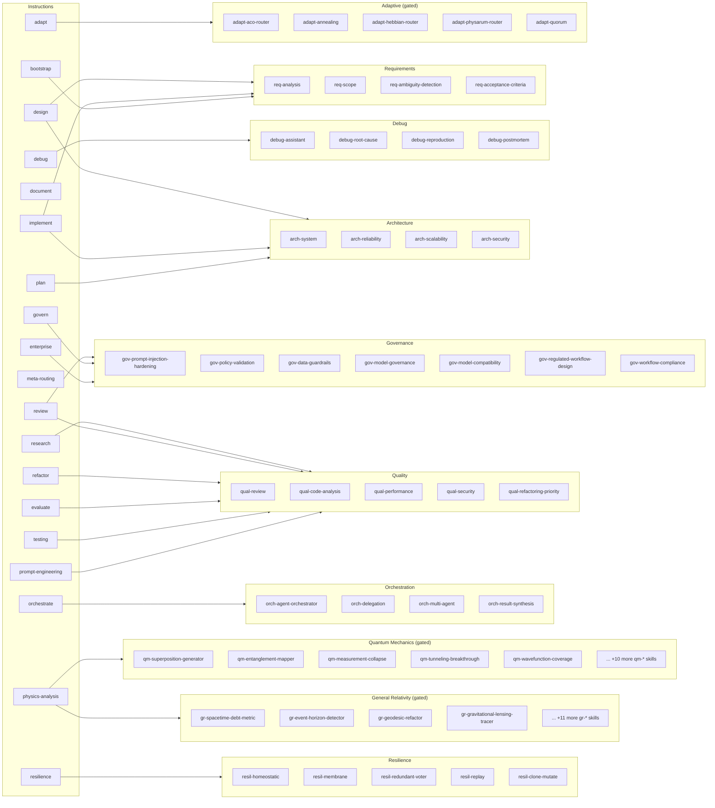

import { Badge, Aside, CardGrid, LinkCard, Icon, Tabs, TabItem } from "@astrojs/starlight/components";

## What Are Skills?

Skills are the internal workflow assets beneath the 20 public instruction tools. Consumers never call skills directly — they invoke an instruction tool which internally orchestrates the right skills.

**102 skills · 18 domains · 0 orphans** (verified by `scripts/verify_matrix.py`)

<Aside type="note" title="Model class glossary">
  Every skill carries a model-class hint. These describe **task complexity**, not pricing — the class tells the orchestrator what tier of model can handle this task well:

  | Badge | Internal key | What it means |
  |-------|-------------|---------------|
  | <Badge text="Zero-Cost" variant="success" /> | `free` | Solved by zero-cost models — [GPT-4.1](https://platform.openai.com/docs/models/gpt-4.1), [GPT-5 mini](https://platform.openai.com/docs/models/gpt-5-mini) |
  | <Badge text="Efficient" variant="caution" /> | `cheap` | Low-cost models — [Claude Haiku 4.5](https://www.anthropic.com/claude/haiku), [GPT-5.4 mini](https://developers.openai.com/api/docs/models/gpt-5.4-mini) |
  | <Badge text="Advanced" variant="danger" /> | `strong` | Full-capability models — [Claude Sonnet 4.6](https://www.anthropic.com/claude/sonnet), [Claude Opus 4.6](https://www.anthropic.com/claude/opus), [GPT-5.4](https://developers.openai.com/api/docs/models/gpt-5.4), [GPT-5.3-Codex](https://developers.openai.com/api/docs/models/gpt-5.3-codex) |
  | <Badge text="Cross-Model" variant="note" /> | `reviewer` | Independent cross-model review — [Gemini 3.1 Pro](https://ai.google.dev/gemini-api/docs/models), [Claude Opus 4.6](https://www.anthropic.com/claude/opus) |

  See [Model Routing](/mcp-ai-agent-guidelines/concepts/model-routing/) for the full class resolution logic · [Artificial Analysis](https://artificialanalysis.ai)
</Aside>

## Skill Domains

<Tabs>
  <TabItem label="Core domains" icon="approve-check-circle">
    <CardGrid>
      <LinkCard title="Requirements (4)" href="/mcp-ai-agent-guidelines/skills/requirements/" description="req-* — Analysis, scope, ambiguity detection, acceptance criteria" />
      <LinkCard title="Architecture (4)" href="/mcp-ai-agent-guidelines/skills/architecture/" description="arch-* — System, reliability, scalability, security design" />
      <LinkCard title="Quality (5)" href="/mcp-ai-agent-guidelines/skills/quality/" description="qual-* — Code analysis, review, performance, security, refactoring priority" />
      <LinkCard title="Debugging (4)" href="/mcp-ai-agent-guidelines/skills/debugging/" description="debug-* — Assistant, root cause, reproduction, postmortem" />
      <LinkCard title="Documentation (4)" href="/mcp-ai-agent-guidelines/skills/documentation/" description="doc-* — Generator, README, API reference, runbook" />
      <LinkCard title="Evaluation (5)" href="/mcp-ai-agent-guidelines/skills/evaluation/" description="eval-* — Prompt, output grading, variance, design, benchmark" />
      <LinkCard title="Benchmarking (3)" href="/mcp-ai-agent-guidelines/skills/benchmarking/" description="bench-* — Analyzer, blind comparison, eval suite" />
      <LinkCard title="Workflows (3)" href="/mcp-ai-agent-guidelines/skills/workflows/" description="flow-* — Orchestrator, context handoff, mode switching" />
      <LinkCard title="Governance (7)" href="/mcp-ai-agent-guidelines/skills/governance/" description="gov-* — Policy, compliance, guardrails, prompt-injection hardening" />
      <LinkCard title="Orchestration (4)" href="/mcp-ai-agent-guidelines/skills/orchestration/" description="orch-* — Agent orchestrator, delegation, multi-agent, synthesis" />
      <LinkCard title="Prompting (4)" href="/mcp-ai-agent-guidelines/skills/prompting/" description="prompt-* — Engineering, chaining, refinement, hierarchy" />
      <LinkCard title="Research (4)" href="/mcp-ai-agent-guidelines/skills/research/" description="synth-* — Comparative, research, recommendation, engine" />
      <LinkCard title="Strategy (4)" href="/mcp-ai-agent-guidelines/skills/strategy/" description="strat-* — Advisor, roadmap, prioritization, tradeoff" />
      <LinkCard title="Resilience (5)" href="/mcp-ai-agent-guidelines/skills/resilience/" description="resil-* — Homeostatic, membrane, voter, replay, clone-mutate" />
      <LinkCard title="Leadership (7)" href="/mcp-ai-agent-guidelines/skills/leadership/" description="lead-* — Capability mapping, roadmap, exec briefing, mentoring" />
    </CardGrid>
  </TabItem>
  <TabItem label="Feature-gated domains" icon="warning">
    <Aside type="caution" title="Feature gates required">
      The domains below must be explicitly enabled via environment variables. They are off by default to prevent non-deterministic behavior in production.
    </Aside>
    <CardGrid>
      <LinkCard title="Adaptive (5)" href="/mcp-ai-agent-guidelines/skills/adaptive/" description="adapt-* — ACO router, annealing, Hebbian, Physarum, quorum. Requires ENABLE_ADAPTIVE_ROUTING=true" />
      <LinkCard title="Quantum Mechanics (15)" href="/mcp-ai-agent-guidelines/skills/physics-qm/" description="qm-* — Physics-metaphor code analysis using QM principles. Requires ENABLE_PHYSICS_SKILLS=true" />
      <LinkCard title="General Relativity (15)" href="/mcp-ai-agent-guidelines/skills/physics-gr/" description="gr-* — Physics-metaphor code analysis using GR principles. Requires ENABLE_PHYSICS_SKILLS=true" />
    </CardGrid>
  </TabItem>
</Tabs>

## Instruction–Skill Coverage Graph

The graph below shows which instructions invoke which skill domains. Auto-generated from `src/workflows/workflow-spec.ts`.

## How Skills Are Invoked

Skills are dispatched by tier in `src/tools/skill-handler.ts`:

- **Physics tier** (`qm-*`, `gr-*`): Requires `ENABLE_PHYSICS_SKILLS=true`
- **Governance tier** (`gov-*`): Optional human-in-the-loop via `ENABLE_GOVERNANCE_STRICT`
- **Adaptive tier** (`adapt-*`): Requires `ENABLE_ADAPTIVE_ROUTING=true`
- **Core tier**: Everything else, always available

See [The Skill System](/mcp-ai-agent-guidelines/concepts/skill-system/) for the full architecture.
