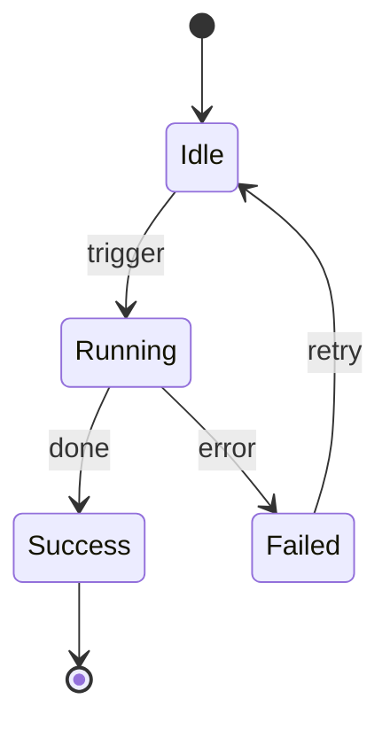

The `flow-*` family models, optimises, and generates automated workflows, pipelines, and process definitions.

## Skills

| Skill ID | Description | Model Class |
|----------|-------------|-------------|
| `flow-design` | Models a complex multi-step business or technical process; produces a state-machine or flowchart | `cheap` |
| `flow-automation` | Generates automation scripts, GitHub Actions workflows, or CI/CD pipeline definitions | `free` |
| `flow-optimisation` | Analyses an existing workflow for bottlenecks, redundant steps, and parallelism opportunities | `cheap` |

## When to Use

| Situation | Skill(s) |
|-----------|----------|
| Designing a new CI/CD pipeline | `flow-automation` |
| Mapping a business process | `flow-design` |
| Speeding up an existing pipeline | `flow-optimisation` |

## Instructions That Invoke These Skills

- **implement** — uses `flow-automation` to generate CI/CD scaffolding
- **design** — uses `flow-design` to model workflow architectures
- **plan** — uses `flow-optimisation` to find parallelism in implementation plans

## `flow-design` Output

`flow-design` produces a [XState](https://xstate.js.org/)-compatible state machine JSON and a Mermaid stateDiagram:

## `flow-automation` Output

Generates complete YAML for common targets:
- GitHub Actions (push/PR triggers, matrix builds, artifact upload)
- Docker Compose / `docker build` pipelines
- Node.js / Python build and test chains
