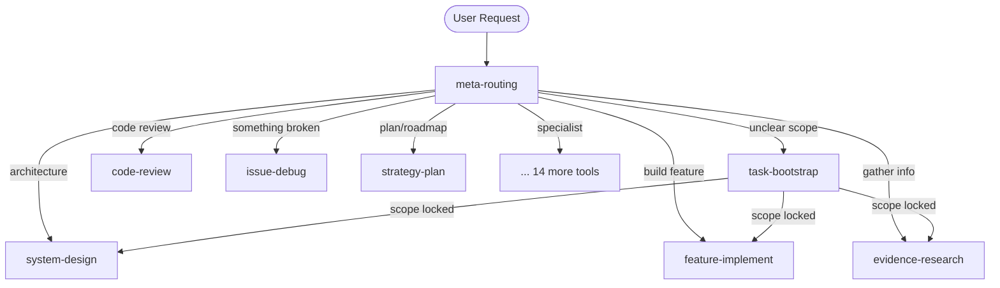

## Overview

Each instruction tool maps to a detailed workflow specification describing trigger conditions, required skills, decision points, and success chains. The workflows are described using finite state machine (FSM) diagrams and execution sequence diagrams.

## Workflow Index

| # | Workflow | Instruction Tool | Key Skills | Success Chains |
|---|----------|-----------------|------------|----------------|
| 00 | [Meta-Routing](/mcp-ai-agent-guidelines/workflows/meta-routing/) | `meta-routing` | scope-clarification, ambiguity-detection | Terminal node |
| 01 | [Bootstrap](/mcp-ai-agent-guidelines/workflows/bootstrap/) | `task-bootstrap` | req-analysis, req-scope | design, implement, research, + 9 more |
| 03 | [Design](/mcp-ai-agent-guidelines/workflows/design/) | `system-design` | arch-system, arch-security | feature-implement, policy-govern |
| 04 | [Plan](/mcp-ai-agent-guidelines/workflows/plan/) | `strategy-plan` | strat-roadmap, strat-prioritisation | feature-implement, enterprise-strategy |
| 05 | [Implement](/mcp-ai-agent-guidelines/workflows/implement/) | `feature-implement` | req-analysis, arch-system | test-verify, code-review |
| 06 | [Physics Analysis](/mcp-ai-agent-guidelines/workflows/physics-analysis/) | `physics-analysis` | qm-*, gr-* | code-review, feature-implement |
| 07 | [Evaluate](/mcp-ai-agent-guidelines/workflows/evaluate/) | `quality-evaluate` | eval-output-grading, bench-blind-comparison | prompt-engineering, code-refactor |
| 08 | [Review](/mcp-ai-agent-guidelines/workflows/review/) | `code-review` | qual-review, qual-security | policy-govern, code-refactor |
| 09 | [Testing](/mcp-ai-agent-guidelines/workflows/testing/) | `test-verify` | qual-code-analysis, bench-eval-suite | code-review, issue-debug |
| 10 | [Debug](/mcp-ai-agent-guidelines/workflows/debug/) | `issue-debug` | debug-assistant, debug-root-cause | test-verify, code-refactor |
| 11 | [Refactor](/mcp-ai-agent-guidelines/workflows/refactor/) | `code-refactor` | qual-refactoring-priority, gr-geodesic-refactor | test-verify, code-review |
| 12 | [Adapt](/mcp-ai-agent-guidelines/workflows/adapt/) | `routing-adapt` | adapt-aco-router, adapt-hebbian-router | agent-orchestrate, quality-evaluate |
| 13 | [Document](/mcp-ai-agent-guidelines/workflows/document/) | `docs-generate` | doc-readme, doc-api, doc-runbook | code-review, enterprise-strategy |
| 14 | [Enterprise](/mcp-ai-agent-guidelines/workflows/enterprise/) | `enterprise-strategy` | lead-transformation-roadmap, lead-capability-mapping | policy-govern, system-design |
| 15 | [Govern](/mcp-ai-agent-guidelines/workflows/govern/) | `policy-govern` | gov-prompt-injection-hardening, gov-workflow-compliance | code-review, fault-resilience |
| 16 | [Orchestrate](/mcp-ai-agent-guidelines/workflows/orchestrate/) | `agent-orchestrate` | orch-agent-orchestrator, orch-result-synthesis | quality-evaluate, fault-resilience |
| 17 | [Prompt Engineering](/mcp-ai-agent-guidelines/workflows/prompt-engineering/) | `prompt-engineering` | prompt-engineering, prompt-refinement | quality-evaluate, policy-govern |
| 18 | [Research](/mcp-ai-agent-guidelines/workflows/research/) | `evidence-research` | synth-research, synth-engine | strategy-plan, system-design |
| 19 | [Resilience](/mcp-ai-agent-guidelines/workflows/resilience/) | `fault-resilience` | resil-homeostatic, resil-redundant-voter | policy-govern, quality-evaluate |
| 20 | [Onboard Project](/mcp-ai-agent-guidelines/workflows/onboard-project/) | `project-onboard` | — | Terminal node |

## Routing Architecture

The `meta-routing` workflow is the universal entry point. It classifies every incoming request and dispatches to the appropriate instruction tool:

## FSM Conventions

All workflow FSMs use `stateDiagram-v2` (Mermaid). States represent cognitive phases; transitions show conditions that move execution forward or back.

Common re-entry transitions (backward arrows) represent:
- **Reflective interruption** — quality check reveals insufficient output
- **Scope revision** — new information changes requirements
- **Model escalation** — cheap model cannot resolve; escalate to strong
