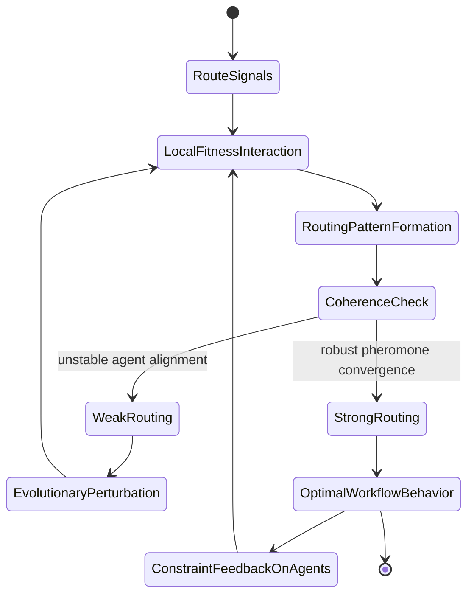
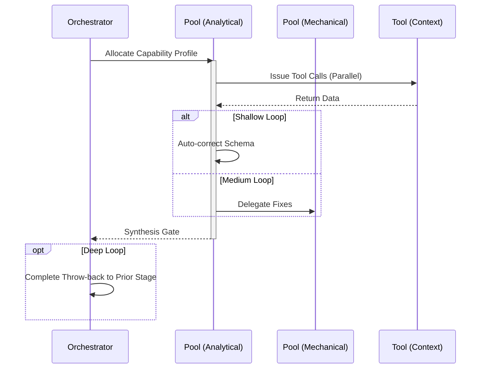

import { Badge, Aside } from '@astrojs/starlight/components';

<Badge text="Tool: routing-adapt" variant="tip" /> <Badge text="Model: Advanced" variant="note" />
<Badge text="Requires: ENABLE_ADAPTIVE_ROUTING=true" variant="danger" />

## Trigger & Intent

**Triggered by:** Workflow efficiency degrading, or a request to "self-optimize routing" and prune unused agent paths.

**Intent:** Mutates and reinforces good pathways dynamically without hardcoded modifications. Uses biological metaphors (ACO, Hebbian, Physarum, Quorum, Annealing).

<Aside type="caution">
Requires `ENABLE_ADAPTIVE_ROUTING=true` in the environment. This workflow directly modifies routing configuration and must be used deliberately.
</Aside>

## Resource Pooling

Capability profile: `adaptive_routing` — requires `structured_output`, prefers `cost_sensitive`, `fast_draft` fallback. Gated by `ENABLE_ADAPTIVE_ROUTING=true`.

## Required Skills

| Skill | Role |
|-------|------|
| `adapt-aco-router` | Ant Colony Optimization — pheromone-trail routing reinforcement |
| `adapt-annealing` | Simulated Annealing — global optimum routing discovery |
| `resil-clone-mutate` | Clone-and-mutate strategy evolution |
| `adapt-hebbian-router` | Hebbian learning — "neurons that fire together wire together" |
| `adapt-physarum-router` | Physarum slime-mold network optimization |
| `adapt-quorum` | Quorum sensing for distributed consensus |
| `resil-replay` | Replay consolidation of learned paths |

## Input Schema

```typescript
{
  executionLogs: unknown[];
  targetMetric: string;
}
```

## Decisions & Throw-Backs

If the simulated annealing optimizer finds a structurally better layout, auto-updates the routing config and tests it against benchmarks. If tests fail, throws back to the previous routing table.

## Success Chains

**Terminal node** — does not chain to other workflows on completion.

## FSM — Emergence from local interaction



## Execution Sequence


