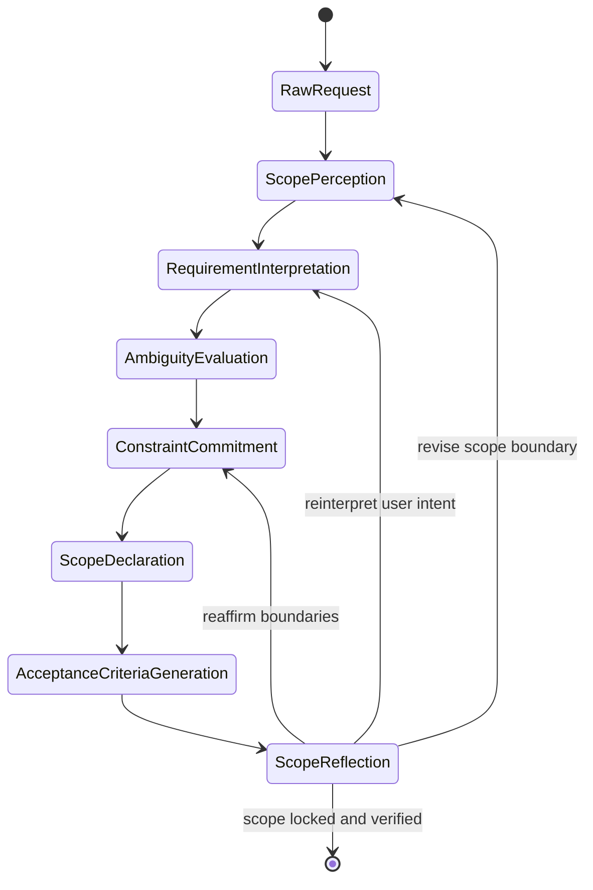

## Trigger & Intent

**Triggered by:** `meta-routing` when a user request is greenfield or has an unclear scope.  
**Intent:** Prevent scope creep and vague requirements by forcing a formal extraction and ambiguity detection phase before any code is written.

## Required Skills

- `req-analysis` — requirements analysis
- `req-scope` — scope boundary definition
- `req-ambiguity-detection` — ambiguity detection
- `req-acceptance-criteria` — acceptance criteria generation

## Input Schema

```typescript
{ rawInput: string; constraints?: string[] }
```

## Decision Logic

- Conflicting or ambiguous requirements → loop back to user for clarification
- Only tightly scoped, bounded requirements exit the workflow

## Required Pre-Conditions

Before scope analysis: `agent-snapshot`, `agent-session`, `agent-memory`

## FSM



## Success Chains

`design` · `implement` · `research` · `review` · `plan` · `debug` · `refactor` · `testing` · `orchestrate` · `govern` · `enterprise` · `physics-analysis`
