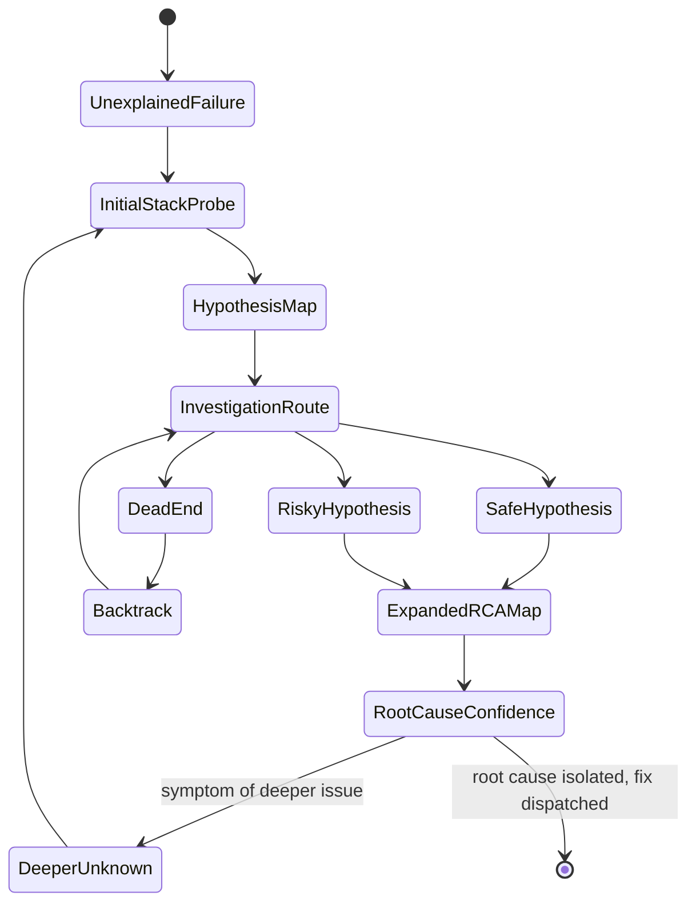
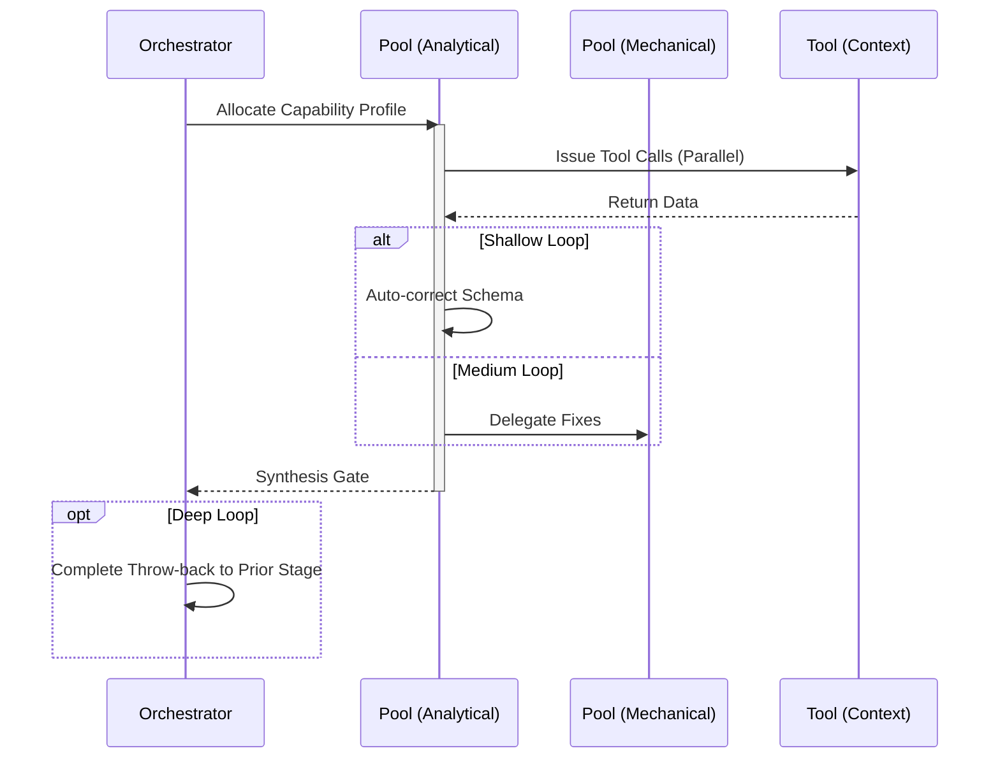

import { Badge } from '@astrojs/starlight/components';

<Badge text="Tool: issue-debug" variant="tip" /> <Badge text="Model: Efficient" variant="note" />

## Trigger & Intent

**Triggered by:** Explicit stack traces, failing CI/CD runs, or execution failures in `implement`.

**Intent:** Performs rigorous Root Cause Analysis (RCA) instead of blindly guessing fixes.

## Resource Pooling

Capability profile: `debugging` — requires `code_analysis`, prefers `cost_sensitive`, `fast_draft` fallback.

## Required Skills

| Skill | Role |
|-------|------|
| `debug-assistant` | Debugging guidance and hypothesis generation |
| `debug-root-cause` | Root cause identification |
| `debug-reproduction` | Minimal reproduction planning |

## Input Schema

```typescript
{
  stackTrace?: string;
  observedBehavior: string;
  expectedBehavior: string;
}
```

## Decisions & Throw-Backs

Attempts to write a minimal failing test case first. If the bug cannot be reproduced, throws back asking for more environment context. Once RCA is confirmed, routes directly to `implement`.

## Success Chains

On successful completion chains to: **testing** · **refactor** · **govern**

## FSM — Exploration of the unknown with recursive map-making



## Execution Sequence


