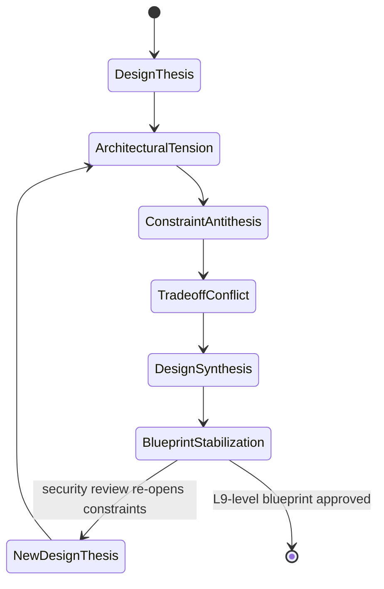

## Trigger & Intent

**Triggered by:** `task-bootstrap` or directly when user asks for system architecture, data models, or tradeoff analysis.  
**Intent:** Formulate structural guarantees. Generate L9-level system blueprints without rushing into implementation.

## Required Skills

- `arch-system` — system design
- `arch-security` — security threat modelling
- `arch-reliability` — failure mode analysis
- `arch-scalability` — scaling strategy
- `req-analysis` — requirements clarification

## Resource Profile

`large_context` + `code_analysis` required, `synthesis` preferred, `cost_sensitive` fallback.

## Decision Logic

- Build-vs-buy and tradeoff analysis performed before any decision
- Security review flags critical vulnerabilities → throw back to tradeoff matrix
- Only L9-level blueprint approved exits the workflow

## FSM

## Success Chains

`feature-implement` · `policy-govern`
