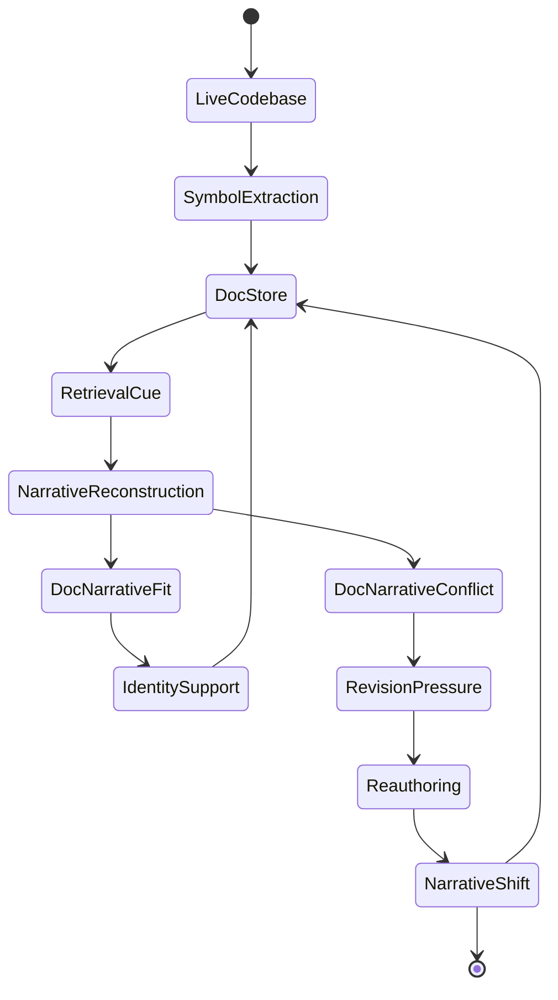
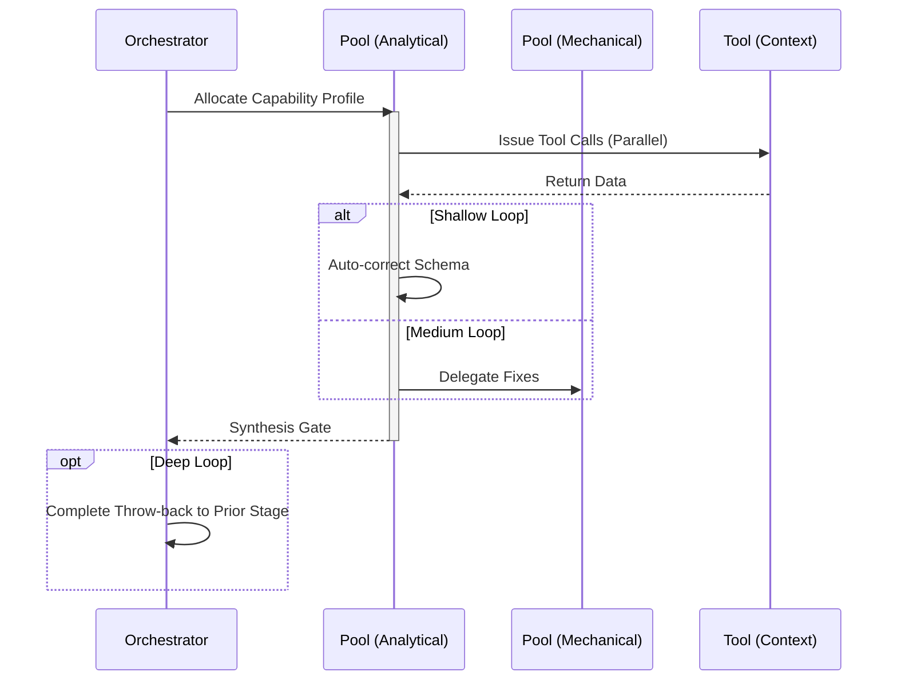

import { Badge } from '@astrojs/starlight/components';

<Badge text="Tool: docs-generate" variant="tip" /> <Badge text="Model: Efficient" variant="note" />

## Trigger & Intent

**Triggered by:** A request to auto-document code, generate APIs, or write runbooks.

**Intent:** Exposes deep technical context for humans in predictable schemas without subjective fluff. Code dictates docs.

## Resource Pooling

Capability profile: `documentation` — requires `fast_draft`, prefers `cost_sensitive`, fan-out 3.

## Required Skills

| Skill | Role |
|-------|------|
| `doc-api` | API reference documentation |
| `doc-generator` | General documentation generation |
| `doc-readme` | README and project overview generation |
| `doc-runbook` | Operational runbook authoring |

## Input Schema

```typescript
{
  sourcePaths: string[];
  docType: "api" | "runbook" | "readme";
}
```

## Decisions & Throw-Backs

If API docs fail schema-validation tests, throws back to `implement` to fix the underlying API. Code dictates docs — never the reverse.

## Success Chains

On successful completion chains to: **review** · **enterprise**

## FSM — Narrative identity through memory reconstruction



## Execution Sequence


