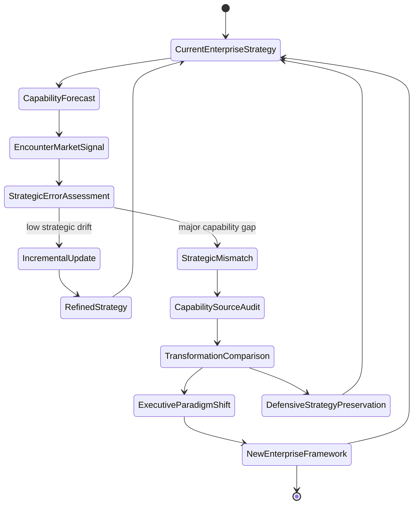
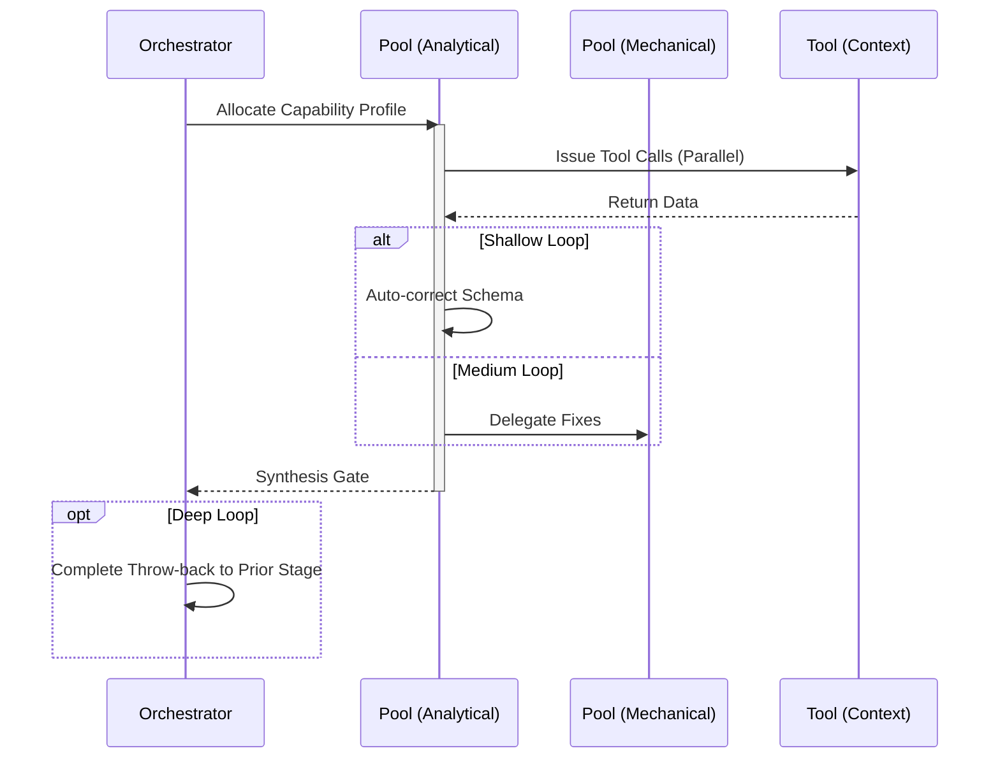

import { Badge, Aside } from '@astrojs/starlight/components';

<Badge text="Tool: enterprise-strategy" variant="tip" /> <Badge text="Model: Advanced" variant="note" />

## Trigger & Intent

**Triggered by:** Exec briefings, staff-level mentoring, or capability mappings at organizational scale.

**Intent:** Provides distinguished-engineer perspective on AI strategy and ecosystem design. Refuses legacy debt.

<Aside type="tip">
This is one of two workflows (alongside `govern`) that applies the Software Evangelist principle: any strategy retaining legacy AI or "duck tape" integration is rejected and thrown back.
</Aside>

## Resource Pooling

Capability profile: `enterprise` — requires `large_context` + `synthesis`, prefers `deep_reasoning`, `cost_sensitive` fallback.

## Required Skills

| Skill | Role |
|-------|------|
| `lead-capability-mapping` | Organizational capability assessment |
| `lead-digital-architect` | Digital enterprise architecture |
| `lead-exec-briefing` | Executive technical briefing |
| `lead-l9-engineer` | Distinguished Engineer perspective |
| `lead-staff-mentor` | Staff engineering mentoring |
| `lead-transformation-roadmap` | Transformation roadmap design |
| `lead-software-evangelist` | Radical Forward Movement enforcement |

## Input Schema

```typescript
{
  orgData: unknown;
  scale: string;
}
```

## Decisions & Throw-Backs

**Evangelist check:** If any strategy retains legacy AI or "duck tape" integration, throws back and refuses to sign off. Radical integration only.

## Success Chains

On successful completion chains to: **govern** · **design** · **plan**

## FSM — Meta-learning engine of belief revision



## Execution Sequence


