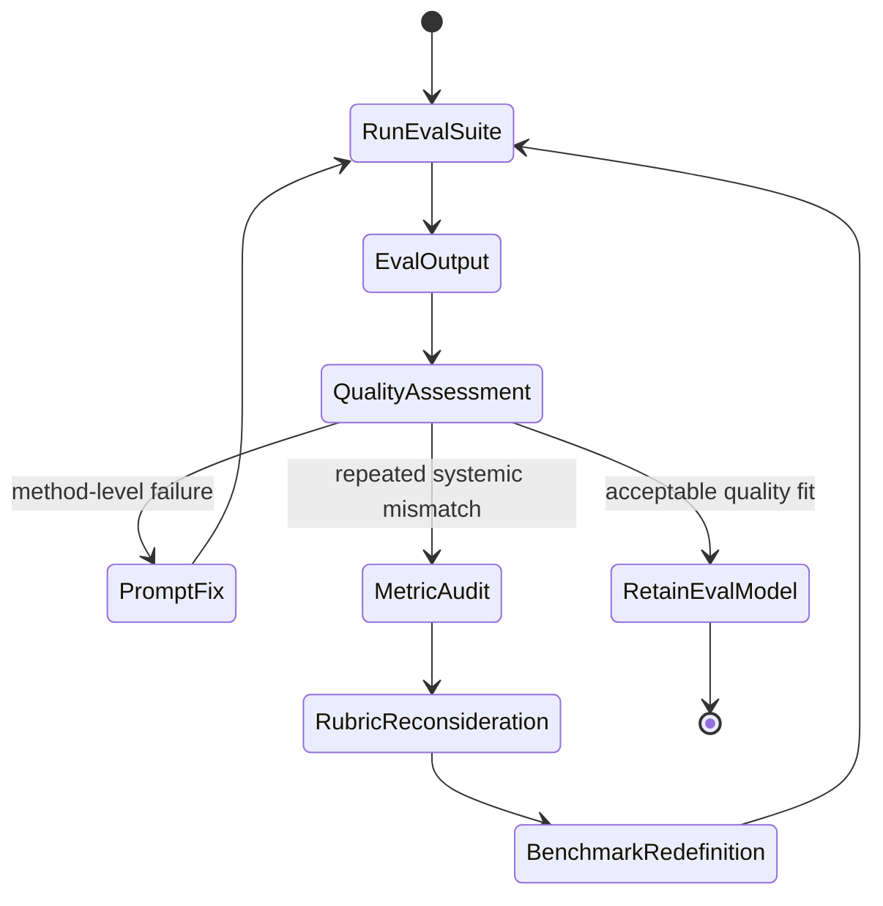
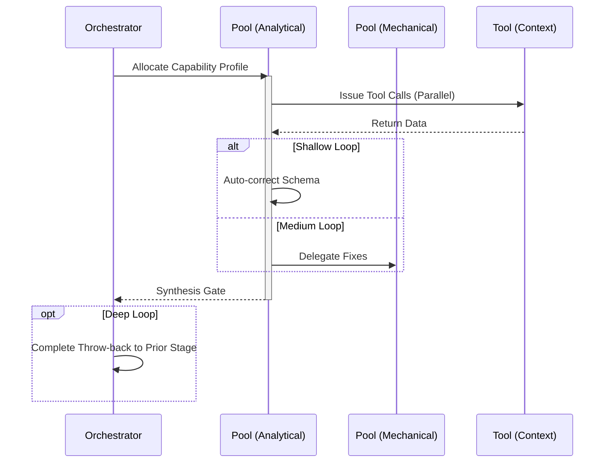

import { Badge } from '@astrojs/starlight/components';

<Badge text="Tool: quality-evaluate" variant="tip" /> <Badge text="Model: Cross-Model" variant="note" />

## Trigger & Intent

**Triggered by:** The `implement` workflow or a direct `eval` request against prompt templates.

**Intent:** Quantify variance and accuracy of agent pipelines without human intervention. Benchmarks must be repeatable.

## Resource Pooling

Capability profile: `evaluation` — requires `structured_output` + `classification`, prefers `cost_sensitive`, `fast_draft` fallback, fan-out 3. Tie-break/synthesis escalation handled by configured orchestration patterns.

## Required Skills

| Skill | Role |
|-------|------|
| `eval-prompt` | Prompt template evaluation |
| `eval-variance` | Statistical variance analysis |
| `bench-blind-comparison` | A/B pairwise comparison |

## Input Schema

```typescript
{
  evalSuiteId: string;
  targetModel: string;
}
```

## Decisions & Throw-Backs

If performance degrades (variance increases or score drops), throws an exception and routes back to `prompt-engineering` to refine templates. Evaluates output quality using randomly generated A/B pairwise comparisons.

## Success Chains

On successful completion chains to: **prompt-engineering** · **refactor** · **govern**

## FSM — Double-loop learning with assumption revision



## Execution Sequence


