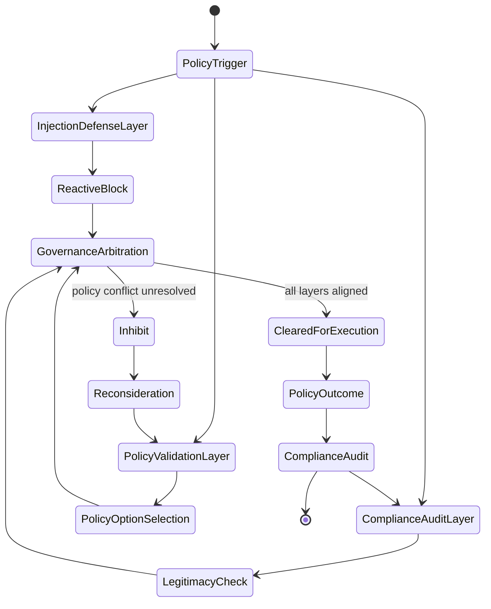
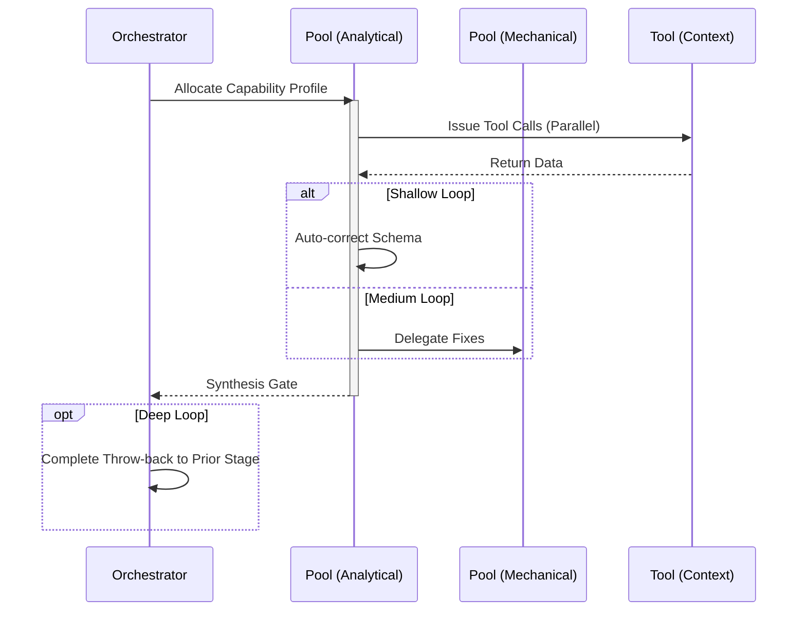

import { Badge, Aside } from '@astrojs/starlight/components';

<Badge text="Tool: policy-govern" variant="tip" /> <Badge text="Model: Advanced" variant="note" />
<Badge text="Requires: ALLOW_GOVERNANCE_SKILLS=true" variant="danger" />

## Trigger & Intent

**Triggered by:** Compliance checks, prompt injection hardening, and safety validation for regulated workflows.

**Intent:** Strictly validates outputs against policy controls before allowing interaction with sensitive systems.

<Aside type="caution">
`gov-*` skill execution is gated by `ALLOW_GOVERNANCE_SKILLS=true`. This workflow always runs adversarial depth and requires human-in-the-loop where policy dictates.
</Aside>

## Resource Pooling

Capability profile: `governance` — requires `security_audit` + `adversarial`, prefers `deep_reasoning`, human-in-the-loop required.

## Required Skills

| Skill | Role |
|-------|------|
| `gov-data-guardrails` | PII detection and data handling compliance |
| `gov-model-compatibility` | Model capability/policy compatibility check |
| `gov-model-governance` | Model lifecycle governance |
| `gov-policy-validation` | Policy schema validation |
| `gov-prompt-injection-hardening` | Injection attack prevention |
| `gov-regulated-workflow-design` | Regulated environment workflow design |
| `gov-workflow-compliance` | End-to-end workflow compliance audit |

## Input Schema

```typescript
{
  targetPipeline: string;
  policySchema: string;
}
```

## Decisions & Throw-Backs

If any PII, injection vulnerability, or policy violation is flagged by the adversarial tier → throws back to `design` or `implement` loudly. Does not soft-fail silently.

## Success Chains

On successful completion chains to: **review** · **resilience** · **document**

## FSM — Multi-level governance of action



## Execution Sequence


