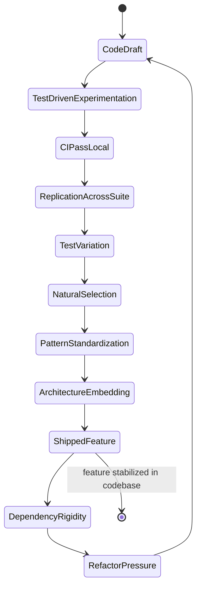
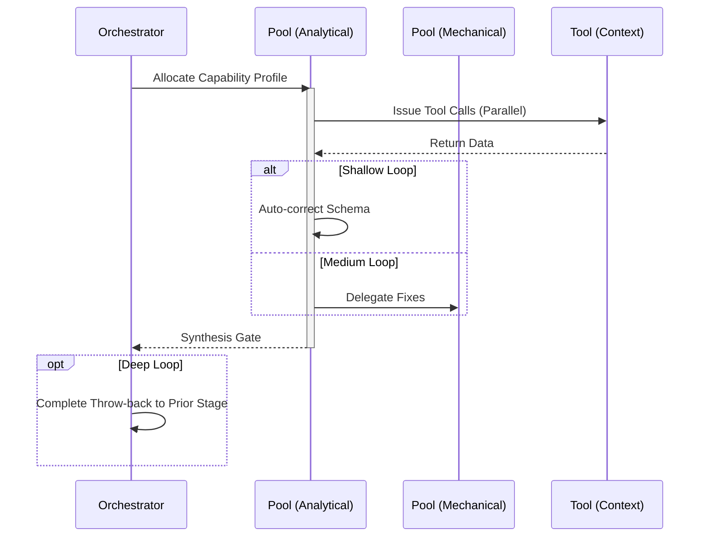

import { Badge, Aside } from '@astrojs/starlight/components';

<Badge text="Tool: feature-implement" variant="tip" /> <Badge text="Model: Advanced" variant="note" />

## Trigger & Intent

**Triggered by:** `design` or `meta-routing` when a clear specification is present.

**Intent:** Writes deterministic, dependency-aware code with immediate test-driven guardrails.

## Resource Pooling

Capability profile: `implement` — requires `code_analysis` + `structured_output`, prefers `cost_sensitive`, `fast_draft` fallback, fan-out 2.

## Required Skills

| Skill | Role |
|-------|------|
| `req-analysis` | Requirements decomposition |
| `qual-code-analysis` | Static analysis and code quality gates |
| `arch-system` | Architecture compliance verification |

## Input Schema

```typescript
{
  specification: string;
  constraints: string[];
}
```

## Decisions & Throw-Backs

Drafts code, generates an AST-level test suite.

- If tests pass → push to **Review**
- If tests fail → silent auto-loop (throw-back) 3× before failing and invoking `Resilient-Adapt`

## Success Chains

On successful completion chains to: **testing** · **review**

## FSM — Institutionalization of innovation



## Execution Sequence


