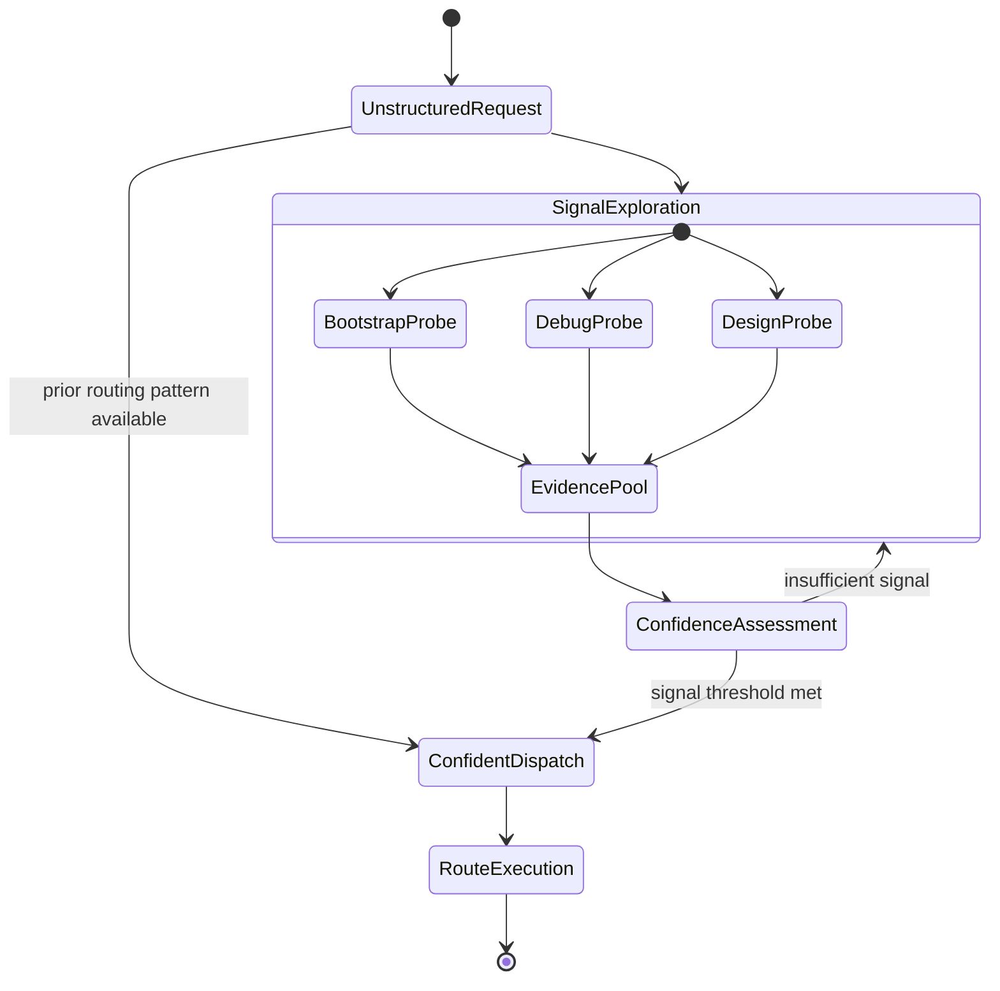

## Trigger & Intent

**Triggered by:** Absolute entry point of any user interaction.  
**Intent:** Triage ambiguous, generic queries into the 20 structured master instructions without human input.

## Required Skills

- `req-ambiguity-detection` — detects under-specification
- `req-scope` — clarifies request boundary

## Input Schema

```typescript
{ request: string; context?: string; taskType?: string; currentPhase?: string }
```

## Decision Logic

- Missing architecture context → route to `task-bootstrap`
- Explicit stack trace → route directly to `issue-debug`
- Structural rewrite requested → route to `system-design`
- Compound multi-domain task → route to `meta-routing` recursively then fan-out

## FSM



## Success Chains

Terminal node — does not chain to other workflows on completion.
