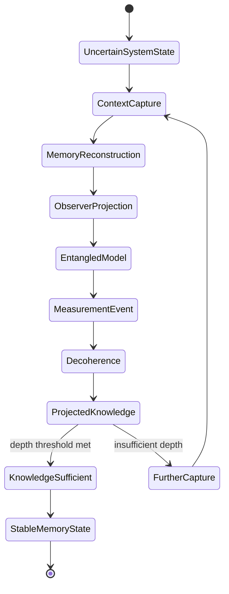
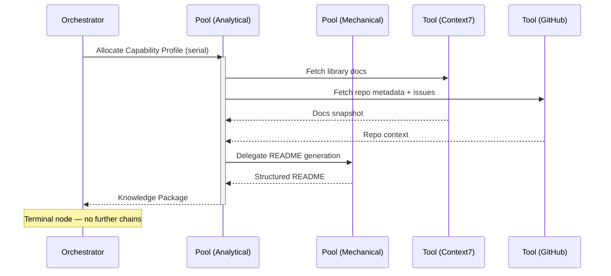

import { Badge, Aside } from '@astrojs/starlight/components';

<Badge text="Tool: project-onboard" variant="tip" /> <Badge text="Model: Efficient" variant="note" />

## Trigger & Intent

**Triggered by:** A new developer joining a project, or a comprehensive knowledge-capture session for an existing codebase.

**Intent:** Converts a raw codebase into structured, navigable memory. Terminal workflow node — does not chain to further workflows.

<Aside type="note">
This is a terminal workflow node. It uses Context7-MCP and GitHub-specific tools for live documentation and repository analysis. It chains to no downstream workflow.
</Aside>

## Resource Pooling

Capability profile: `onboarding` — requires `codebase_scan` + `memory_write`, prefers `cost_sensitive`, serial execution.

## Required Skills

| Skill | Role |
|-------|------|
| `core-codebase-qa` | Codebase question and answer |
| `core-requirement-tracker` | Requirement extraction and tracking |
| `doc-readme` | README and project overview generation |
| External: `context7-mcp` | Live framework documentation retrieval |
| External: `mcp-github` | Repository metadata and issue context |

## Input Schema

```typescript
{
  repoUrl: string;
  knowledgeDepth: "surface" | "full";
}
```

## Decisions & Throw-Backs

Terminal node — no downstream throw-backs. If `context7-mcp` fails to resolve library docs (network unavailable) → falls back to cached documentation in `doc-readme` skill.

## Success Chains

This is a **terminal node**. No downstream chains.

## FSM — Observer-system entanglement



## Execution Sequence


