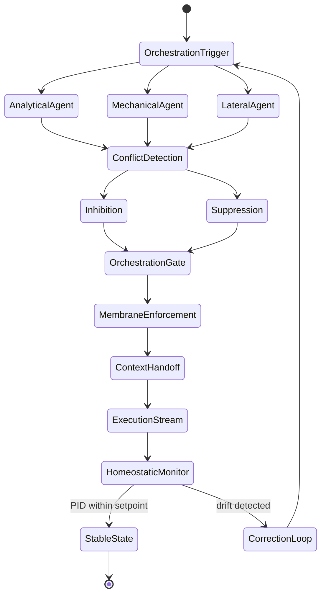
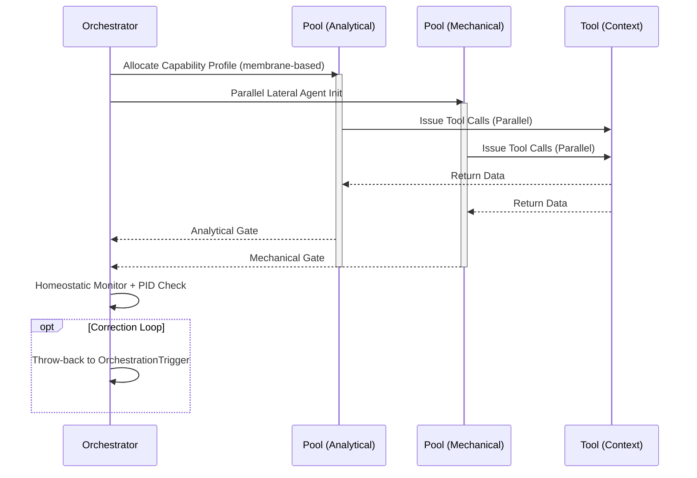

import { Badge, Aside } from '@astrojs/starlight/components';

<Badge text="Tool: agent-orchestrate" variant="tip" /> <Badge text="Model: Advanced" variant="note" />

## Trigger & Intent

**Triggered by:** Multi-agent coordination, FSM design, or homeostatic control loop requirements.

**Intent:** Builds membrane-based multi-agent architectures with parallel inner faculties, context handoff, and contradiction resolution. Never produces flat tool-call chains.

<Aside type="tip">
This workflow activates the `adv-*` (advanced/bio-inspired) tier. All competing agent pools are governed by adaptive routing with PID setpoints.
</Aside>

## Resource Pooling

Capability profile: `orchestration` — requires `multi_agent` + `fsm`, requires `adaptive_routing`, prefers `deep_reasoning`.

## Required Skills

| Skill | Role |
|-------|------|
| `adv-membrane-orchestrator` | Membrane boundary enforcement |
| `core-agent-orchestrator` | Core multi-agent coordination |
| `core-context-handoff` | Context state transfer between agents |
| `core-multi-agent-prompt` | Prompt design for agent ensembles |
| `core-session-management` | Agent session and state lifecycle |
| `resil-homeostatic-module` | PID setpoint homeostatic control |
| `resil-redundant-voter` | Consensus voting across agent outputs |

## Input Schema

```typescript
{
  agentGraph: unknown;
  coordinationMode: "parallel" | "sequential" | "membrane";
}
```

## Decisions & Throw-Backs

If agent graph produces cyclic deadlock or unconstrained fan-out → throws back to `design` to add FSM constraints or membrane limits.

## Success Chains

On successful completion chains to: **evaluate** · **resilience**

## FSM — Parallel inner faculties competing for control



## Execution Sequence


