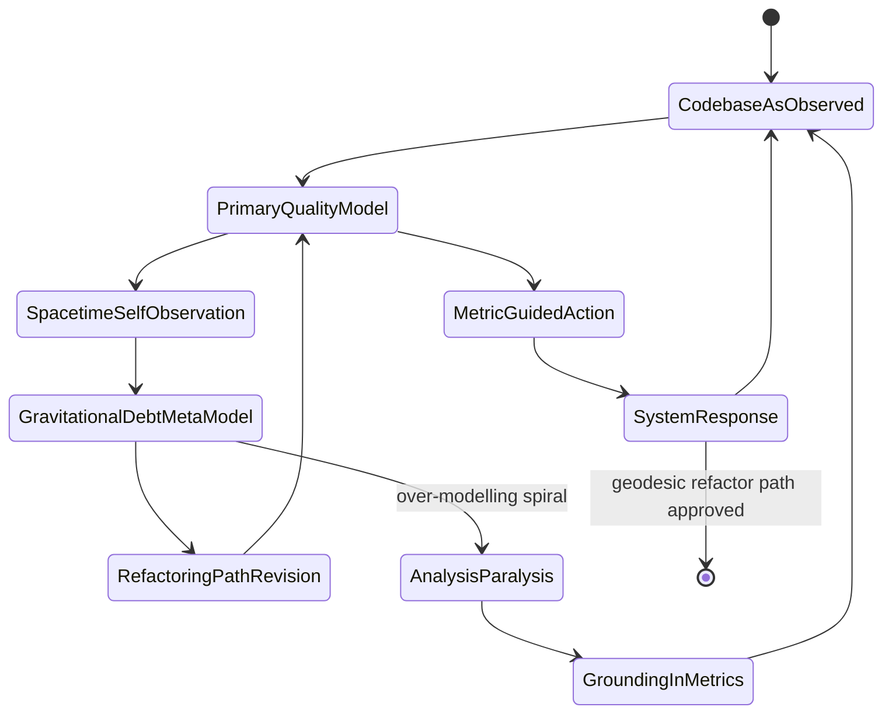
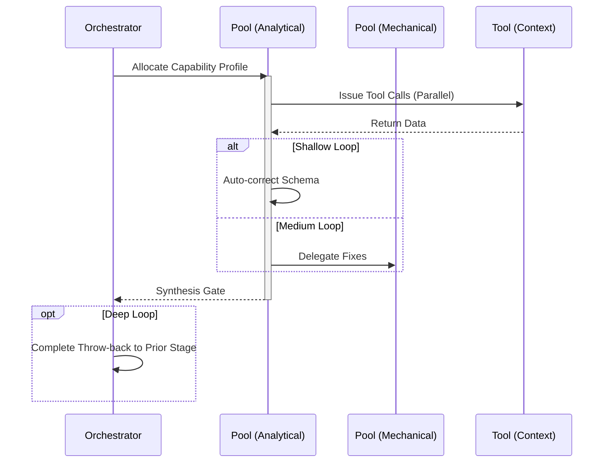

import { Badge, Aside } from '@astrojs/starlight/components';

<Badge text="Tool: physics-analysis" variant="tip" /> <Badge text="Model: Advanced" variant="note" />
<Badge text="Requires: ENABLE_PHYSICS_SKILLS=true" variant="danger" />

## Trigger & Intent

**Triggered by:** The `qual-review` loop when cyclomatic complexity exceeds 80, or coupling metrics are breached.

**Intent:** Use QM/GR metaphors to diagnose unmaintainable dependency webs without bias from conventional heuristics.

<Aside type="caution">
Physics skills require `ENABLE_PHYSICS_SKILLS=true` in the environment. They are gated explicitly because physics-metaphor output requires strong model capacity (`math_physics` + `deep_reasoning`).
</Aside>

## Resource Pooling

Capability profile: `physics_analysis` — requires `math_physics` + `deep_reasoning`, **no fallback configured**, schema enforcement enabled.

## Required Skills

| Skill | Role |
|-------|------|
| `gr-event-horizon-detector` | Identifies modules past the point of refactoring return |
| `qm-entanglement-mapper` | Detects invisible coupling through co-change histories |
| `qm-heisenberg-picture` | Tracks non-commuting quality metrics |

## Input Schema

```typescript
{
  targetPath: string;
  baselineAST: unknown;
}
```

## Decisions & Throw-Backs

Calculates *spacetime debt* and proposes a *geodesic refactoring* path. If the cost of the refactor is too high, throws execution back to `strategy` to prioritize in the roadmap instead of proceeding.

## Success Chains

**Terminal node** — does not chain to other workflows on completion (outputs feed back to `strategy-plan` or `code-refactor` as user-driven decisions).

## FSM — Recursive self-modeling



## Execution Sequence


