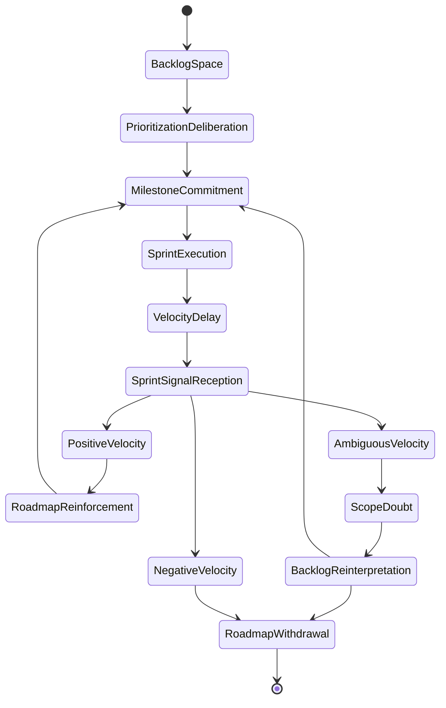
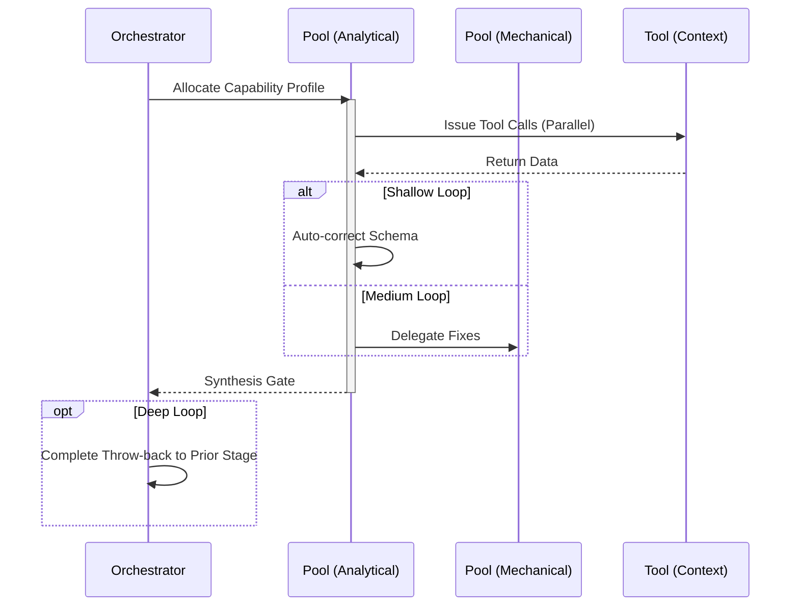

import { Badge, Aside } from '@astrojs/starlight/components';

<Badge text="Tool: strategy-plan" variant="tip" /> <Badge text="Model: Advanced" variant="note" />

## Trigger & Intent

**Triggered by:** User asking for a sprint plan, roadmap, prioritization matrix, or organizational setup.

**Intent:** Produces a structured sequence of work blocks with explicit milestones. Prevents jumping into execution without a strategy.

## Resource Pooling

Capability profile: `strategy` — requires `large_context` + `structured_output`, prefers `cost_sensitive`, fan-out 1.

## Required Skills

| Skill | Role |
|-------|------|
| `strat-advisor` | Strategic framing and option analysis |
| `strat-prioritization` | Weighted backlog ordering |
| `strat-roadmap` | Milestone and horizon structuring |

## Input Schema

```typescript
{
  goal: string;
  constraints?: string[];
  horizon: "sprint" | "quarter" | "year";
}
```

## Decisions & Throw-Backs

If work exceeds the capability matrix, flags constraints. Throws to user if the prioritized list is out of budget.

## Success Chains

On successful completion chains to: **implement** · **enterprise** · **research**

## FSM — Commitment under uncertainty with delayed consequence



## Execution Sequence


