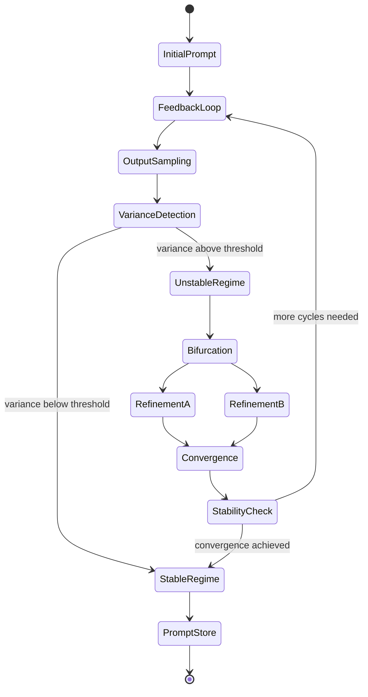
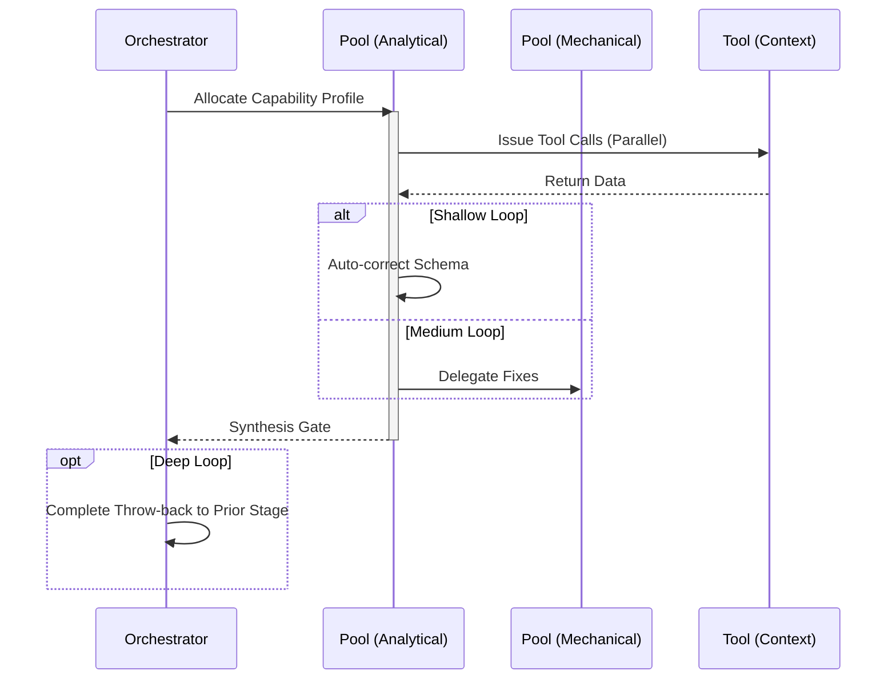

import { Badge } from '@astrojs/starlight/components';

<Badge text="Tool: prompt-engineering" variant="tip" /> <Badge text="Model: Efficient" variant="note" />

## Trigger & Intent

**Triggered by:** Requests to improve, chain, or systematize prompts at scale.

**Intent:** Iterative prompt refinement using feedback systems with stable and unstable regimes. Detects variance, applies hierarchy, and stabilizes outputs through reinforced chains.

## Resource Pooling

Capability profile: `prompting` — requires `iterative_refinement`, prefers `cost_sensitive`, fan-out 2.

## Required Skills

| Skill | Role |
|-------|------|
| `prompt-chaining` | Sequential prompt dependency design |
| `prompt-engineering` | Core prompt construction methodology |
| `prompt-hierarchy` | Multi-level prompt organization |
| `prompt-refinement` | Feedback-driven prompt improvement |

## Input Schema

```typescript
{
  rawPrompts: string[];
  targetBehavior: string;
}
```

## Decisions & Throw-Backs

If variance remains above threshold after 3 refinement cycles → escalates to `govern` for policy-level review of prompt language.

## Success Chains

On successful completion chains to: **evaluate** · **govern**

## FSM — Feedback system with stable and unstable regimes



## Execution Sequence


