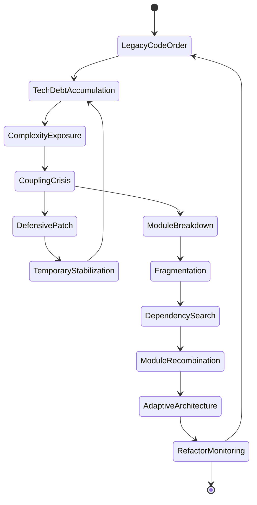
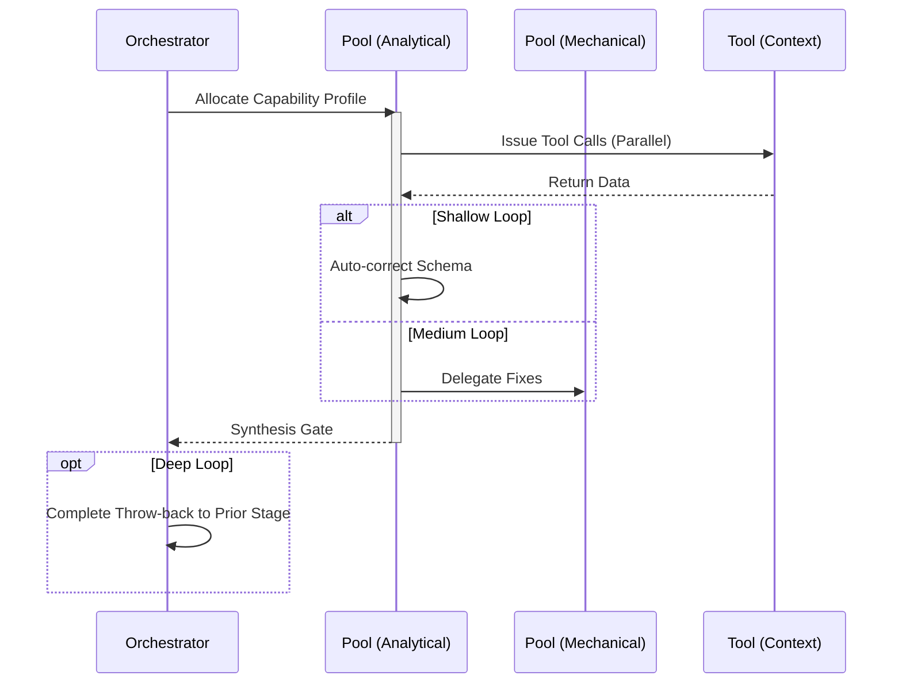

import { Badge } from '@astrojs/starlight/components';

<Badge text="Tool: code-refactor" variant="tip" /> <Badge text="Model: Efficient" variant="note" />

## Trigger & Intent

**Triggered by:** `physics-analysis` output or a user request to clean up technical debt.

**Intent:** Reduces complexity without changing observable functionality. Modifies AST safely.

## Resource Pooling

Capability profile: `refactor` — requires `code_analysis`, prefers `structured_output`, `fast_draft` fallback.

## Required Skills

| Skill | Role |
|-------|------|
| `qual-refactoring-priority` | Prioritize refactoring targets by impact/cost |
| `gr-geodesic-refactor` | Compute the minimum-path refactoring through module graph |
| `gr-spacetime-debt-metric` | Measure accumulated structural debt |

## Input Schema

```typescript
{
  targetModules: string[];
  complexityTarget?: number;
}
```

## Decisions & Throw-Backs

Uses GR spacetime-debt metrics to compute the cheapest cross-module refactoring path. Once written, throws to `testing` for regression validation.

## Success Chains

On successful completion chains to: **testing** · **review**

## FSM — Crisis, collapse, and adaptive reassembly



## Execution Sequence


