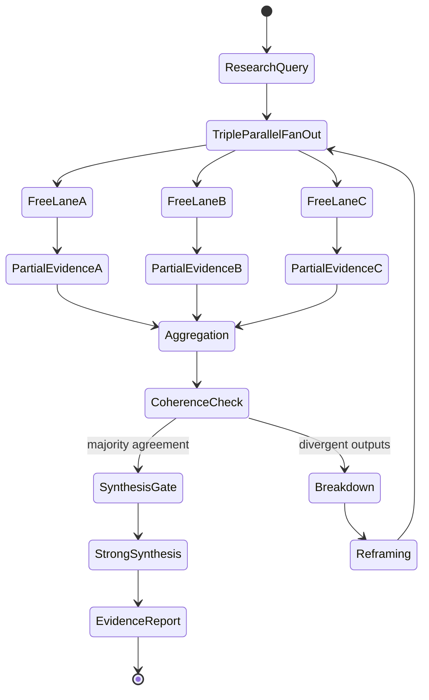

import { Badge } from '@astrojs/starlight/components';

<Badge text="Tool: evidence-research" variant="tip" /> <Badge text="Model: Advanced" variant="note" />

## Trigger & Intent

**Triggered by:** Deep research, comparative analysis, or knowledge synthesis requests.

**Intent:** Triple-parallel synthesis using free lanes plus cross-model validation. Produces adversarially stress-tested evidence synthesis — not summarized opinion.

## Resource Pooling

Capability profile: `research` — requires `triple_parallel_synthesis`, fan-out 3 (free lanes), then strong synthesis pass.

Pattern: `GPT-5 mini` (breadth) × `GPT-4.1` (depth A) × `GPT-4.1` (depth B, distinct framing) → `Claude Sonnet 4.6` synthesis.

## Required Skills

| Skill | Role |
|-------|------|
| `synth-comparative-analysis` | Side-by-side evidence comparison |
| `synth-decision-engine` | Evidence-to-decision translation |
| `synth-recommendation-engine` | Ranked recommendation synthesis |
| `synth-research` | Deep domain research |

## Input Schema

```typescript
{
  researchQuery: string;
  depth: "surface" | "medium" | "deep";
}
```

## Decisions & Throw-Backs

If 3 free lanes produce divergent synthesis (no majority agreement) → escalates immediately to `enterprise` for strategic framing before retry.

## Success Chains

On successful completion chains to: **plan** · **design** · **enterprise**

## FSM — Meaning-making with breakdown and reconstruction



## Execution Sequence

```mermaid
sequenceDiagram
    participant Orchestrator
    participant FreeLane A (GPT-5 mini)
    participant FreeLane B (GPT-4.1)
    participant FreeLane C (GPT-4.1)
    participant Synthesis (Sonnet)

    Orchestrator->>FreeLane A (GPT-5 mini): Broad research pass
    Orchestrator->>FreeLane B (GPT-4.1): Deep analysis pass
    Orchestrator->>FreeLane C (GPT-4.1): Alternative framing pass

    FreeLane A (GPT-5 mini)-->>Orchestrator: Perspective A
    FreeLane B (GPT-4.1)-->>Orchestrator: Perspective B
    FreeLane C (GPT-4.1)-->>Perspective C

    Orchestrator->>Synthesis (Sonnet): Synthesize 3 perspectives
    Synthesis (Sonnet)-->>Orchestrator: Evidence Report

    opt Divergent Outputs
        Orchestrator->>Orchestrator: Throw-back to enterprise for framing
    end
```
