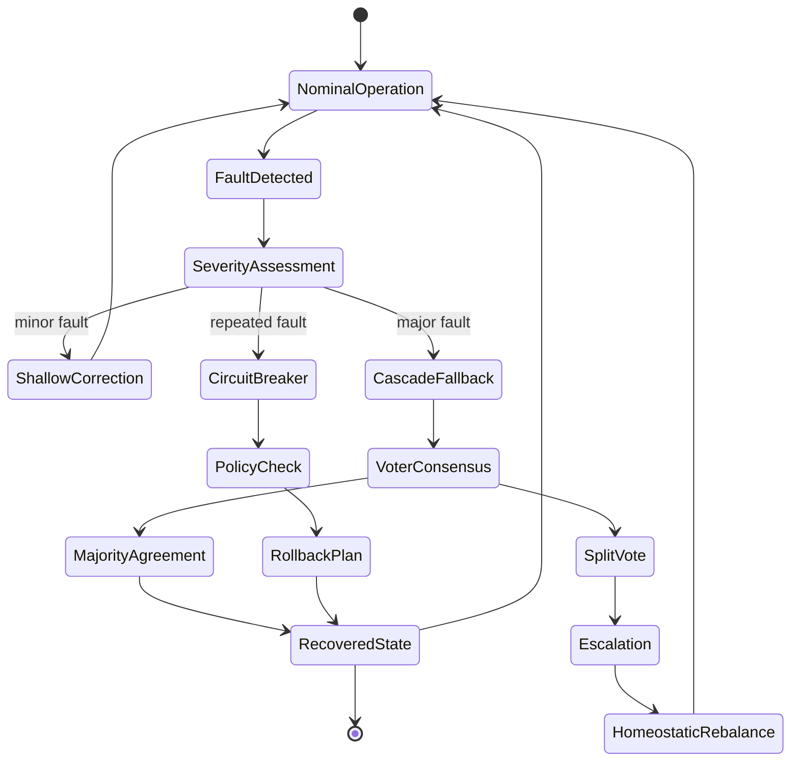
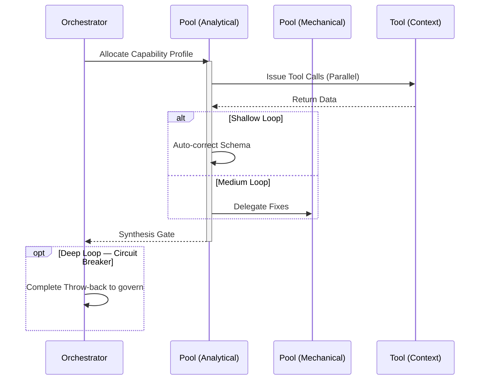

import { Badge } from '@astrojs/starlight/components';

<Badge text="Tool: fault-resilience" variant="tip" /> <Badge text="Model: Advanced" variant="note" />

## Trigger & Intent

**Triggered by:** Any workflow that requires fault-tolerance, adaptive fallback, or homeostatic recovery mechanisms.

**Intent:** Builds systems that self-heal through cascade fallbacks, voter consensus arbitration, and PID-controlled setpoints. Never relies on static retry logic.

## Resource Pooling

Capability profile: `resilience` — requires `homeostatic` + `voter_consensus`, prefers `adaptive_routing`, cascade fallback mandatory.

## Required Skills

| Skill | Role |
|-------|------|
| `resil-homeostatic-module` | PID setpoint homeostatic control |
| `resil-redundant-voter` | Multi-model consensus voting |
| `resil-circuit-breaker` | Circuit breaker pattern implementation |
| `resil-graceful-degradation` | Graceful capability degradation |
| `resil-context-recovery` | Context state recovery on failure |
| `resil-rollback-planner` | Safe rollback plan generation |

## Input Schema

```typescript
{
  targetService: string;
  faultMode: "cascade" | "voter" | "homeostatic";
}
```

## Decisions & Throw-Backs

If circuit breaker trips 3× without recovery → escalates to `govern` to check policy constraints on retry behavior. Homeostatic drift over setpoint triggers immediate throw-back.

## Success Chains

On successful completion chains to: **govern** · **evaluate**

## FSM — Adaptive identity through repeated contradiction



## Execution Sequence


