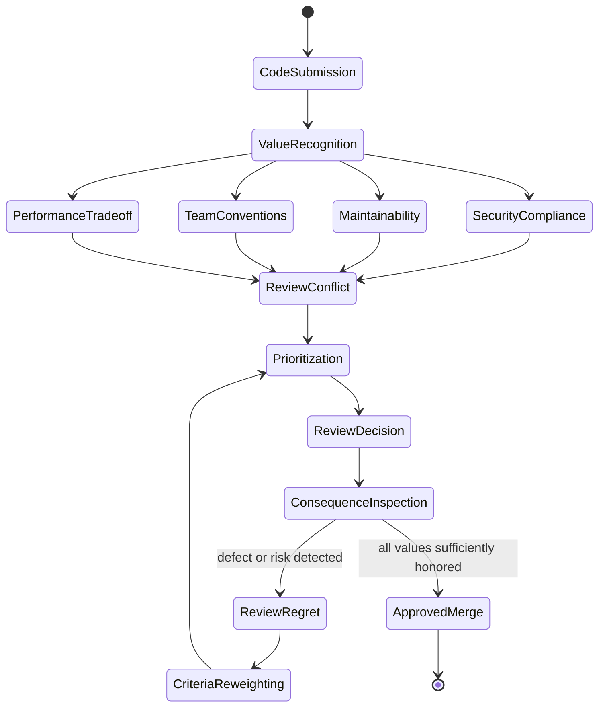
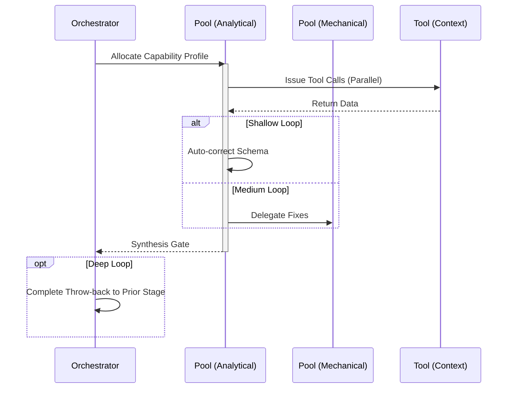

import { Badge } from '@astrojs/starlight/components';

<Badge text="Tool: code-review" variant="tip" /> <Badge text="Model: Cross-Model" variant="note" />

## Trigger & Intent

**Triggered by:** A pull request, a completed `implement` step, or an explicit request to audit existing code.

**Intent:** Enforce L9-level quality, security, and performance gates before merging.

## Resource Pooling

Capability profile: `code_review` — requires `code_analysis`, prefers `structured_output`, `fast_draft` fallback. Stronger review models selected by availability rules when needed.

## Required Skills

| Skill | Role |
|-------|------|
| `qual-review` | General code quality review |
| `qual-security` | Security vulnerability detection |
| `qual-performance` | Performance regression analysis |

## Input Schema

```typescript
{
  targetFiles: string[];
  reviewDepth: "standard" | "deep" | "adversarial";
}
```

## Decisions & Throw-Backs

- Security review failure → immediately rejects the PR/draft and throws back to `implement`
- Performance degradation → throws back
- All gates pass → advances to `govern`, `refactor`, or `testing`

## Success Chains

On successful completion chains to: **govern** · **refactor** · **testing**

## FSM — Ethical deliberation under conflicting goods



## Execution Sequence


