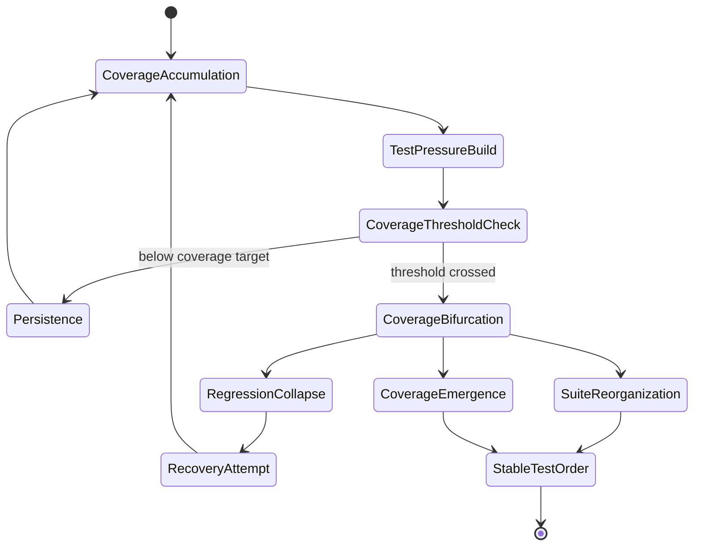
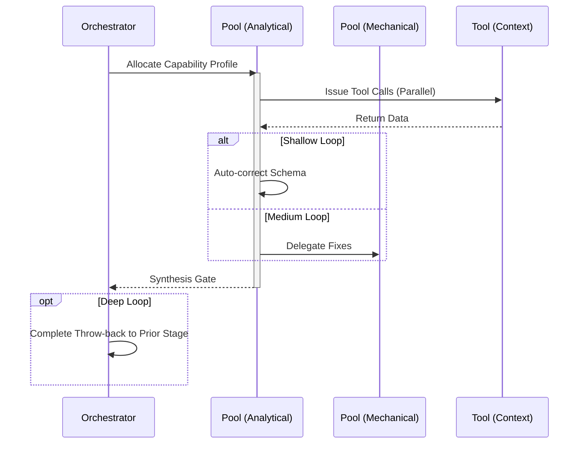

import { Badge } from '@astrojs/starlight/components';

<Badge text="Tool: test-verify" variant="tip" /> <Badge text="Model: Efficient" variant="note" />

## Trigger & Intent

**Triggered by:** Completing `implement` or a request to shore up a module's tests.

**Intent:** Ensures every new piece of work is regression-safe, building reliable infrastructure.

## Resource Pooling

Capability profile: `testing` — requires `code_analysis` + `structured_output`, prefers `cost_sensitive`, `fast_draft` fallback.

## Required Skills

| Skill | Role |
|-------|------|
| `eval-design` | Test design and coverage planning |
| `arch-reliability` | Reliability architecture patterns |

## Input Schema

```typescript
{
  targetFiles: string[];
  testFramework: string;
}
```

## Decisions & Throw-Backs

- If tests cannot cover logic → throws to `refactor` (logic is untestable)
- Output must reach the configured coverage threshold before proceeding

## Success Chains

On successful completion chains to: **review** · **debug** · **evaluate**

## FSM — Threshold crossing and bifurcation



## Execution Sequence


