<!-- HEADER:START -->



<!-- HEADER:END -->

# Code Quality Improvements

> **Best Practices & Analysis Tools**

[](../README.md)
[](./README.md)
[](#code-quality-evaluation-improvements)

<details>
<summary><strong>📍 Quick Navigation</strong></summary>

**Related Guides:**

- [Clean Code Initiative](./CLEAN_CODE_INITIATIVE.md)
- Clean Code Scorer (see [Tools Reference](./TOOLS_REFERENCE.md))
- Code Hygiene Analyzer (see [Tools Reference](./TOOLS_REFERENCE.md))

</details>

---

# Code Quality Evaluation Improvements

## Overview

This document summarizes the changes made to improve code quality evaluation criteria, making them more realistic and actionable for developers.

## Problem Statement

The original code quality evaluation tools were too lenient, providing overly positive assessments that failed to highlight real issues and provide actionable feedback. This led to:

- False sense of code quality
- Missed opportunities for improvement
- Less useful developer feedback

## Solution Summary

### 1. Guidelines Validator - Stricter Base Scores

**File**: `src/tools/config/guidelines-config.ts`

**Changes**:

- Reduced base score from **50 to 30** for all categories
- This makes it significantly harder to achieve good/excellent ratings with minimal effort
- Updated compliance thresholds to be more realistic:

| Rating    | Old Threshold | New Threshold |
| --------- | ------------- | ------------- |
| Excellent | 85+           | 80+           |
| Good      | 70-84         | 65-79         |
| Fair      | 50-69         | 45-64         |
| Poor      | <50           | <45           |

**Impact**:

- Empty or minimal descriptions now get **30/100 (Poor)** instead of 50/100 (Fair)
- Requires demonstrating multiple best practices to achieve good ratings
- Maximum possible score per category reduced (e.g., Architecture: 85 → 65)

### 2. Code Hygiene Analyzer - Severity-Based Scoring

**File**: `../src/tools/code-hygiene-analyzer.ts`

**Changes**:

- Implemented **severity-based penalty system**:
  - **Critical issues: -20 points** (was -10)
    - Hardcoded credentials/API keys
    - Missing error handling in async code
  - **Major issues: -12 points** (was -10)
    - Debug statements (console.log, print)
    - Complex functions (>50 lines)
  - **Minor issues: -5 points** (was -10)
    - TODOs/FIXMEs
    - Outdated patterns (var declarations)
    - Commented-out code

**New Detections**:

- Hardcoded credentials/API keys (Critical)
- Commented-out dead code (Minor)

**Improved Feedback**:

- Priority-based next steps: "Address X critical issue(s) immediately"
- Clearer severity indicators in recommendations
- More actionable guidance

**Score Comparison**:

```
Old: 100 - (issues.length * 10)
New: 100 - (critical*20 + major*12 + minor*5)
```

### 3. Prompting Hierarchy Evaluator - Adjusted Thresholds

**File**: `src/tools/prompt/prompting-hierarchy-evaluator.ts`

**Changes**:

- Made score thresholds more demanding:

| Rating               | Old Threshold | New Threshold |
| -------------------- | ------------- | ------------- |
| Excellent ✅         | 80+           | 85+           |
| Good 👍              | 60-79         | 70-84         |
| Fair ⚠️              | 40-59         | 50-69         |
| Needs Improvement ❌ | <40           | <50           |

## Examples of New Behavior

### Example 1: Security Issues (Critical Severity)

```javascript
// Old Score: 100 - 10 = 90 (Excellent)
// New Score: 100 - 20 = 80 (Good)
const apiKey = "sk-1234567890abcdef";
```

### Example 2: Multiple Issues

```javascript
// Old Score: 100 - (4 * 10) = 60 (Needs Improvement)
// New Score: 100 - (2*20 + 1*12 + 1*5) = 43 (Needs Improvement)
const password = "admin123"; // Critical: -20
async function getData() {
  // Critical: -20
  console.log("fetching"); // Major: -12
  var x = 1; // Minor: -5
  await fetch("/api");
}
```

### Example 3: Guidelines Validation

```
Description: "We use some patterns"
Old: 50/100 (Fair)
New: 30/100 (Poor)

Description: "We implement modular architecture with separation of concerns"
Old: 85/100 (Excellent)
New: 65/100 (Good)
```

## Test Coverage

All changes include comprehensive test coverage:

1. **Updated existing tests** in:

   - `tests/vitest/guidelines-validator.edge-cases.test.ts`
   - `tests/vitest/guidelines-validator.edge-coverage.test.ts`
   - `tests/vitest/code-hygiene-analyzer.test.ts`

2. **New test suite** `tests/vitest/code-quality-stricter-evaluation.test.ts`:
   - Severity-based penalty validation
   - Security issue detection
   - Dead code detection
   - Priority-based feedback
   - Realistic scoring for various quality levels

## Benefits

### For Developers

✅ **More honest assessments** - No false positives about code quality
✅ **Actionable feedback** - Clear priorities (critical > major > minor)
✅ **Better learning** - Understanding what truly constitutes quality code
✅ **Security awareness** - Critical issues like hardcoded credentials are heavily penalized

### For Code Quality

✅ **Higher standards** - Teams must demonstrate multiple best practices
✅ **Better prioritization** - Security and error handling issues get immediate attention
✅ **Realistic expectations** - Scores reflect actual code quality, not just presence of keywords

### For MCP Agent Development

✅ **Improved guidelines** - More rigorous evaluation of AI agent development practices
✅ **Better compliance tracking** - Clear distinction between poor, fair, good, and excellent practices
✅ **Actionable improvements** - Specific recommendations based on identified gaps

## Migration Guide

### For Existing Users

1. **Expect lower scores** - This is intentional and reflects more realistic assessment
2. **Focus on critical issues first** - Security and error handling take priority
3. **Aim for comprehensive practices** - Need multiple best practices for good ratings
4. **Use feedback to improve** - Recommendations are now more specific and actionable

### Score Interpretation

- **80+ (Excellent)**: Truly exceptional quality with all best practices
- **65-79 (Good)**: Solid quality with most best practices covered
- **45-64 (Fair)**: Basic quality, several areas need improvement
- **<45 (Poor)**: Significant improvements needed across multiple areas

## Technical Details

### Breaking Changes

- None - All changes are internal to evaluation logic
- API signatures remain unchanged
- Output format is consistent

### Compatibility

- ✅ All existing tests updated and passing (980 tests)
- ✅ Build and quality checks passing
- ✅ Backward compatible with existing integrations

## Future Enhancements

Potential areas for further improvement:

- [ ] Configurable severity weights
- [ ] Custom rule definitions
- [ ] Language-specific checks
- [ ] Integration with static analysis tools
- [ ] Machine learning-based quality predictions

## References

- Original Issue: #[issue-number]
- PR: #[pr-number]
- Related Documentation: `/docs/code-quality-evaluation.md`

---

<<!-- FOOTER:START -->


<!-- FOOTER:END -->
